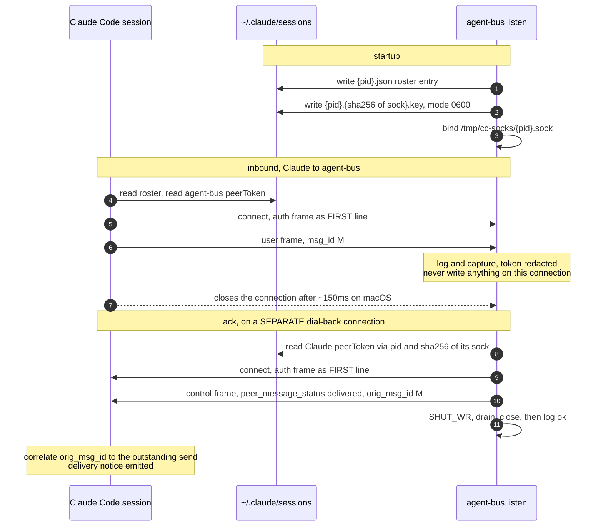
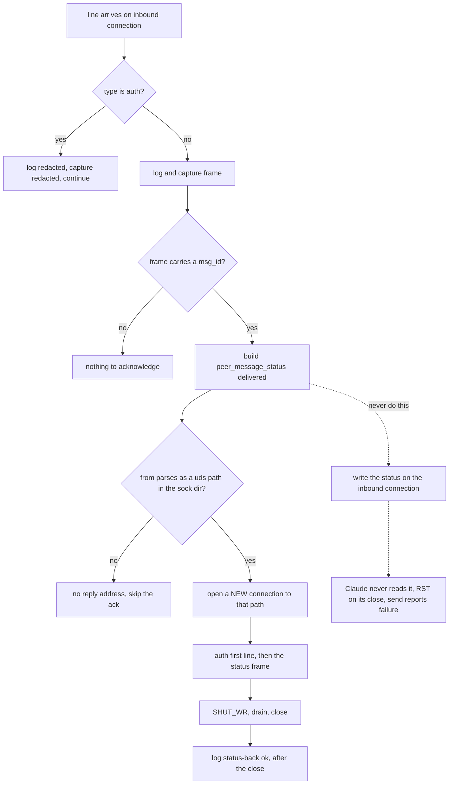

# UDS Peer Protocol for agent-bus

Unofficial reverse-engineered interop with Claude Code's native UDS messaging (ListAgents / SendMessage).

## Claude vs Grok usage

- **Claude Code users**: install NOTHING. No plugin, no MCP, no skills. Use native `/list-agents` and SendMessage. Our `listen` (started by a peer's MCP server, or manually) makes the host appear as a teammate. Outbound UDS is what `agent-bus send` uses for a claude-kind target.
- **Grok**: run `agent-bus mcp` as an MCP server. `serve()` does session_start + starts `listen --pid <host>`, and exposes the file-bus tools. Grok also has file-bus inboxes.
- listen publishes the **listener process pid** (daemon), watches host pid if `--pid` given.

## 1. Scope / unofficial 2.1.239 caveat

This document describes the current UDS peer protocol support in agent-bus as of 2026-08-22, verified working in both directions against Claude Code 2.1.239 (arm64).

- Claude -> agent-bus (inbound to our `listen`): `success:true`, auth accepted, dial-back ack correlated.
- agent-bus -> Claude (outbound, `agent-bus send` routed to the claude transport): delivered directly into the target conversation as a `<cross-session-message>` block.

**Caveat**: Derived from runtime behavior, logs, and binary string analysis on version 2.1.239. Behavior is unofficial and version-specific; re-verify after Claude Code upgrades. Auth may be platform-conditional.

This document covers one part of a single bus: the UDS path (`listen` +
`agent-bus send`) by which Claude Code peers reach it. It is not a second bus running
alongside the file bus — an inbound frame is persisted with the same
`send_message()` call into the same `AGENT_BUS_HOME` inbox, and an outbound frame
names `uds:<our_sock>` so the ack can come back. See `identity-and-peering.md`.
frame bodies are in sections 5 and 6; this shows ordering and which connection carries what.



## 2. Discovery

Claude Code peers (and our listeners) publish under `~/.claude/sessions/` (or `AGENT_BUS_SESSIONS_DIR` override):

- `sessions/<pid>.json` — the roster entry (we write via listen using the publish pid).
- `sessions/<pid>.<sha256(sock)>.key` (mode 0600).
- Socket: `/tmp/cc-socks/<pid>.sock`

`agent-bus listen` (or via Grok MCP) writes the `.json` and the `.key`. It binds the socket using `publish_pid = --pid or os.getpid()`.

When `--pid <host-pid>` (as the MCP server does), the session/sock use the host pid (for ListAgents name match), while the listener daemon pid is tracked separately for lifecycle (in AGENT_BUS_HOME/listeners/<host>.pid by the starter).

Outbound send resolves our own sock (some paths still use legacy /tmp/agent-bus/listen.pid for test harness; Grok context uses host pid).
## 3. JSONL + first-line auth

All frames are newline-delimited JSON (JSONL over AF_UNIX SOCK_STREAM).

Every connection **must** start with an auth frame when auth is required:

    {"type": "auth", "token": "<peerToken>"}

The token is the receiver's `peerToken` from their `.key` file (first line on conn is special: `f = !l` flag).

Subsequent lines are user or control frames.

agent-bus:
- Accepts auth as first (or any) line on inbound; redacts token in all logs and captures.
- For outbound (dial-back or send): always sends target's auth FIRST on the connection.

## 4. Inbound listen: accept auth (redact in logs), type:user frames; NEVER write on inbound conn; dial-back ack

`run_listen`:
- Publishes session + key + binds socket.
- Accepts connections, reads chunks, splits on `\n`, processes complete lines immediately.
- In `_process_frame`:
  - If `type == "auth"`: log redacted `{"type":"auth","token":"<redacted>"}`, capture redacted, continue (no ack for auth).
  - Else: log + capture.
  - Extract `msg_id` (or `id`, or `message.id`/`message.msg_id`) and `from`.
  - If `mid`: construct status (see §5) but **do not send on this inbound conn**.
- Comment in code: "DO NOT send same-conn status frame on inbound conn. Claude never reads it; only dial-back works."
- If `from` present and parseable as `uds:<path>` (or bare path in sock dir), perform **dial-back** to that path using the peer's token (looked up from sessions key by pid + sha/glob).
- On EOF/timeout/close: flush any partial trailing line.
- Thread per conn; cleanup on signals/atexit only our files.

The decision path for each inbound line, including the one edge that must never be taken:



We tolerate final buffer without trailing `\n`.

## 5. Status frame we send

When we receive a user frame with `mid`, we send exactly:

    {
      "msgV": 1,
      "type": "control",
      "action": "peer_message_status",
      "orig_msg_id": "<mid as str>",
      "status": "delivered",
      "from": "uds:<our listen sock_path>"
    }

**Only on the dial-back connection** (never the inbound one).

Send sequence on dial-back conn:
1. `{"type":"auth","token": <target's peerToken>}` + `\n`
2. status JSON + `\n`
3. `shutdown(SHUT_WR)`
4. `settimeout(1.0)`; drain `while recv(4096): pass`
5. `close()`
6. Then log `[status-back] path=... ok`

We **only emit `status: "delivered"`** (no `held`/`denied`/etc at this time). Print of "ok" is after close.

## 6. Outbound send: auth with TARGET token, type:user, non-empty string content, omit session_id, from=uds:<our...>, wrap in <cross-session-message>, fresh msg_id

`send_peer_message(target_sock, text)`, reached by `agent-bus send` when the
target's kind is claude:

- Resolve target (by name via `~/.claude/sessions/*.json` "name" match, or direct .sock path).
- Read our listen pid: `cat /tmp/agent-bus/listen.pid` → our_sock = `/tmp/cc-socks/{pid}.sock`
- Lookup target `peerToken` via `{tpid}.{sha256(target_sock)}.key` or glob in sessions dir.
- Build inner:
  ```
  <cross-session-message from="uds:{our_sock}" from-name="agent-bus" from-mode="prompting">
  {text}
  </cross-session-message>
  ```
- Frame:
  ```
  {
    "msgV": 1,
    "msg_id": "<fresh uuid4 str>",
    "type": "user",
    "message": {"role": "user", "content": inner},
    "priority": "next",
    "from": "uds:{our_sock}"
  }
  ```
- Note: `session_id` is omitted (per spec).
- Connection to target:
  - auth (target token) + `\n`
  - frame + `\n`
  - SHUT_WR + drain + close (same as status)
- CLI usage: `agent-bus send <name> -m TEXT` (the transport is chosen from the
  target's kind; there is no vendor-named send command)

## 7. send-uds is TEST-ONLY (empty token) against our listen

`send_uds_frame(socket_path, text)` (CLI: `agent-bus send-uds <sock> -m TEXT`):

- Only for testing our own `listen` under env overrides (never against live Claude).
- Sends:
  ```
  {"type":"auth","token":""}
  {"type":"user","message":{"role":"user","content":text}}
  ```
- Then SHUT_WR + drain + close + best-effort short read for reply.
- Empty token is accepted only by our listener (tests).

## 8. Safety

- **Never log tokens**: auth tokens are redacted in `[recv]`, `[status-back]`, captures.
- Messages received over UDS (or file bus) are **not implicit user consent**. Claude may surface them for approval; treat all inbound as untrusted.
- "Claude may hold inbound for approval" in some configurations (delivery notice appears separately).
- Use file-bus `inbox`/`ack` where possible for auditable cross-session work.
- `listen` is an experiment; the claude transport allows impersonating a UDS peer for sending.

## 9. Brief appendix: four fixes

The four fixes required (in order) to make bidirectional UDS work:

1. **Frame shape**: Status must use `"type":"control"`, `"action":"peer_message_status"` (not bare `type:peer_message_status`).
2. **Peer auth**: Publish the `.key` file (0600); send `{"type":"auth","token":...}` as **first** line on every outbound/dial-back connection.
3. **Close timing**: Use `shutdown(SHUT_WR)` + drain loop before `close()` (Claude does ~150ms delay on macOS before end).
4. **Never write on the inbound connection**: Claude never reads the send socket for acks. Writing status (or anything) on the inbound conn after receive caused RST on sender close → `success:false` classified as other error. All acks are dial-back only.

Root symptom `success:false` + "Failed to send..." was ultimately caused by #4 (inbound-write RST), even after earlier fixes made the ack path logically correct. Delivery + approval notices appeared earlier; the tool return value was driven by the write-side socket state.

Current code (in `uds.py`):
- No same-conn writes for status.
- All status and outbound sends use authenticated dial-out + proper half-close.
- `[status-back] ... ok` logged after close.
