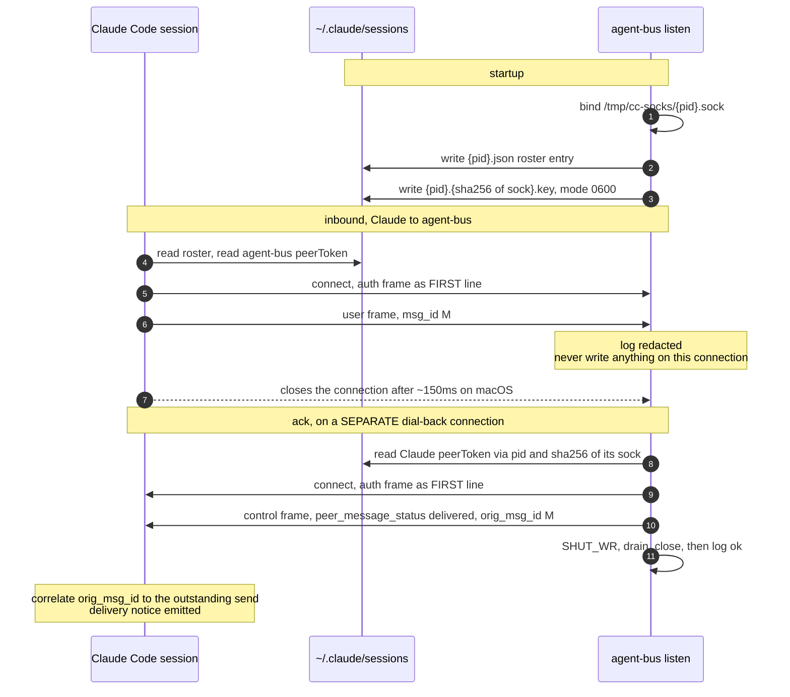
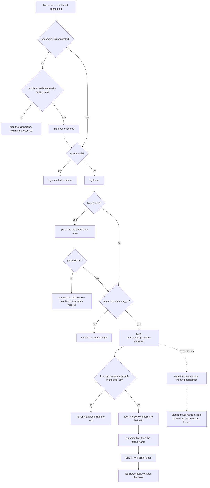

# UDS Peer Protocol for agent-bus

Unofficial reverse-engineered interop with Claude Code's native UDS messaging (ListAgents / SendMessage).

## Claude vs everyone else

The asymmetry is the design. Claude Code already speaks this protocol; every
other harness has to be given a way in.

- **Claude Code**: install NOTHING. No plugin, no MCP, no skills. Native
  `/list-agents` and SendMessage already work. A peer's `listen` makes it appear
  in that list as a teammate, and `agent-bus send` reaches a claude-kind target
  over UDS. That absence of Claude-side code is the feature, not a gap.
- **Everyone else** (grok, codex, omp): run `agent-bus mcp` as an MCP server.
  `session_start()` registers the session and starts `listen --pid <host>`, and
  the same server exposes the file-bus tools.
- **Harnesses with neither MCP nor hooks** (pi): the shell is the whole
  integration surface. They run the CLI directly — `agent-bus listen --name X
  --pid $PPID` — and `--pid` is what makes the registration outlive the command
  that started it.
- listen publishes the **listener process pid** (daemon), and watches the host
  pid when `--pid` is given.

## 1. Scope / unofficial 2.1.239 caveat

This document describes the current UDS peer protocol support in agent-bus as of 2026-08-22, verified working in both directions against Claude Code 2.1.239 (arm64).

- Claude -> agent-bus (inbound to our `listen`): `success:true`, auth accepted, dial-back ack correlated.
- agent-bus -> Claude (outbound, `agent-bus send` routed to the claude transport): delivered directly into the target conversation as a `<cross-session-message>` block.

**Caveat**: Derived from runtime behavior, logs, and binary string analysis on version 2.1.239. Behavior is unofficial and version-specific; re-verify after Claude Code upgrades. Auth may be platform-conditional.

This document covers one part of a single bus: the UDS path (`listen` +
`agent-bus send`) by which Claude Code peers reach it. It is not a second bus running
alongside the file bus — an inbound frame is persisted with the same
`send_message()` call into the same `AGENT_BUS_HOME` inbox, and an outbound frame
names `uds:<our_sock>` so the ack can come back. See `identity-and-peering.md`.
frame bodies are in sections 5 and 6; this shows ordering and which connection carries what.



## 2. Discovery

Claude Code peers (and our listeners) publish under `~/.claude/sessions/` (or `AGENT_BUS_SESSIONS_DIR` override):

- `sessions/<pid>.json` — the roster entry (we write via listen using the publish pid).
- `sessions/<pid>.<sha256(sock)>.key` (mode 0600).
- Socket: `/tmp/cc-socks/<pid>.sock`

`agent-bus listen` (or via Grok MCP) writes the `.json` and the `.key`. It always binds and publishes under its own `os.getpid()` -- `run_listen`'s own docstring calls this out: "the listener always publishes under its own os.getpid() ... `pid` (from `--pid`) is WATCH-PID ONLY ... It is NOT the advertised pid."

`--pid <host-pid>` (as the MCP server passes) is the process the listener watches, not the one it publishes as: if that host pid exits, the listener exits and cleans up. It is tracked separately for lifecycle, in `AGENT_BUS_HOME/listeners/<host>.pid`, which holds the listener's own pid so a sibling process can find it.

Outbound send has to name our own socket as the reply address, and resolves it
in four steps (`send_peer_message`, `uds.py`):

1. `AGENT_BUS_LISTEN_SOCK`, if set and the path exists.
2. `<sock_dir>/<our pid>.sock` — the case where we are the listener.
3. Otherwise walk our ancestors: `<AGENT_BUS_HOME>/listeners/<ancestor>.pid` is
   named for the **host** and contains the **listener's** pid, and the socket is
   named for the listener. Building `<our own pid>.sock` never resolves, because
   the caller is usually neither.
4. Failing that, the single live listener in this `AGENT_BUS_HOME` is
   unambiguously ours.

Step 3 exists because a shell-only peer starts `listen` as a separate process;
it was added after `send` proved unable to find a listener it had just started.
## 3. JSONL + first-line auth

All frames are newline-delimited JSON (JSONL over AF_UNIX SOCK_STREAM).

Every connection **must** start with an auth frame when auth is required:

    {"type": "auth", "token": "<peerToken>"}

The token is the receiver's `peerToken` from their `.key` file (first line on conn is special: `f = !l` flag).

Subsequent lines are user or control frames.

agent-bus:
- **Verifies inbound auth against our own published `peerToken`**, per connection.
  The first frame must be an auth frame carrying that token; anything else, or a
  wrong token, drops the connection before the frame is processed. Until this
  was enforced the token was redacted for logging and never compared, so any
  caller that could reach the socket was trusted and filesystem permissions
  (0600 socket in a 0700 directory) were the only real control.
- Redacts tokens once, before anything is written.
- For outbound (dial-back or send): always sends target's auth FIRST on the connection.

## 4. Inbound listen: accept auth (redact in logs), type:user frames; NEVER write on inbound conn; dial-back ack

`run_listen`:
- Publishes session + key + binds socket.
- Accepts connections, reads chunks, splits on `\n`, processes complete lines immediately.
- In `_process_frame`:
  - If `type == "auth"`: compare against our published token. No match, or a
    non-auth frame before one, and the connection is dropped. On a match, log
    redacted `{"type":"auth","token":"<redacted>"}`, continue
    (no ack for auth).
  - Else: log the frame.
  - For a `type:"user"` frame, first calls `store.send_message` to persist it
    to the target's file inbox. If that raises (no such agent, no mailbox,
    text too long, inbox full, ...) the frame is NOT acknowledged: `inbox_ok`
    is set `False` and no status is built for it, even though `mid` is
    present. Any other frame type skips this persistence step entirely and is
    always eligible for a status.
  - Extract `msg_id` (or `id`, or `message.id`/`message.msg_id`) and `from`.
  - If `mid` **and** (persistence succeeded, or this wasn't a user frame):
    construct status (see §5) but **do not send on this inbound conn**.
- Comment in code: "DO NOT send same-conn status frame on inbound conn. Claude never reads it; only dial-back works."
- If `from` present and parseable as `uds:<path>` (or bare path in sock dir), perform **dial-back** to that path using the peer's token (looked up from sessions key by pid + sha/glob).
- On EOF/timeout/close: flush any partial trailing line.
- Thread per conn; cleanup on signals/atexit only our files.

The decision path for each inbound line, including the one edge that must never be taken:



We tolerate final buffer without trailing `\n`.

## 5. Status frame we send

When we receive a user frame with `mid`, we send exactly:

    {
      "msgV": 1,
      "type": "control",
      "action": "peer_message_status",
      "orig_msg_id": "<mid as str>",
      "status": "delivered",
      "from": "uds:<our listen sock_path>"
    }

**Only on the dial-back connection** (never the inbound one).

Send sequence on dial-back conn:
1. `{"type":"auth","token": <target's peerToken>}` + `\n`
2. status JSON + `\n`
3. `shutdown(SHUT_WR)`
4. `settimeout(1.0)`; drain `while recv(4096): pass`
5. `close()`
6. Then log `[status-back] path=... ok`

We **only emit `status: "delivered"`** (no `held`/`denied`/etc at this time). Print of "ok" is after close.

## 6. Outbound send: auth with TARGET token, type:user, non-empty string content, omit session_id, from=uds:<our...>, wrap in <cross-session-message>, fresh msg_id

`send_peer_message(target_sock, text)`, reached by `agent-bus send` when the
target's kind is claude:

- Resolve target (by name via `~/.claude/sessions/*.json` "name" match, or direct .sock path).
- Resolve our own socket for the reply address (the four steps in §2).
- Lookup target `peerToken` via `{tpid}.{sha256(target_sock)}.key` or glob in sessions dir.
- Build inner:
  ```
  <cross-session-message from="uds:{our_sock}" from-name="{advertised_name}" from-mode="prompting">
  {text}
  </cross-session-message>
  ```
  `{advertised_name}` is `_advertised_name(our_sock)`: the name from the
  sender's own published session, falling back to `agent-bus` only if nothing
  is published there.
- Frame:
  ```
  {
    "msgV": 1,
    "msg_id": "<fresh uuid4 str>",
    "type": "user",
    "message": {"role": "user", "content": inner},
    "priority": "next",
    "from": "uds:{our_sock}"
  }
  ```
- Note: `session_id` is omitted (per spec).
- Connection to target:
  - auth (target token) + `\n`
  - frame + `\n`
  - SHUT_WR + drain + close (same as status)
- CLI usage: `agent-bus send <name> -m TEXT` (the transport is chosen from the
  target's kind; there is no vendor-named send command)

## 7. Safety

- **Never log tokens.** An auth frame becomes
  `{"type":"auth","token":"<redacted>"}` **once**, before any sink sees it, so
  `[recv]`, `[parsed]` and `log.trace` all get the redacted form. At the byte
  boundary only the size is logged — the first version logged `raw=ln` and
  leaked a token.
- **TRACE copies frame content by design**, which is the level to check when
  asking where a body could be. It emits at `severity: DEBUG`, and strings are
  cut at 8 KB with a `<field>_len` recording the original size, so a record
  cannot hold a 32 KB message.
- **Inbound auth is verified**, per connection, against the token we published in
  our own `.key` (§3). A frame carrying a token we never issued is dropped.
- Messages received over UDS (or file bus) are **not implicit user consent**. Claude may surface them for approval; treat all inbound as untrusted.
- "Claude may hold inbound for approval" in some configurations (delivery notice appears separately).
- Use file-bus `inbox`/`ack` where possible for auditable cross-session work.
- `listen` is not an experiment. It is how a non-Claude agent becomes a peer:
  it publishes a Claude-shaped session file and binds the socket, and the
  integration tests exercise it end to end against a live Claude session. The
  claude transport does let a peer speak on this wire, so treat the ability to
  send as the capability it is — inbound frames are still not consent (above).

## 8. Brief appendix: four fixes

The four fixes required (in order) to make bidirectional UDS work:

1. **Frame shape**: Status must use `"type":"control"`, `"action":"peer_message_status"` (not bare `type:peer_message_status`).
2. **Peer auth**: Publish the `.key` file (0600); send `{"type":"auth","token":...}` as **first** line on every outbound/dial-back connection.
3. **Close timing**: Use `shutdown(SHUT_WR)` + drain loop before `close()` (Claude does ~150ms delay on macOS before end).
4. **Never write on the inbound connection**: Claude never reads the send socket for acks. Writing status (or anything) on the inbound conn after receive caused RST on sender close → `success:false` classified as other error. All acks are dial-back only.

Root symptom `success:false` + "Failed to send..." was ultimately caused by #4 (inbound-write RST), even after earlier fixes made the ack path logically correct. Delivery + approval notices appeared earlier; the tool return value was driven by the write-side socket state.

Current code (in `uds.py`):
- No same-conn writes for status.
- All status and outbound sends use authenticated dial-out + proper half-close.
- `[status-back] ... ok` logged after close.
