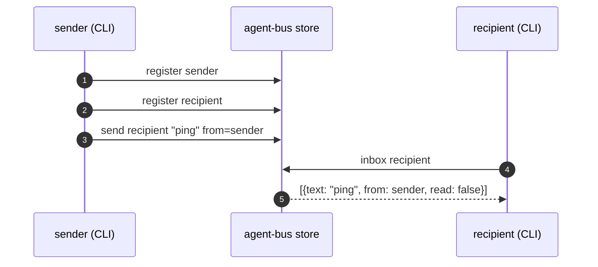
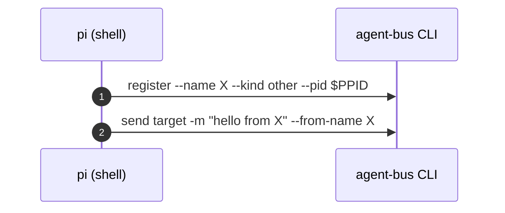
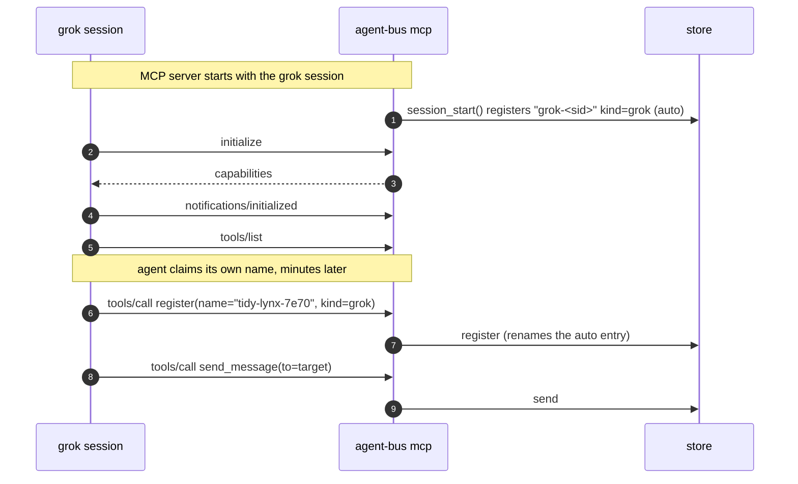
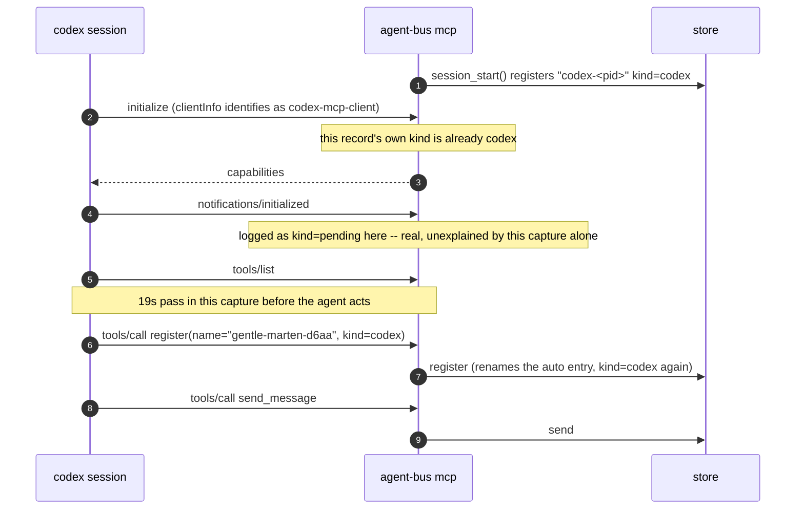
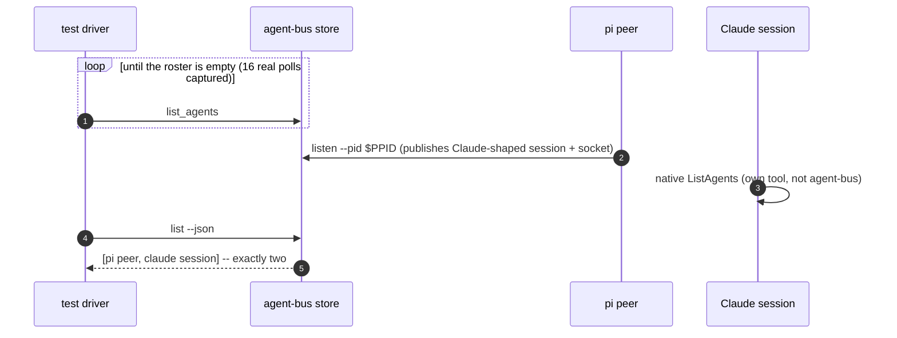
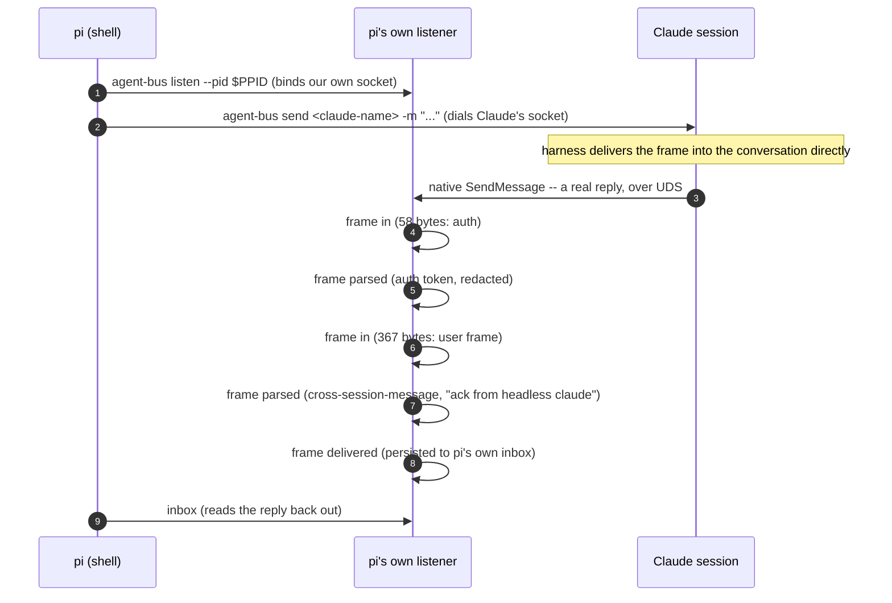
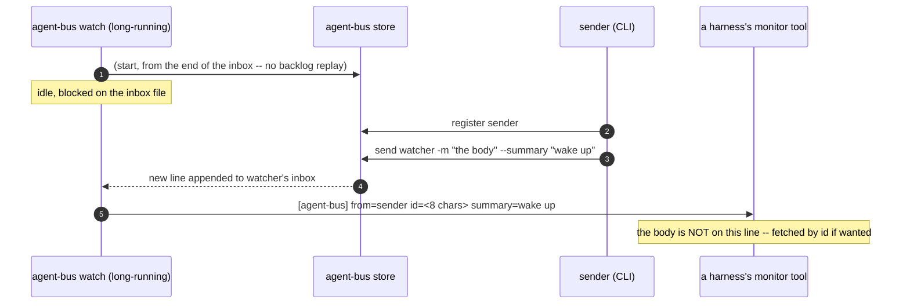
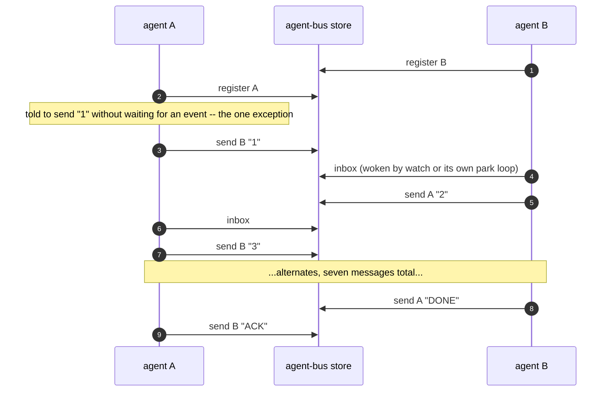
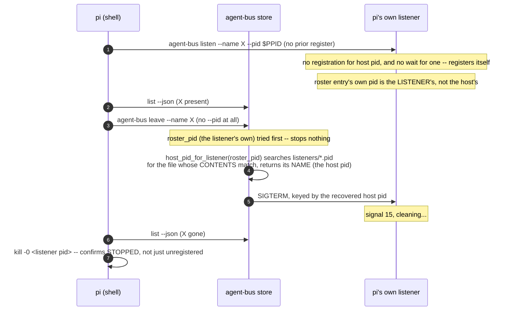

# What the e2e tests actually show, and what they don't

Eight diagrams, one per `tests/agent_bus/integration/test_*.py` file, each
built from a real captured `AGENT_BUS_LOG_FILE` -- not from reading the test
source.
`scripts/e2e_coverage.py` reads the same evidence for a coverage matrix across
every test; this reads a handful of individual runs to show one mechanism
each, in order.

**Read `harness-compatibility.md`'s "CI-shaped and use-shaped are different
questions" first.** It says why this file exists in one paragraph: a run
nobody watches wants a blocking call and a known end; a person working wants
an agent that keeps going. The two want opposite things from the exact same
code paths, and a test built for the first is not a demonstration of the
second. Every section below says, explicitly, which of the two it is a test
of -- because the tests are what a cold reader meets first, and CI's own
shape (a deterministic wait, a single round trip, a driver polling in a
tight loop) is the one that gets copied into "how agent-bus is used" by
mistake.

## How to reproduce a capture

```sh
AGENT_BUS_LOG_LEVEL=INFO uv run pytest tests/agent_bus/integration/test_the_file_bus.py \
    -q --basetemp=/tmp/capture
find /tmp/capture -name '*-log.jsonl'
```

`AGENT_BUS_LOG_LEVEL=TRACE` is what the UDS-messaging section below actually
needed -- `frame in`/`frame parsed`/`frame delivered` records emit at DEBUG
severity and TRACE is the level that turns them on (`docs/structured-logging.md`).
INFO is what `spendy_tests.sh` and the `e2e` docker service set by default,
and it is enough for every other section here.

The spendy tests (everything except `test_the_file_bus.py` and
`test_watch_wakes_a_peer.py`) cost real API spend -- see
`tests/agent_bus/integration/README.md` before running them for this.

---

## 1. The file bus -- no harness, `test_the_file_bus.py`

**CI-shaped and use-shaped agree here.** Two CLI calls, no model, no
process left running afterward. This is also exactly how a real send
happens -- there is no CI-only shortcut in this one.



Captured from a real run:

```json
{"verb":"register","args":{"name":"nimble-puffin-d1c9","kind":"other"},"ok":true}
{"verb":"register","args":{"name":"keen-badger-ee32","kind":"other"},"ok":true}
{"verb":"send","agent":"keen-badger-ee32","args":{"to":"keen-badger-ee32","from_name":"nimble-puffin-d1c9"},"ok":true}
{"verb":"inbox","agent":"keen-badger-ee32","args":{"unread_only":false},"ok":true}
```

**What this does not show:** a real sender and recipient are two different
processes; this test's helper runs `send` and `inbox` from the same shell in
sequence because that is sufficient to prove the store's contract. Nothing
here is about timing or waking -- that is section 5.

---

## 2. A harness joins, per harness -- `test_a_harness_joins_the_bus.py`

**Both.** The registration handshake below is exactly what a real session
does at startup; what's CI-shaped is that the test then exits the moment one
message has landed, which a real session has no reason to do.

Four harnesses, four different paths to the same three facts: register,
prove identity by sending, and the sender's own registered name/kind must
appear on the message that arrives. Real captures, one per harness:

### pi -- shell only, no MCP



### grok -- MCP server, explicit `register` call



**`notifications/initialized` here is the handshake, not a wake channel --
worth being explicit, because this whole document sits in
notifications-adjacent territory.** It is grok telling us "I've processed
your `initialize` response," sent once at startup by every harness that
speaks MCP. `mcp_server.py`'s own `EAGER_DISCOVERY` comment measured this
directly, for a different reason (why eager `resources/list` etc. must
answer empty rather than refuse): "None of the five coding harnesses does
this today -- measured across a full container run, they ask for
initialize, notifications/initialized, tools/list and tools/call, and
nothing else." Our own handler (`mcp_server.py::_dispatch`) does nothing
with `notifications/initialized` but silently accept it. There is no
MCP-defined "you have mail" notification for a server to push, and nothing
here sends one -- which is exactly why `watch` exists as a separate,
agent-bus-owned polling mechanism instead of riding this channel.

Separately reverse-engineered against grok's own source
(`docs/harnesses/grok-build-monitor-reference.md`): of the MCP notification
types a server genuinely *can* push (`notifications/tools/list_changed`,
`resources/list_changed`, `resources/updated`, `prompts/list_changed`,
`progress`, `message`), grok's `rmcp` client handles exactly two --
`tools/list_changed` and `resources/list_changed`, and only to flip a UI
badge, never to re-fetch anything. `notifications/message` (a server
pushing its own log lines to the client) is a confirmed no-op, verified
against `rmcp` 2.1.0's published source, not assumed. None of this is the
wake mechanism either way: grok's actual wake, `monitor`
(`docs/harnesses/grok.md`), is an unrelated tool that streams a shell
command's stdout as conversation events -- architecturally independent of
the JSON-RPC notification channel MCP defines, not a use of it.

### codex -- MCP server, kind settles at `initialize`, then reverts to `pending`

The real capture has an oddity worth keeping rather than smoothing away: the
`initialize` record itself already carries `kind=codex` (codex's
`clientInfo.name` identifies it immediately, unlike grok and omp below), but
the very next two records -- `notifications/initialized` and `tools/list` --
log against `pending-<pid>` again before `register` settles `kind=codex` for
good. Read directly, not inferred:

Times are UTC on 2026-08-31 (`HH:MM:SS`), one capture:

```
12:47:51  message=register  agent=null              kind=null
12:47:53  message=register  agent=codex-7471         kind=codex
12:47:53  message=initialize                         kind=codex
12:47:53  message=notifications/initialized  agent=pending-7471  kind=pending
12:47:53  message=tools/list                 agent=pending-7471  kind=pending
12:48:12  message=register  agent=gentle-marten-d6aa kind=codex
12:48:12  message=tools/call tool=register    agent=gentle-marten-d6aa kind=codex
12:48:14  message=send       agent=gentle-marten-d6aa kind=codex
12:48:14  message=tools/call tool=send_message agent=gentle-marten-d6aa kind=codex
```



### omp -- MCP server, `pending` until `initialize` names it

Real capture, in order:

```json
{"agent":"omp-4461","kind":"omp","message":"register","args":{"name":"omp-4461","pid":4461}}
{"agent":"pending-4461","kind":"pending","message":"initialize","client":"omp-coding-agent"}
{"agent":"pending-4461","kind":"pending","message":"notifications/initialized"}
{"agent":"pending-4461","kind":"pending","message":"tools/list"}
{"agent":"pending-4461","kind":"pending","message":"resources/list"}
{"agent":"pending-4461","kind":"pending","message":"resources/templates/list"}
{"agent":"pending-4461","kind":"pending","message":"prompts/list"}
{"agent":"zesty-falcon-79b2","kind":"omp","message":"register","args":{"name":"zesty-falcon-79b2"}}
{"agent":"zesty-falcon-79b2","kind":"omp","message":"tools/call","tool":"register"}
{"agent":"zesty-falcon-79b2","kind":"omp","message":"send"}
{"agent":"zesty-falcon-79b2","kind":"omp","message":"tools/call","tool":"send_message"}
```

The opposite ordering from codex: `session_start()`'s own auto-register
already carries `kind=omp` (`agent="omp-4461"`), but every MCP record from
`initialize` through the eager-discovery calls (`resources/list`,
`resources/templates/list`, `prompts/list` -- `EAGER_DISCOVERY` in
`mcp_server.py`, answered empty for a client that calls them before reading
capabilities) logs against `pending-4461` until the agent's own `register`
tool call settles it back to `omp`.

**What this proves, and what it doesn't.** Real registration and real
delivery, for real. What's cut short: the test's own docstring says why --
"a headless agent is a one-shot -- it registers, exits, and its entry is
pruned as dead, correctly, because presence is liveness." A live session
stays registered and keeps working; this test cannot show that half, because
proving it would mean the session never exits, which is not a shape a
deterministic CI assertion can wait on.

---

## 3. Both views of the roster agree -- `test_both_views_of_the_roster_agree.py`

**CI-shaped, and says so about itself.** `_require_an_exclusive_bus` polls
`agent-bus list` once a second until the machine has zero agents on it,
purely so the assertion isn't fooled by a bystander. A real machine is never
required to be empty before an agent starts.



Captured (the polling loop, real):

```json
{"verb":"list_agents","ok":true,"ms":46}
{"verb":"list_agents","ok":true,"ms":1}
... 14 more, one per second, until the bus reports empty
```

**What the CLI log alone cannot show:** Claude's own `ListAgents` call never
touches agent-bus at all -- it is the harness's native tool, reading the
session file `listen` published. The only record of what Claude actually
saw is in *its own transcript* (`stdout.jsonl`), which is why the test's
`_list_agents_results()` helper parses that file separately rather than
trusting anything in the structured log. This is the clearest example in
this set of "the log is not the whole story" -- two systems being compared,
and only one of them logs to agent-bus at all.

---

## 4. A peer messages a live Claude session over UDS -- `test_messaging_a_claude_session.py`

**This is the product**, per the test's own docstring, and the diagram below
needed `AGENT_BUS_LOG_LEVEL=TRACE` to capture -- the frame-level records are
DEBUG severity and off by default. This is the one place in this document
where a CI convenience (driving it with `pi`, "the least capable harness
available") is also exactly the real path a shell-only peer takes; nothing
here is CI-only.



Captured, real (`AGENT_BUS_LOG_LEVEL=TRACE`):

```json
{"message":"frame in","surface":"listen","bytes":58}
{"message":"frame parsed","surface":"listen","parsed":{"type":"auth","token":"<redacted>"}}
{"message":"frame in","surface":"listen","bytes":367}
{"message":"frame parsed","surface":"listen","parsed":{"type":"user","message":{"content":"<cross-session-message from=\"uds:/tmp/cc-socks/10681.sock\" ... from-name=\"agent-bus-23\">\nack from headless claude\n</cross-session-message>"}}}
{"message":"frame delivered","surface":"listen","text_len":24}
```

**What this does not show:** whether Claude ever confirms *our* outbound
send at the protocol level. It doesn't -- measured directly, twice, across
two Claude Code versions, and recorded in the belief ledger. Delivery here
is real; a wire-level receipt for it is not a thing this protocol has.

---

## 5. `watch` wakes a peer -- `test_watch_wakes_a_peer.py`

**CI-shaped in exactly the way `harness-compatibility.md` warns about**,
and its own module docstring already half-says so: `omp`'s bounded
`hub logs --follow` loop is "a CI compromise for determinism... a real
session is not obligated to loop this tightly just because this test does."
This test drives the same mechanism a real monitor uses, but the *shape* of
consumption -- one poll, one assertion, then the test ends -- is CI's, not a
running peer's.



Captured, real (the CLI-log half):

```json
{"verb":"register","args":{"name":"brisk-marten-fe3e","kind":"other"}}
{"verb":"send","args":{"to":"brisk-marten-fe3e","from_name":"gentle-vole-61f2","summary_len":7}}
```

The line a monitor actually sees, from `watch`'s own stdout (never written to
`AGENT_BUS_LOG_FILE` -- `watch` has no verb-call logging of its own today,
only this line):

```
[agent-bus] from=gentle-vole-61f2 id=136abbd6 summary=wake up
```

**What this does not show:** `watch` is a background process a real peer
starts once and leaves running for its whole session; this test starts one,
waits for exactly one line, and tears it down. A real monitor's loop --
`monitor(command="agent-bus watch --name me", persistent=true)` -- has no
analog to "the test ends here" at all.

---

## 6. Two agents hold a conversation -- `test_two_agents_hold_a_conversation.py`

**The most CI-shaped test in this directory, and it says so in its own
module docstring: "a CI compromise for determinism."** Read this one last,
and read the warning first: `WAKE[harness] == "park"` (omp today) means the
agent blocks in a tool call and loops on a bounded read, purely so there is
one deterministic point per exchange for the test to assert on. A pushed
harness (Claude, grok) ends its turn and gets re-invoked by an event instead
-- closer to real use, but still inside a fixture built to produce an
assertion, not to demonstrate the idle-and-respond shape a working session
actually holds.



Captured, real (claude-to-grok, `ms` is each call's own duration; the gaps
*between* lines -- up to 17s here -- are model-thinking time, not shown by
`ms` at all):

```json
{"verb":"register","args":{"name":"quiet-vole-f7a2"}}
{"verb":"register","args":{"name":"dapper-shrew-ea23"}}
{"verb":"inbox","args":{"name":"dapper-shrew-ea23"}}
{"verb":"send","args":{"to":"quiet-vole-f7a2"},"ms":196}
{"verb":"inbox","args":{"name":"quiet-vole-f7a2"},"ms":44}
... alternates, 21 records total
```

**What this does not show, and is the whole point of this document:** a
real conversation is not seven scripted turns with a hardcoded stop word. It
is two agents doing real work, occasionally sending or receiving a message
in the middle of it, with no deadline and no "DONE" convention imposed from
outside. If you are reading this test to understand how to *use* the bus,
you will come away thinking a peer's job is to sit and wait for mail. That
is what CI needed from it. It is not what a working agent should do with
its time -- see `harness-compatibility.md`'s **Woken headless?** row, and
the "push and park" distinction directly below it, for the actual shape.

---

## 7. `leave` stops the listener it unregisters -- `test_leave_stops_a_listener.py`

**Not CI-shaped at all -- this is a real bug's regression test**, driven by
`pi` from a bare shell because, per the test's own docstring, "`leave` is a
shell verb and this is the surface a person or an agent actually types it
on." #170 fixed a real gap #166's earlier fix had left open: `leave --name X`
with no `--pid` -- the ordinary, documented form -- reported success while
the listener process kept its socket bound.



Captured, real (a live `pi` run, `AGENT_BUS_LOG_LEVEL=INFO`):

```json
{"verb":"list_agents","args":{"kind":null},"ok":true}
{"verb":"leave","args":{"name":"keen-badger-cf7b","host_pid":null},"ok":true}
{"verb":"list_agents","args":{"kind":null},"ok":true}
```

The listener's own log, same run, exactly as captured:

```
[listen] no registration for pid 33439 after 5s; registering our own
[listen] pid=33824 name=keen-badger-cf7b
...
[listen] signal 15, cleaning...
```

**That first line's own "after 5s" is wrong, and was product code lying, not
a documentation slip.** `--adopt` is internal-only -- a bare `agent-bus
listen`, exactly the call above, never passes it -- so the adopt-wait loop's
deadline was `now + 0.0`, and the loop fell through on its first check,
never waiting at all. But the message unconditionally printed the constant
`ADOPT_TIMEOUT` regardless of which path actually ran, so every bare
`listen` claimed a 5-second wait that never happened. A reader debugging
"why didn't my listener adopt my registration" would read this line and
conclude it looked twice, five seconds apart, and the entry genuinely
wasn't there -- when it never looked a second time at all, and a
registration landing 100ms later would have been missed just the same.
Caught by a second reader of this exact section, live-reproduced (under 3s
real wall clock for the whole startup sequence, `PYTHONUNBUFFERED=1` to
rule out output buffering as a confound) before fixing `uds.py` to print
the interval it actually used. Worth stating plainly, since this document's
whole premise is "built from real evidence, not from reading source": that
premise is not immunity. A captured line is real evidence that the product
*said* this -- it is not, on its own, evidence that what it said was true.
This is the one case in this document where the two came apart.

Two different pids in one run -- `33439` (pi's shell, the host) and `33824`
(the listener's own) -- is the entire bug in two lines, the "after 5s"
mistake aside. Before #170, `leave` only ever looked up `33824` under a key
meant for `33439` and found nothing; `--json leave.json` still said
`{"left": true}` and the process kept running. This capture confirms the
fix: `host_pid: null` in the `leave` record (the ordinary, no-flag form)
still resolved the right pid, and the listener's own log shows the signal
actually landing.

**What this does not show:** the same coverage gap that let this bug ship in
the first place. `join` and `leave` were, until this test, the only two CLI
verbs a real harness had never touched -- `listen`, which they wrap, had
three prompts driving it; they had none. `scripts/e2e_coverage.py`'s matrix
is what would have surfaced that gap, if anyone had looked at it as a gap
rather than as a passing suite.

---

## 8. `join` reaches a Claude session the instant it returns -- `test_join_reaches_a_claude_session.py`

**`join`'s sibling gap, per #171 -- and, unlike section 7's `leave`, not a
bug.** Checked live before writing anything: a real `join` from a real
shell, against a real held pid, correctly resolved the host pid, published
a listener whose pid file matched it (no divergence -- `start_uds_listen`,
which `join` uses, always passes `--adopt` and always keys the pid file by
the host pid it was already given, unlike the hand-started shape section 7
found broken), and both an inbound send to it and this test's own outbound
send *from* it worked. `join` had zero e2e coverage, not a live defect.

`join`'s actual documented risk is narrower: `register()` claims a name and
stops; the listener that gives a peer a socket to send *from* is a detached
process, so there is a window between "registered" and "reachable" where an
agent that starts working loses whatever it tries to send. `join` closes
that window by blocking until the socket exists. This test is whether that
wait actually holds for a real shell-only peer sending to a real Claude
session, immediately, with no sleep of its own -- `join`'s own wait is the
only thing standing between "registered" and "sent."

```mermaid
sequenceDiagram
    autonumber
    participant pi as pi (shell)
    participant bus as agent-bus store
    participant claude as Claude session

    pi->>bus: agent-bus join --name X --kind other --pid $PPID --json
    Note over bus: register() then start_uds_listen() (--adopt) then blocks<br/>until the socket exists -- 717ms in this capture
    bus-->>pi: {"reachable": true, "pid": <host>, ...}
    Note over pi: join and send are chained with `;` in one bash<br/>invocation -- no model turn, no latency, between them
    pi->>claude: agent-bus send <claude-name> -m "..." (dials Claude's socket)
    Note over claude: harness delivers the frame into the conversation directly
```

A first draft ran `join` and `send` as two separate steps in the prompt --
two separate tool calls a real model makes one at a time, with a full turn
between them. A review of this PR caught it: that turn is real latency (the
first capture showed ~4 real seconds between the two), and if `join` had
returned before the socket actually existed, those four seconds would have
masked it exactly the way a `sleep` would have. The fix is the one-line
version above -- `join` and `send` chained by `;` inside a single bash
invocation, so there is one tool call and no model turn between them. The
capture below is from that fixed prompt, not the original one.

Captured, real (`AGENT_BUS_LOG_LEVEL=INFO`, a live `pi` run against a live
Claude session):

```json
{"verb":"register","args":{"name":"merry-puffin-e1e8","pid":5983},"ok":true,"ms":21}
{"verb":"join","args":{"name":"merry-puffin-e1e8","pid":5983,"ready_timeout":15.0},"ok":true,"ms":717}
{"verb":"send","args":{"to":"agent-bus-dev-a3","text_len":34},"ok":true,"ms":741}
```

The listener's own log, same run:

```
[listen] adopting host registration merry-puffin-e1e8 (pid 5983)
[listen] pid=6658 name=merry-puffin-e1e8
[listen] socket=/tmp/cc-socks/6658.sock
[listen] session=/Users/dan/.claude/sessions/6658.json
[listen] waiting for connections (newline json frames)...
```

`register` and `join` both land in the same second; the listener's own log
confirms it took the *adopting* branch (`--adopt`, since `start_uds_listen`
always passes it), not the "no registration" branch section 7 was built on
-- the two tests exercise the two different paths through the same adopt
loop on purpose. `send` runs immediately after `join` returns, inside the
same shell invocation, and reports `ok: true`; `send.txt` reads
`SEND_EXIT=0`. No gap is left for `join`'s wait to hide behind.

**What this does not show:** `join`'s `False`-reachable path -- what
happens when the wait genuinely times out. Nothing here forces that; it
would need a way to make the listener slow to bind on purpose, which is a
different, harder test than driving the ordinary case for real.

---

## The pattern across all eight

Every diagram above was built from a real `*-log.jsonl`, not from reading
test source -- `scripts/e2e_coverage.py` reads the same files for a coverage
matrix rather than one mechanism at a time. Four things recur:

1. **CI needs a deterministic end; real use has none.** Sections 3, 5 and 6
   are explicit about this, in their own module docstrings, before this
   document restates it.
2. **The structured log is not the whole story.** Section 3 (Claude's own
   `ListAgents`) and section 5 (`watch`'s stdout line) both have a real
   mechanism the JSONL log cannot show at all -- a transcript or a stdout
   stream is the only record.
3. **A test proving delivery is not a test proving a protocol receipt.**
   Section 4's `frame delivered` is real; a wire-level confirmation *of our
   send* is not something this protocol has, measured directly rather than
   assumed.
4. **A verb with no e2e coverage at all is a real, different kind of gap
   from a CI-shaped test.** Sections 1 through 6 are all about a test's
   *shape* misleading a reader; section 7 is what happens when there is no
   test's shape to be misled by in the first place -- the bug lived
   entirely in the space `scripts/e2e_coverage.py` would have shown as
   empty.
5. **Closing a coverage gap does not owe you a bug.** `join` and `leave`
   were the same size of gap, checked with the same discipline; one had a
   real defect and one didn't. Section 8 is the null result, kept rather
   than left unwritten -- the value of driving a verb for real is
   confirming the design holds, not only catching it when it doesn't.
