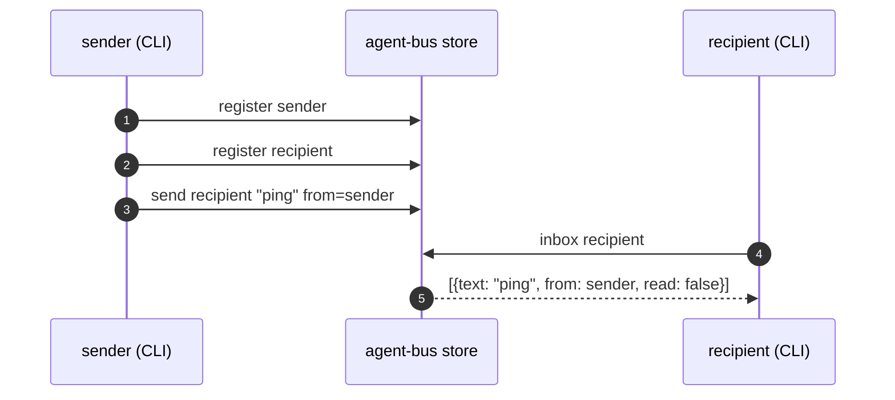
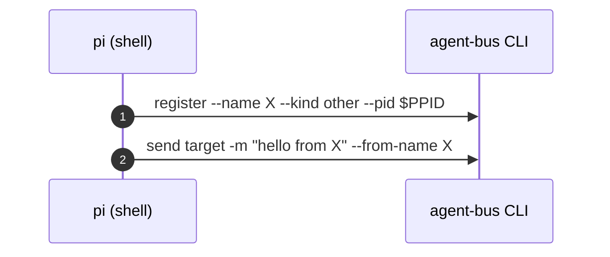
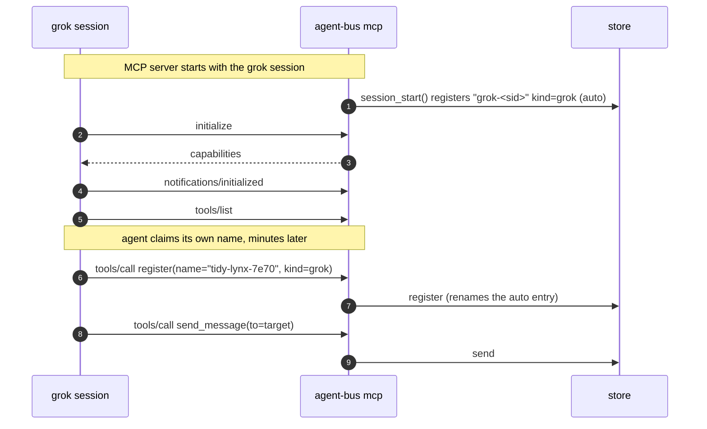
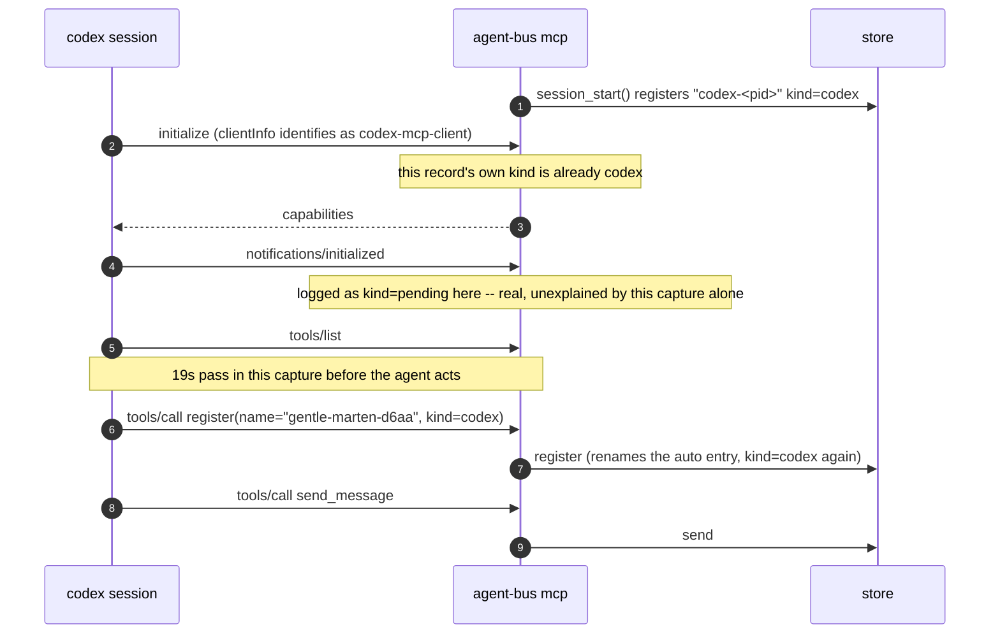
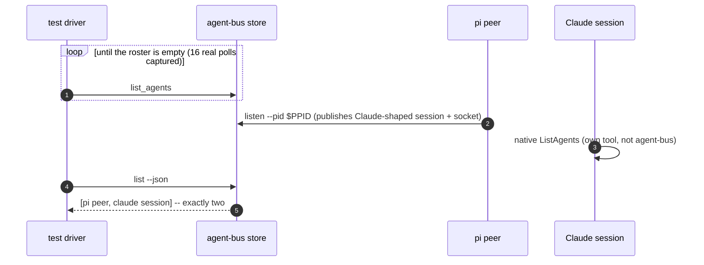
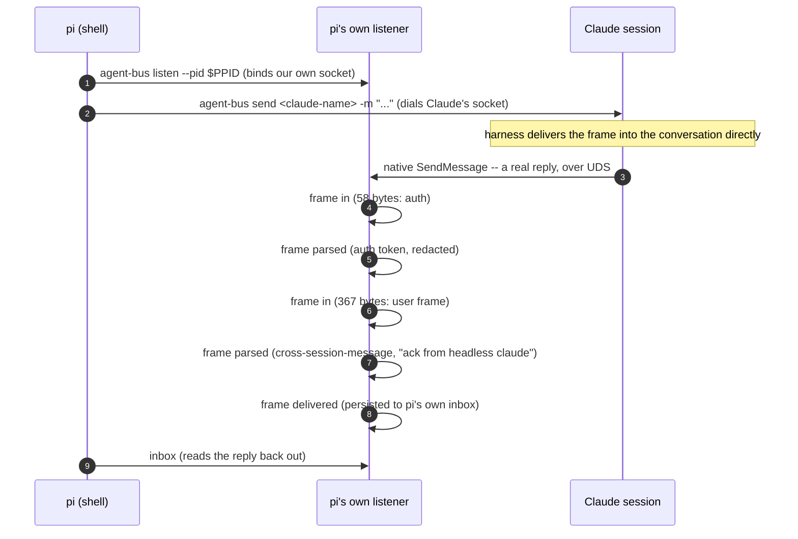
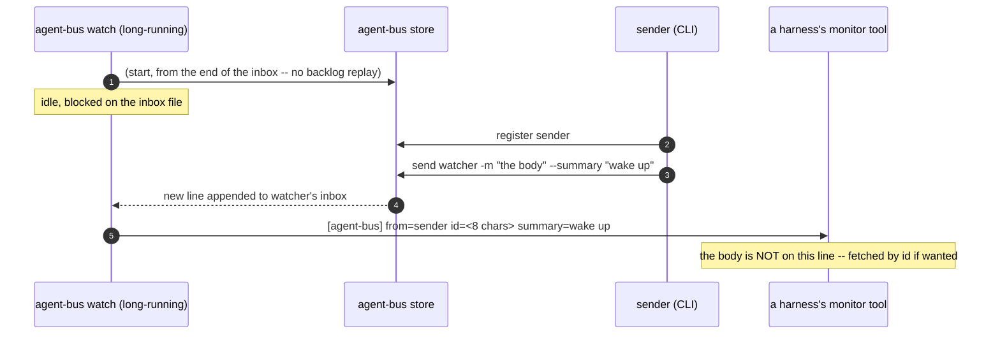
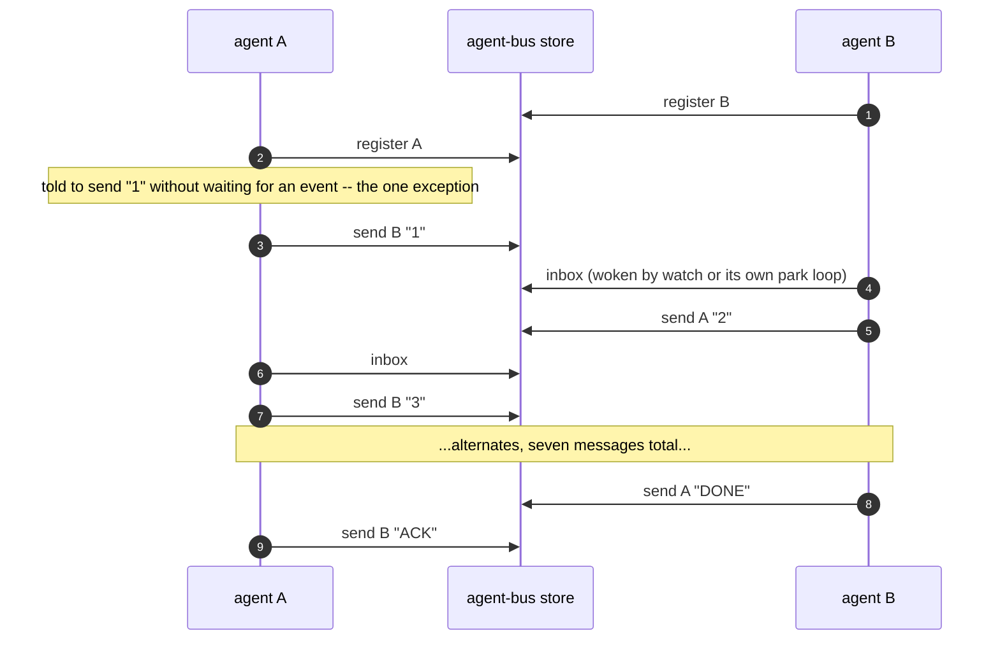

# What the e2e tests actually show, and what they don't

Six diagrams, one per `tests/agent_bus/integration/test_*.py` file, each built
from a real captured `AGENT_BUS_LOG_FILE` -- not from reading the test source.
`scripts/e2e_coverage.py` reads the same evidence for a coverage matrix across
every test; this reads a handful of individual runs to show one mechanism
each, in order.

**Read `harness-compatibility.md`'s "CI-shaped and use-shaped are different
questions" first.** It says why this file exists in one paragraph: a run
nobody watches wants a blocking call and a known end; a person working wants
an agent that keeps going. The two want opposite things from the exact same
code paths, and a test built for the first is not a demonstration of the
second. Every section below says, explicitly, which of the two it is a test
of -- because the tests are what a cold reader meets first, and CI's own
shape (a deterministic wait, a single round trip, a driver polling in a
tight loop) is the one that gets copied into "how agent-bus is used" by
mistake.

## How to reproduce a capture

```sh
AGENT_BUS_LOG_LEVEL=INFO uv run pytest tests/agent_bus/integration/test_the_file_bus.py \
    -q --basetemp=/tmp/capture
find /tmp/capture -name '*-log.jsonl'
```

`AGENT_BUS_LOG_LEVEL=TRACE` is what the UDS-messaging section below actually
needed -- `frame in`/`frame parsed`/`frame delivered` records emit at DEBUG
severity and TRACE is the level that turns them on (`docs/structured-logging.md`).
INFO is what `spendy_tests.sh` and the `e2e` docker service set by default,
and it is enough for every other section here.

The spendy tests (everything except `test_the_file_bus.py` and
`test_watch_wakes_a_peer.py`) cost real API spend -- see
`tests/agent_bus/integration/README.md` before running them for this.

---

## 1. The file bus -- no harness, `test_the_file_bus.py`

**CI-shaped and use-shaped agree here.** Two CLI calls, no model, no
process left running afterward. This is also exactly how a real send
happens -- there is no CI-only shortcut in this one.



Captured from a real run:

```json
{"verb":"register","args":{"name":"nimble-puffin-d1c9","kind":"other"},"ok":true}
{"verb":"register","args":{"name":"keen-badger-ee32","kind":"other"},"ok":true}
{"verb":"send","agent":"keen-badger-ee32","args":{"to":"keen-badger-ee32","from_name":"nimble-puffin-d1c9"},"ok":true}
{"verb":"inbox","agent":"keen-badger-ee32","args":{"unread_only":false},"ok":true}
```

**What this does not show:** a real sender and recipient are two different
processes; this test's helper runs `send` and `inbox` from the same shell in
sequence because that is sufficient to prove the store's contract. Nothing
here is about timing or waking -- that is section 5.

---

## 2. A harness joins, per harness -- `test_a_harness_joins_the_bus.py`

**Both.** The registration handshake below is exactly what a real session
does at startup; what's CI-shaped is that the test then exits the moment one
message has landed, which a real session has no reason to do.

Four harnesses, four different paths to the same three facts: register,
prove identity by sending, and the sender's own registered name/kind must
appear on the message that arrives. Real captures, one per harness:

### pi -- shell only, no MCP



### grok -- MCP server, explicit `register` call



### codex -- MCP server, kind settles at `initialize`, then reverts to `pending`

The real capture has an oddity worth keeping rather than smoothing away: the
`initialize` record itself already carries `kind=codex` (codex's
`clientInfo.name` identifies it immediately, unlike grok and omp below), but
the very next two records -- `notifications/initialized` and `tools/list` --
log against `pending-<pid>` again before `register` settles `kind=codex` for
good. Read directly, not inferred:

Times are UTC on 2026-08-31 (`HH:MM:SS`), one capture:

```
12:47:51  message=register  agent=null              kind=null
12:47:53  message=register  agent=codex-7471         kind=codex
12:47:53  message=initialize                         kind=codex
12:47:53  message=notifications/initialized  agent=pending-7471  kind=pending
12:47:53  message=tools/list                 agent=pending-7471  kind=pending
12:48:12  message=register  agent=gentle-marten-d6aa kind=codex
12:48:12  message=tools/call tool=register    agent=gentle-marten-d6aa kind=codex
12:48:14  message=send       agent=gentle-marten-d6aa kind=codex
12:48:14  message=tools/call tool=send_message agent=gentle-marten-d6aa kind=codex
```



### omp -- MCP server, `pending` until `initialize` names it

Real capture, in order:

```json
{"agent":"omp-4461","kind":"omp","message":"register","args":{"name":"omp-4461","pid":4461}}
{"agent":"pending-4461","kind":"pending","message":"initialize","client":"omp-coding-agent"}
{"agent":"pending-4461","kind":"pending","message":"notifications/initialized"}
{"agent":"pending-4461","kind":"pending","message":"tools/list"}
{"agent":"pending-4461","kind":"pending","message":"resources/list"}
{"agent":"pending-4461","kind":"pending","message":"resources/templates/list"}
{"agent":"pending-4461","kind":"pending","message":"prompts/list"}
{"agent":"zesty-falcon-79b2","kind":"omp","message":"register","args":{"name":"zesty-falcon-79b2"}}
{"agent":"zesty-falcon-79b2","kind":"omp","message":"tools/call","tool":"register"}
{"agent":"zesty-falcon-79b2","kind":"omp","message":"send"}
{"agent":"zesty-falcon-79b2","kind":"omp","message":"tools/call","tool":"send_message"}
```

The opposite ordering from codex: `session_start()`'s own auto-register
already carries `kind=omp` (`agent="omp-4461"`), but every MCP record from
`initialize` through the eager-discovery calls (`resources/list`,
`resources/templates/list`, `prompts/list` -- `EAGER_DISCOVERY` in
`mcp_server.py`, answered empty for a client that calls them before reading
capabilities) logs against `pending-4461` until the agent's own `register`
tool call settles it back to `omp`.

**What this proves, and what it doesn't.** Real registration and real
delivery, for real. What's cut short: the test's own docstring says why --
"a headless agent is a one-shot -- it registers, exits, and its entry is
pruned as dead, correctly, because presence is liveness." A live session
stays registered and keeps working; this test cannot show that half, because
proving it would mean the session never exits, which is not a shape a
deterministic CI assertion can wait on.

---

## 3. Both views of the roster agree -- `test_both_views_of_the_roster_agree.py`

**CI-shaped, and says so about itself.** `_require_an_exclusive_bus` polls
`agent-bus list` once a second until the machine has zero agents on it,
purely so the assertion isn't fooled by a bystander. A real machine is never
required to be empty before an agent starts.



Captured (the polling loop, real):

```json
{"verb":"list_agents","ok":true,"ms":46}
{"verb":"list_agents","ok":true,"ms":1}
... 14 more, one per second, until the bus reports empty
```

**What the CLI log alone cannot show:** Claude's own `ListAgents` call never
touches agent-bus at all -- it is the harness's native tool, reading the
session file `listen` published. The only record of what Claude actually
saw is in *its own transcript* (`stdout.jsonl`), which is why the test's
`_list_agents_results()` helper parses that file separately rather than
trusting anything in the structured log. This is the clearest example in
this set of "the log is not the whole story" -- two systems being compared,
and only one of them logs to agent-bus at all.

---

## 4. A peer messages a live Claude session over UDS -- `test_messaging_a_claude_session.py`

**This is the product**, per the test's own docstring, and the diagram below
needed `AGENT_BUS_LOG_LEVEL=TRACE` to capture -- the frame-level records are
DEBUG severity and off by default. This is the one place in this document
where a CI convenience (driving it with `pi`, "the least capable harness
available") is also exactly the real path a shell-only peer takes; nothing
here is CI-only.



Captured, real (`AGENT_BUS_LOG_LEVEL=TRACE`):

```json
{"message":"frame in","surface":"listen","bytes":58}
{"message":"frame parsed","surface":"listen","parsed":{"type":"auth","token":"<redacted>"}}
{"message":"frame in","surface":"listen","bytes":367}
{"message":"frame parsed","surface":"listen","parsed":{"type":"user","message":{"content":"<cross-session-message from=\"uds:/tmp/cc-socks/10681.sock\" ... from-name=\"agent-bus-23\">\nack from headless claude\n</cross-session-message>"}}}
{"message":"frame delivered","surface":"listen","text_len":24}
```

**What this does not show:** whether Claude ever confirms *our* outbound
send at the protocol level. It doesn't -- measured directly, twice, across
two Claude Code versions, and recorded in the belief ledger. Delivery here
is real; a wire-level receipt for it is not a thing this protocol has.

---

## 5. `watch` wakes a peer -- `test_watch_wakes_a_peer.py`

**CI-shaped in exactly the way `harness-compatibility.md` warns about**,
and its own module docstring already half-says so: `omp`'s bounded
`hub logs --follow` loop is "a CI compromise for determinism... a real
session is not obligated to loop this tightly just because this test does."
This test drives the same mechanism a real monitor uses, but the *shape* of
consumption -- one poll, one assertion, then the test ends -- is CI's, not a
running peer's.



Captured, real (the CLI-log half):

```json
{"verb":"register","args":{"name":"brisk-marten-fe3e","kind":"other"}}
{"verb":"send","args":{"to":"brisk-marten-fe3e","from_name":"gentle-vole-61f2","summary_len":7}}
```

The line a monitor actually sees, from `watch`'s own stdout (never written to
`AGENT_BUS_LOG_FILE` -- `watch` has no verb-call logging of its own today,
only this line):

```
[agent-bus] from=gentle-vole-61f2 id=136abbd6 summary=wake up
```

**What this does not show:** `watch` is a background process a real peer
starts once and leaves running for its whole session; this test starts one,
waits for exactly one line, and tears it down. A real monitor's loop --
`monitor(command="agent-bus watch --name me", persistent=true)` -- has no
analog to "the test ends here" at all.

---

## 6. Two agents hold a conversation -- `test_two_agents_hold_a_conversation.py`

**The most CI-shaped test in this directory, and it says so in its own
module docstring: "a CI compromise for determinism."** Read this one last,
and read the warning first: `WAKE[harness] == "park"` (omp today) means the
agent blocks in a tool call and loops on a bounded read, purely so there is
one deterministic point per exchange for the test to assert on. A pushed
harness (Claude, grok) ends its turn and gets re-invoked by an event instead
-- closer to real use, but still inside a fixture built to produce an
assertion, not to demonstrate the idle-and-respond shape a working session
actually holds.



Captured, real (claude-to-grok, `ms` is each call's own duration; the gaps
*between* lines -- up to 17s here -- are model-thinking time, not shown by
`ms` at all):

```json
{"verb":"register","args":{"name":"quiet-vole-f7a2"}}
{"verb":"register","args":{"name":"dapper-shrew-ea23"}}
{"verb":"inbox","args":{"name":"dapper-shrew-ea23"}}
{"verb":"send","args":{"to":"quiet-vole-f7a2"},"ms":196}
{"verb":"inbox","args":{"name":"quiet-vole-f7a2"},"ms":44}
... alternates, 21 records total
```

**What this does not show, and is the whole point of this document:** a
real conversation is not seven scripted turns with a hardcoded stop word. It
is two agents doing real work, occasionally sending or receiving a message
in the middle of it, with no deadline and no "DONE" convention imposed from
outside. If you are reading this test to understand how to *use* the bus,
you will come away thinking a peer's job is to sit and wait for mail. That
is what CI needed from it. It is not what a working agent should do with
its time -- see `harness-compatibility.md`'s **Woken headless?** row, and
the "push and park" distinction directly below it, for the actual shape.

---

## The pattern across all six

Every diagram above was built from a real `*-log.jsonl`, not from reading
test source -- `scripts/e2e_coverage.py` reads the same files for a coverage
matrix rather than one mechanism at a time. Three things recur:

1. **CI needs a deterministic end; real use has none.** Sections 3, 5 and 6
   are explicit about this, in their own module docstrings, before this
   document restates it.
2. **The structured log is not the whole story.** Section 3 (Claude's own
   `ListAgents`) and section 5 (`watch`'s stdout line) both have a real
   mechanism the JSONL log cannot show at all -- a transcript or a stdout
   stream is the only record.
3. **A test proving delivery is not a test proving a protocol receipt.**
   Section 4's `frame delivered` is real; a wire-level confirmation *of our
   send* is not something this protocol has, measured directly rather than
   assumed.
