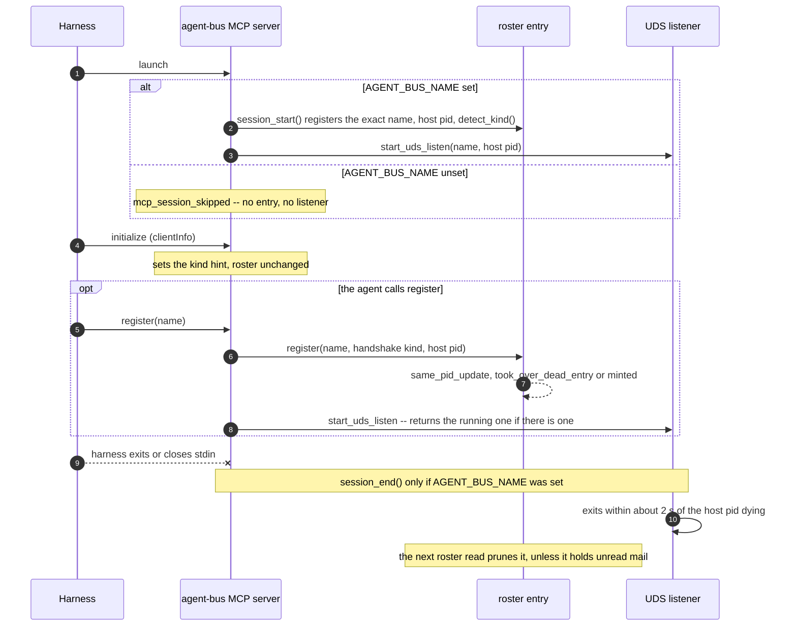

# Identity and peering — what the code does today

## The shape of a session

Six moments, for a peer — the next section is why Claude needs none of them.

1. **It starts.** A harness launches its own MCP server, or nothing does and a
   person drives it by hand.\*
2. **It says who it is.** Either the MCP server's own configuration names it
   (`AGENT_BUS_NAME`), or the agent calls the `register` tool with a name.
   Connecting registers nothing. Claude is the exception: its own session file
   is its identity.
3. **It arms a way to be told.** Not a poll: something that sits open and
   turns each arriving message into an event the harness's own tooling
   already knows how to act on.
4. **Somewhere else, it gets found.** A second agent looks at who is
   reachable, sees this one, and sends to it. Nothing was configured for that
   to work — being present is being addressable.
5. **The notice arrives.** Short: who it's from, and enough of what it's
   about to decide whether to act now. Not the message itself — a receipt
   that one exists.
6. **It goes and reads.** The notice carried what's needed to fetch the one
   thing it refers to, in full, and reply if a reply is owed.

\* `pi` coding harness has no native MCP support without installing a plugin.
   e2e tests drove `pi` through the CLI, until the fixture was culled.

## The asymmetry

Everything from here is current behaviour, written from observed runs and
checked against the code — a description, not a design. Where behaviour is
awkward it is recorded as behaviour, not as a plan.

Claude needs nothing. Native `ListAgents` and `SendMessage` already make a
Claude Code session a full peer — no plugin, no MCP server, no inbox and no
configuration required for that to be true. Whether one is installed anyway is
a separate, harmless choice: it is redundant rather than needed, and Claude's
harness delivers peer messages straight into the conversation either way.

Every other kind of peer needs it. Everything below — the roster, the inboxes,
the MCP tools, the UDS listener — is peer-side machinery whose job is to make a
grok, omp or codex process look like a native Claude peer from the outside.

So the two halves of this document are not symmetric, and should not be read as
though they are.

Claude is on the bus without registering. `store.py::list_agents` merges the
roster with `discover_agents()`, and `adapters/discovery/claude.py::discover`
reads `~/.claude/sessions/<pid>.json` for every live pid. A Claude Code
session therefore appears under the name its own session file carries
(`claude-<pid>` when the file has none). The same merge adds omp sessions from
omp's own files (`adapters/discovery/omp.py`). agent-bus starts no listener
for the `claude` kind (`lifecycle.py::session_start`).

## One bus, two ways in

There is one bus: `AGENT_BUS_HOME` (default `~/.agent-bus`) holds a roster of
live agents and one JSONL inbox per agent. That is the whole of it.

A message can reach an inbox two ways, and once there they are the same thing:

- **Directly** — the `agent-bus` CLI or the MCP tools call `send_message()`.
- **Over UDS** — `~/.claude/sessions/<pid>.json` plus
  `/tmp/cc-socks/<pid>.sock`, the protocol Claude Code's own `ListAgents` /
  `SendMessage` speak, documented in `UDS-protocol.md`. An inbound frame is
  persisted by calling the same `send_message()`, addressed to the same roster
  id, so a reader cannot tell which path a message took.

Do not model these as two buses. The socket is not a parallel channel with its
own inbox; it is how a Claude peer reaches this bus and how a reply from one
finds its way back, since an outbound frame names `uds:<our_sock>` as its
return address. Without a listener there is nowhere for that reply to land, so
a peer without one gets nothing back at all.

That reply is an ordinary `type: user` frame — Claude answering, the same way
it would answer a human, if and when the model chooses to. It is not a
protocol-level delivery receipt: measured directly against both Claude Code
2.1.239 and 2.1.251, a real headless session receiving a cross-session-message
never sent a `peer_message_status` control frame back for it, across a 45s+
window, even though the same session correctly *sent* one when it was on the
receiving end of an inbound frame from us. Confirming a message actually
arrived is possible only if the model replies and says so.

Claude itself reads neither the roster nor the inbox — it only ever sees the
socket, through its own harness.

## How a peer gets an identity

An identity is a roster entry: a name, a kind, a pid and an id. Connecting an
MCP client to `agent-bus mcp` writes none of them. Two things write one:

| trigger | when | name | kind | pid |
|---|---|---|---|---|
| `AGENT_BUS_NAME` in the MCP server's environment | at server start, before `initialize` | that value, verbatim | `detect_kind()`, usually `other` | the host pid, below |
| the `register` tool | when the agent calls it | its `name` argument | the handshake's kind, else its `kind` argument, else `other` | the host pid, below |

To see either decision in a log, run with `AGENT_BUS_LOG_LEVEL=trace` and read
`register_decided`, `session_start_resolved`, `mcp_register_kind_resolved` and
`listener_spawn_decided` (`structured-logging.md`).

### `AGENT_BUS_NAME` set

`mcp_server.py::serve` reads the variable before its read loop starts. When it
is set, `_startup_identity` calls `lifecycle.py::describe` and replaces the
descriptor's name with the variable's value, and `lifecycle.py::session_start`
then:

1. Looks for a live roster entry on the descriptor's pid. If one holds a name
   other than the pid-derived default (`is_still_derived`), the entry keeps
   that name and kind. Otherwise the descriptor's name and kind are used.
2. Calls `store.py::register` under the host pid.
3. Starts the UDS listener (`listener.py::start_uds_listen`) for every kind
   except `claude`, when a pid resolved.

The name is never derived or guessed. The kind is never read from
configuration. `detect_kind()` (`lifecycle.py`) reads the environment: `grok`
if `GROK_HOOK_EVENT` or `GROK_PLUGIN_ROOT` is set, `claude` if
`CLAUDE_PLUGIN_ROOT` or `CLAUDE_PROJECT_DIR` is set, otherwise `other`. These
are the only signals it uses.

The host pid comes from `lifecycle.py::host_pid`: the harness adapter's answer
when the kind has an adapter that resolves one (claude reads the session file
that matches the session id, and only a live pid counts; grok has no pid to
read and returns none), otherwise the parent of the MCP server process. The
parent is the harness.

### `AGENT_BUS_NAME` unset

`serve` writes `mcp_session_skipped`. The connection has no roster entry and no
listener. `self` answers `registered: false`. The server still answers every
tool call, and the `register` tool is the only thing that creates an entry.

### The `register` tool

`mcp_server.py::_call_register` resolves the kind, then the pid, then calls
`commands/agents.py::register`, which calls `store.py::register`.

- **Kind.** The `initialize` handshake sets `_CLIENT_KIND_HINT` from
  `clientInfo.name` and changes nothing on the roster
  (`adapters/lifecycle/__init__.py::identify_mcp_client`):
  `codex-mcp-client` is `codex`, `omp-coding-agent` is `omp`, a name starting
  with `grok-shell` is `grok`. There is no `claude` pattern. When the handshake
  named a kind, `tools/list` omits `kind` from the tool's schema and the call
  uses the handshake's kind. A `kind` argument is ignored, except `claude`,
  which raises. When the handshake named nothing, the kind is the argument, or
  `other` when there is none.
- **Pid.** With a kind, the pid is `host_pid(kind)`, the same rule as above:
  for omp, codex and grok, the parent of the MCP server process. With no kind,
  `commands/agents.py::resolve_host_pid` picks, in order: the pid of the roster
  entry found by walking this process's ancestors (`store.get_self`), the pid of
  a discovered session that is an ancestor of this process, and this process's
  own pid.
- **Listener.** After the entry is written, `_call_register` calls
  `start_uds_listen` for every kind except `claude` when the entry has a pid.
  When a listener for that pid already runs, the call returns it and starts
  nothing.

### What `store.register` decides

`store.py::register` takes one of three branches, and logs it as
`register_decided`.

| `decision` | when | id |
|---|---|---|
| `same_pid_update` | a live entry already holds this pid | kept; the name, kind and cwd are updated, so a second `register` is a rename |
| `took_over_dead_entry` | no live entry holds the pid, and a dead entry has the exact same name and kind | reused, with the entry's inbox and its unread mail |
| `minted` | neither | new |

A dead entry survives only while it holds unread mail
(`store.py::_prune`, `roster_entry_retained`), so a takeover happens only in
that case. A dead entry with no unread mail is deleted at the next roster read,
and a later registration under its name gets a new id.

A name that a live entry already holds is not free. `register` appends `-2`,
`-3` and so on until the name is unused, so a second session started with the
same `AGENT_BUS_NAME` registers as `<name>-2`. A rename keeps the outgoing name
resolving for a short grace period (`_live_former_names`).

### A respawn

A respawn is the same harness starting its MCP server again.

- **Same host pid** (the harness process is still running). `session_start`
  finds the live entry on that pid. If the entry's name is not the pid-derived
  default, the entry keeps it. A name the agent chose with the `register` tool
  therefore stays in place, and `AGENT_BUS_NAME` changes nothing.
- **New host pid.** No live entry holds the pid, so `session_start` registers
  the configured name. A dead entry with that name, that kind and unread mail is
  taken over. A dead entry the agent had renamed to something else is not
  matched. It stays on disk while it holds unread mail, and nothing
  holds its name.

Nothing here carries a name from one pid to another other than the exact
name-and-kind match of `took_over_dead_entry`.

### When a session ends

- `serve` calls `lifecycle.py::session_end` on exit only when `session_start`
  ran for that connection, that is, only when `AGENT_BUS_NAME` was set. It stops
  the listener and calls `store.py::unregister_by_pid`, which keeps an entry that
  holds unread mail (`session_ended_with_unread_mail`).
- A connection that registered through the `register` tool does not run
  `session_end`. Its listener exits within about two seconds of its host pid
  dying (`uds.py::run_listen`: the accept loop checks `is_pid_alive(watch_pid)`
  between 2-second socket timeouts). The next roster read prunes the entry
  (`get_live_roster` calls `prune_dead_roster`), unless the entry holds unread
  mail.



### `other` is a settled kind

`other` says there is an agent, it is addressable, and no adapter can name its
type. Nothing fills it in later. An agent never has to identify its kind to
work: a harness that no adapter recognises is `other`, and it messages Claude
sessions the same way any other kind does.

### omp on the roster

`detect_kind()` does not recognise omp. An MCP server launched by omp inherits
one identifying variable, `PI_NO_TITLE=1`, with no session id and no agent
directory. The handshake names omp instead, so the `register` tool records
`kind: omp`.

Discovery also reports omp, from omp's own daemon-client files
(`adapters/discovery/omp.py`). The registered entry and the discovered record
merge into one row only when `store.py::list_agents` finds the same
`(kind, pid)` on both. No alias links them, because `identify_mcp_client`
returns no session id for omp. When the two pids differ (the daemon client is a
different process than the one that registered), the two stay two rows.

### Claiming a name with the CLI

The MCP `register` tool takes a name, and a kind only for a connection the
handshake could not place. The CLI counterpart is
`agent-bus register --name X --kind K --pid P`. `--kind` is required there,
because there is no handshake to detect it from. `--pid` matters because
`register` defaults to the calling process, and a short-lived `uv run
agent-bus` exits immediately, so the entry would be pruned as dead before the
next command runs. From a shell where no harness claims an ancestor and no
`--pid` is given, the command refuses:
`register failed: cannot tell which process is the session`
(`cli.py::cmd_register`). The CLI starts no listener. `join` and `listen` do.

## An id is an address

An entry's id says *how to reach this agent and how to know it is still there*,
not merely which row it is. Canonical spelling is `<kind>:<space>:<value>`,
where the space is a namespace of identifiers sharing a liveness rule:

| space | example | still there when |
|---|---|---|
| `bus` | `8054898a-70b8-…` | the process that registered is alive |
| `session` | `claude:a4775baa-…` | the harness's process is alive |
| `thread` | `codex:thread:01a01cb8-…` | **always** — a thread is a document, not a process |

There used to be a fourth space, `pid` (`codex:pid:4242`, `omp:tty:900`). It
was retired: its liveness rule was byte-for-byte identical to `bus`'s (both
process-backed, both always mailbox=True), so those two id shapes — legacy,
no adapter mints either any more, but an id already on disk doesn't get to
change shape retroactively — now just parse as an unrecognised space and get
the default rule, which behaves exactly the same as the dedicated space did.
`claude.py` still falls back to a bare `pid:<pid>` when a native session id
is missing, so this is the one shape still actually minted -- the resulting
address, `claude:pid:<pid>`, parses as the unrecognised `pid` space just
like every other legacy one, and gets the same default rule.

Legacy two-part ids (`claude:<sessionId>`) parse as `session` addresses and are
never re-rendered: an inbox filename is derived from the id, so canonicalising
one would move its mailbox out from under it.

### Two different problems, both once called "reconciliation"

`agent-bus list` has to answer two different questions, and conflating them is
what "reconciliation" used to mean here:

- **Discoverability, simultaneous**: right now, one agent can be visible
  through more than one channel at once — a registered roster entry, a
  harness's own session file, a listener's published address — all for the
  same live process. `list_agents()` still merges these into one row: it
  unions the registered roster with everything `discover_agents()` finds,
  matching a discovered record against a registered one by alias or by
  `(kind, pid)`, and folding it in rather than listing it twice. The roster
  entry is authoritative for identity (the name the agent claimed); the
  discovered record is authoritative for what changes moment to moment
  (status, native details) — but only when it actually knows something: an
  adapter with nothing to report says so honestly (`status: "unknown"`)
  rather than guessing, and that must never overwrite a real status a
  registered agent already set.
- **Reconnection, sequential**: a *new* process claiming to be an *old*
  identity — the same harness restarting its MCP connection, a resumed
  session with a new pid. This is `register()`'s job, at registration time,
  not display time. Its same-pid branch already updated a re-registering
  entry in place (renaming it, refreshing `native`, keeping its id and
  inbox) whenever the *same host pid* re-registered. It now has a second
  branch for when the pid changed too: if no live process holds the pid
  being registered, but a *dead* entry under the exact same name **and
  kind** is still on disk (kept only because it still has mail queued — the
  one case `prune_dead_roster` doesn't clean up immediately), that's
  treated as the same identity reconnecting under a new pid, and the
  existing entry is taken over — same id, same inbox — rather than a second
  one being minted. The user-assigned name is the identity axis this
  matches on, regardless of whether it was self-, human-, or
  bridge-assigned; kind is matched too because id also carries
  harness-specific meaning (a discovered-only omp entry's id names its own
  inbox), so a same-named entry of a *different* kind must not be adopted —
  that's coincidence, not a reconnect.

Neither mechanism substitutes for the other: the list-time merge has no
memory across process restarts (a dead entry just disappears from it), and
the register-time reconnect only ever looks at one entry becoming live again
— it does nothing for two live views of the same process that never needed
reconnecting at all.

The register-time side is a floor case, not a full answer: an exact
name-and-kind match, not a fuller lineage-based reconnect (OMP's own session
files carry an array of a session's former ids across a fork/resume, which
would let a *renamed* session still be recognized — not yet wired up). Two
*different* same-kind sessions sharing a user-chosen name (two omp projects
both titled "reviewer") still adopt each other — kind narrows the
mailbox-theft case, it doesn't make the name axis collision-free (#332). A
live collision on the same name (two processes legitimately asserting the
same identity, e.g. a forked session) is now partially handled: the
reconnect branch refuses to adopt a dead entry whose name is already claimed
by a live one, so a collision no longer silently merges two live agents into
one — the second claimant instead gets suffixed to a name it didn't ask for
(`name-2`) by the ordinary fresh-registration path. Nothing here decides
which of the two is "right," and it isn't meant to.

The listener's own published session is a third address on the discoverable
side, still needing its own alias for the same reason: `run_listen` mints
`agentbus:session:<entry-id>` from the entry's own id (not a new field, not a
new discovery branch) so a claim moves the name and the published address
still resolves. `list_agents()`'s merge is what makes that alias load-bearing
— without it, the published address would show as a second row.

## Who a message is from

`store.send_message()` resolves the sender with `get_self()`, which walks the
caller's ancestor pids and matches them against the live roster, falling
through to `session_entry_for_current_process()` -- the same ancestor walk
against *discovery* -- when the sender never registered (#140). An explicit
`from_name` overrides both and is used by the CLI.

That override reaches the durable copy every send writes, but not necessarily
the live wire. `adapters/transport/claude.py`'s `send()` takes a `from_name`
parameter and never uses it — it calls `send_peer_message(sock, text)`, which
builds the Claude-facing envelope from the sender's own published session
name (`_advertised_name`), not the caller's claimed one. Sending to a Claude
peer with an explicit `--from-name` therefore produces two different
records of who sent it: the live conversation Claude reads shows the
sender's real published name, while the durable copy this command also
writes records whatever `from_name` was passed.

The `send_message` tool's schema never listed `from_name` as a parameter, but
`_call_send` used to read it from the call anyway, so an RPC call with an
unadvertised `from_name` succeeded and the inbox recorded that claimed name —
verified directly. Absence from the schema is not the same as it being
rejected, and `_call_send` no longer reads it at all: an MCP client cannot
assert an identity, full stop (#156).

If nothing matches at all -- no roster entry, no discovered session -- the
sender is `anonymous` with a random id, which is delivered but unaddressable
since there is no name to reply to. In practice this means no harness on the
machine at all, since every harness this project talks to publishes some
form of discoverable session.

## Whose mailbox a read reaches

Addressing who a message is *from* and addressing *whose mailbox a read
reaches* are different questions, and `get_inbox`/`read_message`/
`ack_message` used to answer the second one wider than they should have --
their MCP schemas all carried a `name`, and nothing about it was self-only.
Any MCP client could read or ack any registered agent's mail, just by
naming the real recipient: the read-side sibling of #156, the same gap in
the other direction.

Retired entirely rather than validated. `agent-bus mcp` is one stdio
process per session (`serve()` runs until stdin closes), so the calling
session is the only mailbox these tools can mean. The parameter only let a
caller override that answer. `_call_inbox`/`_call_read`/`_call_ack` do not
read it, so these three tools only ever answer for the calling session -- a
call that still sends `name` is answered as if it had not been.

The CLI keeps `--target` on `inbox`/`read`/`ack`/`watch`, deliberately
asymmetric: a human at a shell already has raw filesystem access to every
mailbox under `AGENT_BUS_HOME`, so `--target` grants nothing there that is
not already true. An MCP client can have no other access to the machine at
all, which is what made the schema's `name` a real privilege escalation
rather than a convenience. `--target` rather than `--address`: `address`
already names two other, formal things here -- `address.py`'s
`<kind>:<space>:<value>` and `agent_bridge`/cloud's `<kind>:<name>` -- and
this is a third, different shape (a bare peer name or id). `send`'s
positional was already called `target` for exactly this concept.

## The UDS listener

An MCP server starts a detached listener for **every kind except claude**
(Claude sessions already have their own socket), from `session_start()` when
`AGENT_BUS_NAME` is set and from the `register` tool otherwise. The listener:

- binds `/tmp/cc-socks/<listener_pid>.sock`
- publishes `~/.claude/sessions/<listener_pid>.json` with `agentBus: true` and
  a `sessionId` that is the roster entry's own id, plus a `0600` `.key` holding
  a `peerToken`
- registers `agentbus:session:<entry-id>` as an alias, so the address it just
  published resolves to the entry that published it
- adopts the host's existing roster entry when started with `--pid` and that
  host has already registered, so one peer has one identity. With no such
  entry it registers itself — a listener starting anonymous is normal, not a
  fault
- writes `listeners/<host_pid>.pid` under `AGENT_BUS_HOME`, containing the
  **listener's** pid

That publication is what makes a non-Claude peer appear in Claude's native
`ListAgents`.

Ordering: the socket is bound before the session file is written, so identity
comes from `register()` and a bind failure cannot leave a stale registration.
There is therefore a brief window where the socket exists and the session file
does not.

`session_end()` stops the listener for every kind that gets one, and unregisters
by pid -- through `unregister_by_pid`, which is the same mail-preserving path
`prune_dead_roster` uses: an entry with unread mail is kept, addressable but
off the live roster. `serve()` calls it on exit only when it called
`session_start()`, so a connection that registered through the `register` tool
never runs it. Its listener exits when its host pid dies, and the next roster
read prunes the entry.

The explicit CLI `unregister`, and `leave` (the counterpart to `join`), do not
go through that path. Both call `store.unregister` directly by name and
remove the roster row unconditionally, which can orphan its inbox -- there is
no unread-mail check here the way there is on the pid-based teardown above.

## Delivery, in each direction

**Claude → peer.** Native `SendMessage` to the peer's name. The frame reaches the
listener, which persists it into the peer's file inbox and acks on a separate
dial-back connection. The peer receives it the same way as any other inbound
mail — see *Receiving a message*, below.

**Peer → Claude.** `agent-bus send <name> -m ...`, routed to the claude
transport by the target's kind, which dials the target's
socket over UDS; the message arrives in the Claude session's conversation.
This requires the sending peer to have a listener of its own, because the
outbound frame carries its socket as the reply address. An MCP server starts
one for every non-claude kind with a pid: at server start when
`AGENT_BUS_NAME` is set (`session_start()`), and on a `register` tool call
otherwise. `listen`, `join`, and a bridge process each publish one directly,
with no MCP server involved. A run with none of these has no listener, and the
send fails with `[send-peer] err: cannot determine our listen socket`: a
claude-kind peer (excluded on purpose -- Claude already has its own socket), a
descriptor resolved with no pid, an MCP connection that has neither
`AGENT_BUS_NAME` nor a `register` call, or a peer that only ever ran the CLI
`register`, which starts no listener of its own.

The file-bus `send_message` tool reaches a Claude conversation too. It is the
same router: `commands.messages.send` picks the transport from the target's
kind, so a Claude recipient gets the UDS delivery above and a file-inbox peer
gets a file inbox. One code path, which is the point of the bus. (This document
previously said the opposite; it was true before every peer got a mailbox.)

## Receiving a message

Everything above says where a message ends up. This is how a peer notices —
step 3 and step 5 of *The shape of a session*, made concrete.

A peer does not poll for mail. It arms a standing watch once, piped into
whatever its harness gives an agent for "run this and tell me when it says
something" — a monitor tool, a supervised process, `hub` on omp. Per-harness
specifics are in `harness-compatibility.md`; the mechanism itself is one
command, `agent-bus watch`.

What arrives on that watch is a **notice**, never the message: who it's from,
and enough of the summary to judge urgency, in one line. The body is
deliberately not there — a line long enough to carry it would blow most
monitor tools' per-line limit, and say nothing a fetch couldn't. The peer takes
the id the notice carried and fetches that one message, whole: `read` on the
CLI, `read_message` over MCP.

Claude needs none of this — its harness delivers a peer's message straight
into the conversation, per *The asymmetry*. Watching is what every other kind
of peer does instead of being pushed to.

Watching is what removes the user from the loop. A coding agent without one
only notices mail when told to look — the same manual-courier role a user
already plays for a desktop peer over `agent-bridge`, which has no loop of its
own and has to be told "you've got mail" by hand (`running-the-bridge.md`). A
coding agent does not have that excuse: arming a watch is what turns delivery
near-real-time instead of a chat window someone has to remember to check.

`get_inbox`/`agent-bus inbox` still works cold, with no watch armed — reading
without watching is degraded, not wrong, and worth knowing works. But it is
the desktop peer's shape, adopted by choice rather than forced by the harness.

## Lifetime

Presence and mail have different lifetimes, and conflating them cost real
messages. The roster is pruned of dead pids on read, so a peer stops being
*live* the moment its process exits — but **its mail is not thrown away with
it**. An entry with unread messages is kept, because the entry is the only
pointer to the mailbox, and deleting it on exit meant a reply to an agent that
had just exited failed with `no such agent` while the queued mail became
unreachable.

Delivery to a peer that is not live is refused at the sender with
`Receiver Unavailable`, rather than filing into an inbox nobody will drain.
Reading is deliberately not gated the same way: mail already on disk stays
readable.

For a single-turn peer such as `omp -p`, a reply still has to arrive while the
peer is running for the peer to *act* on it. What changed is that the message
survives instead of vanishing — retained against the entry it arrived at.

That is not the same as surviving to the peer's *next run*. A fresh invocation
that registers the exact name and kind of a dead entry still holding unread
mail takes that entry over: same id, same mailbox (`store.py::register`, see
*Reconnection, sequential*). A fresh invocation under any other name registers
a new entry with an empty mailbox. The old mail then stays with the retained
entry, unreached unless something addresses that entry directly.

## Starting a listener by hand

An implementation detail, kept here for debugging. It is not how an MCP peer
joins the bus: `agent-bus mcp` starts a listener itself, at server start when
`AGENT_BUS_NAME` is set and on a `register` tool call otherwise.

Why to bother: **a listener is what lets this peer send *to* Claude**, not just
receive from it — an outbound frame carries the sending peer's own socket as
the reply address, and a peer with no listener cannot be dialed back for the
ack (see *Delivery, in each direction*, above). Running one by hand is for
debugging that path without a real harness attached.

```sh
agent-bus listen --name my-bus --pid <host-pid>
```

`listen` registers its own entry, so there is no separate `register` step. A
standalone `agent-bus register` from a bare shell, with nothing to resolve an
ancestor session's pid, refuses rather than registering: `register failed:
cannot tell which process is the session`, naming `--pid $PPID` as the fix. A
peer registered with an explicit, live `--pid` is kind `other`, because
nothing in a bare shell identifies a harness.

To watch the path end to end, run it under the test overrides
(`AGENT_BUS_HOME`, `AGENT_BUS_SOCK_DIR`, `AGENT_BUS_SESSIONS_DIR`). A Claude
Code session's `/list-agents` then shows the peer, and anything sent from there
lands in the inbox.

## Known rough edges

Recorded as observed, not as a to-do list.

- `detect_kind()` (self-identification: "what harness is *this process*",
  read from environment variables, and used only when `AGENT_BUS_NAME` is set)
  recognises only grok and claude, so a harness that sets neither is `other`
  on that path. The `register` tool path takes its kind from the `initialize`
  handshake instead, which names omp, codex and grok. This is a completely
  different mechanism from *discovery* (`adapters/discovery/*`: "scan known
  harness data to find *other* live sessions on the machine"), which does
  cover omp and claude — a harness can be fully discoverable while never
  self-identifying via `detect_kind()`, because discovery never requires the
  discovered process to have gone through MCP startup at all.
- Presence still depends on a process. A peer that is down is refused at the
  sender rather than queued, so the bus holds mail for an agent that *was*
  there but cannot accept mail for one that has never been.
