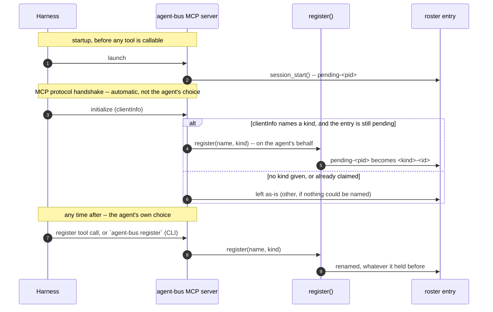

# Identity and peering — what the code does today

## The shape of a session

Six moments, for a peer — the next section is why Claude needs none of them.

1. **It starts.** A harness launches its own MCP server, or a hook fires, or
   nothing does and a person drives it by hand.\*
2. **It says who it is.** The harness's own environment already carries an
   identity — a session id, a working directory — and that becomes an address
   on the bus without anything being typed. A harness that never says
   anything explicit still gets one, provisional until it does.
3. **It arms a way to be told.** Not a poll: something that sits open and
   turns each arriving message into an event the harness's own tooling
   already knows how to act on.
4. **Somewhere else, it gets found.** A second agent looks at who is
   reachable, sees this one, and sends to it. Nothing was configured for that
   to work — being present is being addressable.
5. **The notice arrives.** Short: who it's from, and enough of what it's
   about to decide whether to act now. Not the message itself — a receipt
   that one exists.
6. **It goes and reads.** The notice carried what's needed to fetch the one
   thing it refers to, in full, and reply if a reply is owed.

\* `pi` coding harness has no native MCP support without installing a plugin.
   e2e tests drive `pi` through the CLI.

## The asymmetry

Everything from here is current behaviour as of 2026-08-26, written from
observed runs — a description, not a design. Where behaviour is awkward it is
recorded as behaviour, not as a plan.

Claude needs nothing. Native `ListAgents` and `SendMessage` already make a
Claude Code session a full peer — no plugin, no MCP server, no inbox and no
configuration required for that to be true. Whether one is installed anyway is
a separate, harmless choice: it is redundant rather than needed, and Claude's
harness delivers peer messages straight into the conversation either way.

Every other kind of peer needs it. Everything below — the roster, the inboxes,
the MCP tools, the UDS listener — is peer-side machinery whose job is to make a
grok, omp or codex process look like a native Claude peer from the outside.

So the two halves of this document are not symmetric, and should not be read as
though they are.

## One bus, two ways in

There is one bus: `AGENT_BUS_HOME` (default `~/.agent-bus`) holds a roster of
live agents and one JSONL inbox per agent. That is the whole of it.

A message can reach an inbox two ways, and once there they are the same thing:

- **Directly** — the `agent-bus` CLI or the MCP tools call `send_message()`.
- **Over UDS** — `~/.claude/sessions/<pid>.json` plus
  `/tmp/cc-socks/<pid>.sock`, the protocol Claude Code's own `ListAgents` /
  `SendMessage` speak, documented in `UDS-protocol.md`. An inbound frame is
  persisted by calling the same `send_message()`, addressed to the same roster
  id, so a reader cannot tell which path a message took.

Do not model these as two buses. The socket is not a parallel channel with its
own inbox; it is how a Claude peer reaches this bus and how acks return, since
an outbound frame names `uds:<our_sock>` as its return address. A peer without a
listener cannot be acked at all.

Claude itself reads neither the roster nor the inbox — it only ever sees the
socket, through its own harness.

## How a peer gets an identity

`lifecycle.session_start()` runs when the MCP server starts. agent-bus ships no
hook of its own — `agent-bus hook session-start` calls the same function for a
harness that has hooks and no MCP, but nothing installs it. It:

1. `detect_kind()` — `grok` if `GROK_HOOK_EVENT` or `GROK_PLUGIN_ROOT` is set,
   `claude` if `CLAUDE_PLUGIN_ROOT` or `CLAUDE_PROJECT_DIR` is set, otherwise
   `other`. These are the only signals used.
2. `host_pid()` — for grok, the pid from `~/.grok/active_sessions.json`; for
   claude, the pid from the matching `~/.claude/sessions/*.json` **if that pid is
   alive**; otherwise `os.getppid()`.
3. `derive_name()` — `<kind>-<first 8 chars of session id>`, or `<kind>-<pid>`
   when there is no session id. Grok sessions additionally take their session
   title as the name when one exists.
4. `register()` on the file bus under the host pid.

**omp is not detected.** An MCP server launched by omp inherits exactly one
identifying variable, `PI_NO_TITLE=1`. There is no session id and no agent dir,
so `detect_kind()` returns the fallback.

It still ends up `omp` on the roster — from the other side. Discovery reads
omp's own daemon-client files directly and reports `kind: omp` without needing
any of the above, and the two records reconcile into one row (**Aliases**,
below). Registration cannot see omp; discovery never had to.

### `pending` and `other` are different facts

They shared one word until they were split, and the word hid a bug.

| kind | means | changes later? |
|---|---|---|
| `pending` | nobody has connected and identified themselves **yet** | yes — it exists to be replaced |
| `other` | there **is** an agent, it is addressable, and no discovery adapter can name its type | no — this is a settled answer |

`other` is a positive claim, not a gap. An agent never has to identify its kind
to work: pi is `other` and always will be, and it messages Claude sessions
perfectly well. Nothing may treat `other` as something to fill in later.

`pending` is what the MCP server registers as, because at that moment it
genuinely knows nothing — the harness passes its MCP child no identifying
environment at all. The name is `pending-<pid>`.

**`initialize` is not something an agent calls.** It is the MCP protocol's own
connection handshake — every MCP client sends it automatically, before any
tool becomes callable, and agent-bus does not define it. What agent-bus hooks
into that moment is this: if the handshake's `clientInfo` names a kind, the
server calls the *same* `register()` an agent calls itself, on the agent's
behalf, using that name. `register` is the one real mechanism; the handshake
is one of two ways it gets invoked, and it is the one the agent never chose.



Why the split matters: the automatic call upgrades a peer *only* from the
unclaimed state. While that state was spelled `other`, the guard could take a
correct kind off a peer that had one — a pi peer running the MCP server would
have been overwritten.

### Claiming a name

The MCP surface has a `register` tool (name, kind) — the deliberate path in the
diagram above. It re-registers under the pid `session_start()` already claimed,
so it renames that entry rather than adding a second one, and it rewrites the
published session file so the socket advertises the same name. An agent that
never calls it keeps whatever the handshake settled on automatically — its
harness's kind if `clientInfo` named one, `other` if it connected and could not
be placed.

The CLI equivalent is `agent-bus register --name X --kind K --pid P`. `--pid`
matters: `register()` defaults to the calling process, and a short-lived
`uv run agent-bus` exits immediately, so the entry is pruned as dead before the
next command runs.

## An id is an address

An entry's id says *how to reach this agent and how to know it is still there*,
not merely which row it is. Canonical spelling is `<kind>:<space>:<value>`,
where the space is a namespace of identifiers sharing a liveness rule:

| space | example | still there when |
|---|---|---|
| `bus` | `8054898a-70b8-…` | the process that registered is alive |
| `session` | `claude:a4775baa-…` | the harness's process is alive |
| `pid` | `codex:pid:4242`, `omp:tty:900` | that process is alive |
| `thread` | `codex:thread:01a01cb8-…` | **always** — a thread is a document, not a process |

Legacy two-part ids (`claude:<sessionId>`) parse as `session` addresses and are
never re-rendered: an inbox filename is derived from the id, so canonicalising
one would move its mailbox out from under it.

### Aliases: the same agent, two addresses

An agent registers under a `bus` uuid *and* is separately discovered under its
harness's `session` address. With nothing linking the two, `agent-bus list`
showed one Claude session twice, under two different names — a registered
`claude-a4775baa` and a discovered `exo-ledger`, both pid 58291.

`session_start` now records the harness address as an alias, so the two
reconcile into one row. Entries written before aliases existed are reconciled
retroactively by matching `(kind, pid)`. That comparison deliberately ignores
`procStart`: session files publish `Fri Aug 21 20:16:00 2026` while
`ps -o lstart=` gives `Sun 23 Aug 21:21:13 2026` — two formats under one field
name, so comparing them yields silent false negatives.

When a merge happens the roster entry wins on identity — id, name and kind, the
identity the agent claimed on the bus. The discovered record supplies `status`,
which is the thing that changes moment to moment, and **fills gaps** in
`native`: the merge is `{**discovered, **roster}`, so the roster wins any key
the two both hold.

There is a third address, and it used to be a duplicate: the listener's own
published session. `session_start` records the *harness's* address as an alias
but nothing recorded this one, so a peer registered under its host pid — every
MCP harness — was listed once as itself and once as its own socket.

`run_listen` now records it the same way, with the same `address.mint` call:
it publishes `sessionId` as the entry's own id and registers
`agentbus:session:<entry-id>` as an alias. No new field in the session file and
no new branch in discovery — the address is minted from the entry id, which
`register()` keeps across a rename, so a claim moves the name and the published
address still resolves.

## Who a message is from

`store.send_message()` resolves the sender with `get_self()`, which walks the
caller's ancestor pids and matches them against the live roster. An explicit
`from_name` overrides it and is used by the CLI. The MCP `send_message` tool does
not expose `from_name`, so a peer cannot assert another peer's identity.

If nothing matches, the sender is `anonymous` with a random id — which is
delivered but unaddressable, since there is no name to reply to.

## The UDS listener

`session_start()` starts a detached listener for **every kind except claude**
(Claude sessions already have their own socket). The listener:

- binds `/tmp/cc-socks/<listener_pid>.sock`
- publishes `~/.claude/sessions/<listener_pid>.json` with `agentBus: true` and
  a `sessionId` that is the roster entry's own id, plus a `0600` `.key` holding
  a `peerToken`
- registers `agentbus:session:<entry-id>` as an alias, so the address it just
  published resolves to the entry that published it
- adopts the host's existing roster entry when started with `--pid` and that
  host has already registered, so one peer has one identity. With no such
  entry it registers itself — a listener starting anonymous is normal, not a
  fault
- writes `listeners/<host_pid>.pid` under `AGENT_BUS_HOME`, containing the
  **listener's** pid

That publication is what makes a non-Claude peer appear in Claude's native
`ListAgents`.

Ordering: the socket is bound before the session file is written, so identity
comes from `register()` and a bind failure cannot leave a stale registration.
There is therefore a brief window where the socket exists and the session file
does not.

`session_end()` stops the listener for every kind that gets one, and unregisters
by pid.

## Delivery, in each direction

**Claude → peer.** Native `SendMessage` to the peer's name. The frame reaches the
listener, which persists it into the peer's file inbox and acks on a separate
dial-back connection. The peer receives it the same way as any other inbound
mail — see *Receiving a message*, below.

**Peer → Claude.** `agent-bus send <name> -m ...`, routed to the claude
transport by the target's kind, which dials the target's
socket over UDS; the message arrives in the Claude session's conversation.
This requires the sending peer to have a listener of its own, because the
outbound frame carries its socket as the reply address. The listener only exists
while the peer's MCP server is running — a run that never touches an MCP tool has
no listener, and the send fails with
`[send-peer] err: cannot determine our listen socket`.

The file-bus `send_message` tool reaches a Claude conversation too. It is the
same router: `commands.messages.send` picks the transport from the target's
kind, so a Claude recipient gets the UDS delivery above and a file-inbox peer
gets a file inbox. One code path, which is the point of the bus. (This document
previously said the opposite; it was true before every peer got a mailbox.)

## Receiving a message

Everything above says where a message ends up. This is how a peer notices —
step 3 and step 5 of *The shape of a session*, made concrete.

A peer does not poll for mail. It arms a standing watch once, piped into
whatever its harness gives an agent for "run this and tell me when it says
something" — a monitor tool, a supervised process, `hub` on omp. Per-harness
specifics are in `harness-compatibility.md`; the mechanism itself is one
command, `agent-bus watch`.

What arrives on that watch is a **notice**, never the message: who it's from,
and enough of the summary to judge urgency, in one line. The body is
deliberately not there — a line long enough to carry it would blow most
monitor tools' per-line limit, and say nothing a fetch couldn't. The peer takes
the id the notice carried and fetches that one message, whole: `read` on the
CLI, `read_message` over MCP.

Claude needs none of this — its harness delivers a peer's message straight
into the conversation, per *The asymmetry*. Watching is what every other kind
of peer does instead of being pushed to.

Watching is what removes the user from the loop. A coding agent without one
only notices mail when told to look — the same manual-courier role a user
already plays for a desktop peer over `agent-bridge`, which has no loop of its
own and has to be told "you've got mail" by hand (`running-the-bridge.md`). A
coding agent does not have that excuse: arming a watch is what turns delivery
near-real-time instead of a chat window someone has to remember to check.

`get_inbox`/`agent-bus inbox` still works cold, with no watch armed — reading
without watching is degraded, not wrong, and worth knowing works. But it is
the desktop peer's shape, adopted by choice rather than forced by the harness.

## Lifetime

Presence and mail have different lifetimes, and conflating them cost real
messages. The roster is pruned of dead pids on read, so a peer stops being
*live* the moment its process exits — but **its mail is not thrown away with
it**. An entry with unread messages is kept, because the entry is the only
pointer to the mailbox, and deleting it on exit meant a reply to an agent that
had just exited failed with `no such agent` while the queued mail became
unreachable.

Delivery to a peer that is not live is refused at the sender with
`Receiver Unavailable`, rather than filing into an inbox nobody will drain.
Reading is deliberately not gated the same way: mail already on disk stays
readable.

For a single-turn peer such as `omp -p`, a reply still has to arrive while the
peer is running for the peer to *act* on it. What changed is that the message
survives to be read on its next run instead of vanishing.

## Starting a listener by hand

An implementation detail, kept here for debugging. It is not how a peer joins
the bus and should not be read as a procedure to follow: `session_start()` does
that, when `agent-bus mcp` starts, and it is also what detects the kind.

Why to bother: **a listener is what lets this peer send *to* Claude**, not just
receive from it — an outbound frame carries the sending peer's own socket as
the reply address, and a peer with no listener cannot be dialed back for the
ack (see *Delivery, in each direction*, above). Running one by hand is for
debugging that path without a real harness attached.

```sh
agent-bus listen --name my-bus --pid <host-pid>
```

`listen` registers its own entry, so there is no separate `register` step. A
standalone `agent-bus register` from a shell is a wrong turn worth naming: it
claims the pid of the command, the command exits, and the dead entry is pruned
on the next `list`. A peer started this way is kind `other`, because nothing in
a bare shell identifies a harness.

To watch the path end to end, run it under the test overrides
(`AGENT_BUS_HOME`, `AGENT_BUS_SOCK_DIR`, `AGENT_BUS_SESSIONS_DIR`). A Claude
Code session's `/list-agents` then shows the peer, and anything sent from there
lands in both the capture file and the inbox.

## Known rough edges

Recorded as observed, not as a to-do list.

- A peer's identity depends on its MCP server being alive; nothing registers it
  otherwise.
- `detect_kind()` recognises only grok and claude, so every other harness is
  `pending` until the `initialize` handshake places it, and `other` if that
  handshake cannot.
- Presence still depends on a process. A peer that is down is refused at the
  sender rather than queued, so the bus holds mail for an agent that *was*
  there but cannot accept mail for one that has never been.
