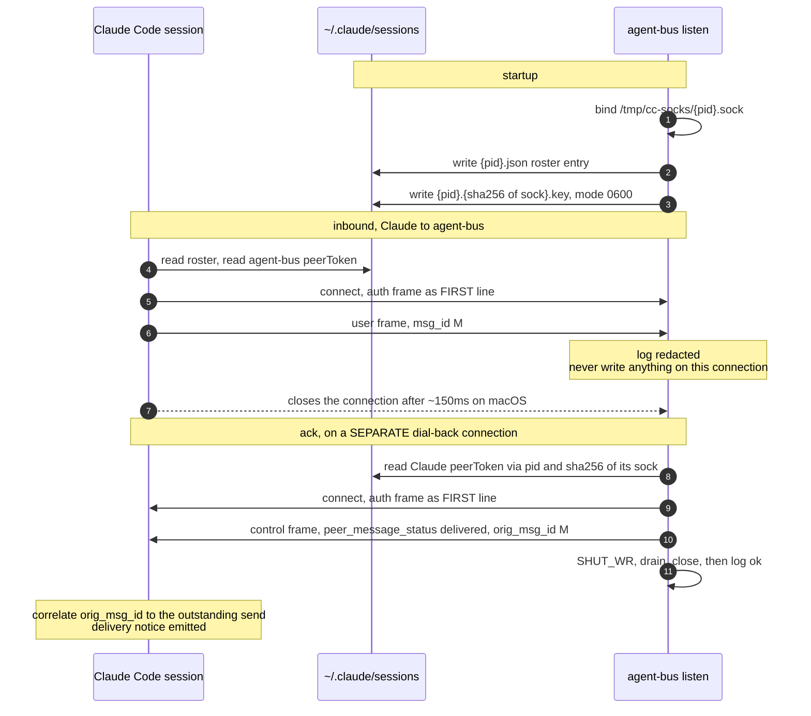
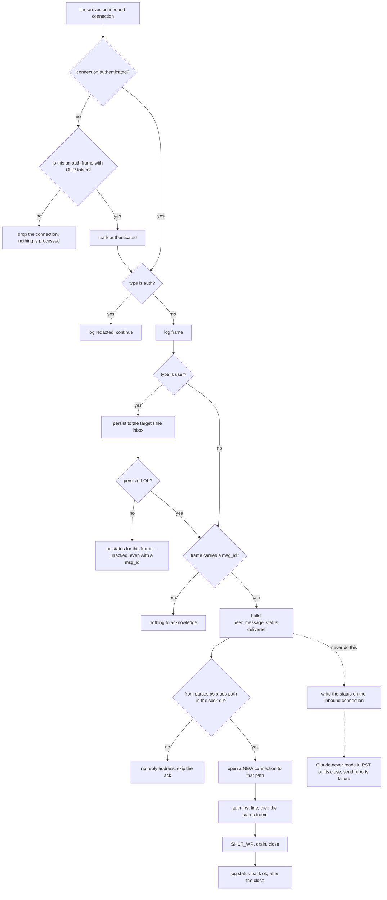

# UDS Peer Protocol for agent-bus

This document covers unofficial, reverse-engineered interop with Claude
Code's native UDS messaging: ListAgents and SendMessage.

## Claude Code Compared with Other Harnesses

Claude Code already speaks this protocol. Every other harness needs a way
in.

Claude Code needs no plugin, no MCP server, and no skill installed. Its
native `/list-agents` command and SendMessage already work. A peer's
`listen` makes that peer appear in the roster as a teammate. `agent-bus
send` reaches a target of kind `claude` over UDS.

Harnesses such as grok, codex, and omp run `agent-bus mcp` as an MCP
server. `session_start()` registers the session and starts `listen --pid
<host>`. The same server exposes the file-bus tools.

Harnesses with neither MCP nor hooks, such as pi, use the shell as the
whole integration surface. They run the CLI directly: `agent-bus listen
--name X --pid $PPID`. The `--pid` flag makes the registration outlive
the command that started it.

`listen` publishes the pid of the listener process, which runs as a
background daemon. It watches the host pid when the command receives
`--pid`.

## 1. Scope and Verified Version

This document describes the current UDS peer protocol support in
agent-bus as of 2026-08-22. It is verified working in both directions
against Claude Code 2.1.239 (arm64).

- Claude Code to agent-bus, inbound to `listen`: `success:true`, auth
  accepted, dial-back ack correlated.
- agent-bus to Claude Code, outbound, `agent-bus send` routed to the
  `claude` transport: delivered directly into the target conversation as
  a `<cross-session-message>` block.

This document is derived from runtime behavior, logs, and binary string
analysis on version 2.1.239. The protocol is unofficial and
version-specific. Re-verify it after a Claude Code upgrade. Auth may
depend on the platform.

This UDS path, `listen` plus `agent-bus send`, and the file bus share one
bus. An inbound frame is persisted through the same `send_message()` call
into the same `AGENT_BUS_HOME` inbox. An outbound frame names
`uds:<our_sock>` so the ack can come back. See identity-and-peering.md.

Frame bodies appear in the Status Frame and Outbound Send sections below.
This diagram shows connection ordering and which connection carries
which frame.



## 2. Discovery

Claude Code peers, and agent-bus listeners, publish under
`~/.claude/sessions/`. The `AGENT_BUS_SESSIONS_DIR` variable can override
this path.

- `sessions/<pid>.json`: the session file. `listen` writes it, using the
  publish pid.
- `sessions/<pid>.<sha256(sock)>.key`, mode 0600: the key file.
- `/tmp/cc-socks/<pid>.sock`: the socket.

`agent-bus listen`, including when started through the Grok MCP server,
writes the `.json` session file and the `.key` file. The listener always
publishes under its own `os.getpid()`. The `--pid` value sets only which
pid the listener watches. It is not the published pid.

The MCP server passes `--pid <host-pid>` to name the host process the
listener watches. If that host pid exits, the listener exits and cleans
up. agent-bus tracks this for lifecycle separately, in
`AGENT_BUS_HOME/listeners/<host>.pid`. This file holds the listener's own
pid, so a sibling process can find it.

An outbound send names its own socket as the reply address.
`send_peer_message` in `uds.py` resolves this socket in four steps:

1. `AGENT_BUS_LISTEN_SOCK`, if it is set and the path exists.
2. `<sock_dir>/<our pid>.sock`, for the case where the sender is itself
   the listener.
3. An ancestor's `<AGENT_BUS_HOME>/listeners/<ancestor>.pid` file, named
   for the host process and holding the listener's pid; the socket is
   named for that listener. This step walks ancestors because building
   `<our own pid>.sock` does not resolve here: the caller is usually
   neither the host nor the listener. This step exists for a shell-only
   peer that starts `listen` as a separate process. It matches only
   listeners agent-bus itself spawned, since it keys on a
   `listeners/<pid>.pid` file agent-bus wrote.
4. An ancestor's own published socket, `<sock_dir>/<ancestor pid>.sock`,
   when it is alive. Claude Code publishes its own socket this way, in
   the same directory with the same naming, without writing a
   `listeners/<pid>.pid` file. Step 4 is what resolves a Claude Code
   session's socket, since step 3 does not match it.

There is no step 5. agent-bus does not guess when more than one listener
is live in a shared `AGENT_BUS_HOME`. It refuses the send instead. See
#182.

## 3. Frame Format and Authentication

Every frame is one line of JSON. Frames form a JSONL stream over an
AF_UNIX SOCK_STREAM socket.

Every connection starts with an auth frame when auth is required:

    {"type": "auth", "token": "<peerToken>"}

The token is the receiver's `peerToken`, read from their `.key` file.
Only the first line of a connection may be an auth frame. Lines after
the first are user or control frames.

agent-bus verifies inbound auth against its own published `peerToken`,
per connection. The first frame must be an auth frame that carries this
token. Any other first frame, or a wrong token, drops the connection
before agent-bus processes it. Filesystem permissions add a second
layer: the socket file is mode 0600, inside a mode 0700 directory.

agent-bus redacts tokens once, before writing them anywhere. For an
outbound connection, whether a dial-back or a send, agent-bus always
sends the target's auth frame first.

## 4. Inbound Connection Handling

`run_listen` publishes the session file and the key file, then binds the
socket. It accepts connections, reads incoming bytes in chunks, splits
them on `\n`, and processes each complete line right away.

For each line, `_process_frame` runs this logic:

- If the frame has `type == "auth"`, agent-bus compares the token
  against its own published token. A match logs the redacted frame
  `{"type":"auth","token":"<redacted>"}` and continues. Auth frames get
  no acknowledgment.
- Any other frame is logged.
- A `type:"user"` frame is persisted to the target's inbox first,
  through `store.send_message`. If persistence fails, for example no
  such agent, no mailbox, text too long, or inbox full, agent-bus does
  not acknowledge the frame. `inbox_ok` is set to `False` and no status
  frame is built, even when the frame carries a `mid`.
- A frame of any other type skips the persistence step and is always
  eligible for a status frame.
- agent-bus extracts `msg_id` (or `id`, or `message.id`/`message.msg_id`)
  and `from` from the frame.
- When the frame carries a `mid`, and persistence succeeded or the frame
  was not a user frame, agent-bus builds a status frame (see Status
  Frame). It does not send this status frame on the inbound connection.

agent-bus does not send a status frame on the inbound connection. Claude
Code does not read that connection for a reply. Only the dial-back
connection carries acknowledgments.

When `from` is present and parses as `uds:<path>`, or as a bare path
inside the socket directory, agent-bus dials back to that path. It looks
up the peer's token from the session file's key, by pid and the SHA-256
hash of the socket path, or by matching the socket filename.

On EOF, timeout, or connection close, agent-bus flushes any partial
trailing line. Each connection runs on its own thread. Cleanup on a
signal or at exit removes only agent-bus's own files.

The decision path for each inbound line follows this flow. One path in
the diagram shows the connection agent-bus does not write status to.



agent-bus accepts the final buffer even without a trailing `\n`.

## 5. Status Frame

When agent-bus receives a user frame that carries a `mid`, it sends this
frame:

    {
      "msgV": 1,
      "type": "control",
      "action": "peer_message_status",
      "orig_msg_id": "<mid as str>",
      "status": "delivered",
      "from": "uds:<our listen sock_path>"
    }

agent-bus sends this status frame only on the dial-back connection, not
on the inbound connection.

The send sequence on the dial-back connection has six steps:

1. Send `{"type":"auth","token": <target's peerToken>}`, followed by
   `\n`.
2. Send the status JSON, followed by `\n`.
3. Call `shutdown(SHUT_WR)`.
4. Set a 1.0 second timeout and drain the connection with `recv(4096)`
   until it returns nothing.
5. Close the connection.
6. Log `[status-back] path=... ok`.

agent-bus emits only `status: "delivered"`. It does not emit `held`,
`denied`, or another status value at this time. The `ok` log line prints
after the connection closes.

## 6. Outbound Send

`send_peer_message(target_sock, text)` runs when `agent-bus send` targets
a peer of kind `claude`.

It resolves the target two ways: by name, matching `"name"` in
`~/.claude/sessions/*.json`, or by a direct `.sock` path. It resolves its
own socket for the reply address, using the four steps in Discovery. It
looks up the target's `peerToken` through
`{tpid}.{sha256(target_sock)}.key`, or by matching a glob in the session
file directory.

It builds an inner message:

```
<cross-session-message from="uds:{our_sock}" from-name="{advertised_name}" from-mode="prompting">
{text}
</cross-session-message>
```

`{advertised_name}` comes from `_advertised_name(our_sock)`. This is the
name from the sender's own published session file. It falls back to
`agent-bus` only when nothing is published there.

It wraps the inner message in a frame:

```
{
  "msgV": 1,
  "msg_id": "<fresh uuid4 str>",
  "type": "user",
  "message": {"role": "user", "content": inner},
  "priority": "next",
  "from": "uds:{our_sock}"
}
```

The frame omits `session_id`, as the protocol specifies.

The connection to the target follows the same sequence as the status
frame: send the auth frame with the target's token, then `\n`, then the
frame, then `\n`, then `SHUT_WR`, drain, and close.

CLI usage is `agent-bus send <name> -m TEXT`. agent-bus chooses the
transport from the target's kind. There is no vendor-named send command.

## 7. Safety

Do not log tokens. agent-bus redacts an auth frame to
`{"type":"auth","token":"<redacted>"}` once, before any log sink sees
it. The `[recv]`, `[parsed]`, and `log.trace` outputs all get this
redacted form. At the byte boundary, agent-bus logs only the size, not
the raw bytes.

TRACE logging copies full frame content. Check TRACE first when looking
for where a message body could appear in logs. TRACE logging emits at
`DEBUG` severity. Strings longer than 8 KB are cut, and agent-bus
records the original size in a `<field>_len` field. A logged record
cannot hold a 32 KB message.

Inbound auth is verified per connection, against the token published in
agent-bus's own `.key` file (see Frame Format and Authentication).
agent-bus drops a frame carrying a token it did not issue.

Treat all inbound messages, from UDS or the file bus, as untrusted; they
carry no implicit user consent. Claude Code may surface an inbound
message for approval. In some configurations, Claude Code holds the
message for approval before delivery, and the delivery notice then
appears separately.

Use the file bus `inbox` and `ack` commands for auditable cross-session
work, where possible.

`listen` is how a non-Claude agent becomes a peer. It publishes a
Claude-shaped session file and binds the socket. The integration tests
exercise this end to end, against a live Claude Code session. The
`claude` transport lets a peer send messages on this wire. Inbound
frames still carry no implicit consent, regardless of this capability.

## 8. Required Behavior Summary

Four rules make delivery and acknowledgment work:

1. The status frame uses `"type":"control"` and
   `"action":"peer_message_status"`.
2. Every outbound or dial-back connection sends
   `{"type":"auth","token":...}` as the first line. The peer publishes
   its `.key` file at mode 0600.
3. Each connection calls `shutdown(SHUT_WR)`, drains, then closes.
   Claude Code delays its own close by about 150ms on macOS.
4. agent-bus does not write on the inbound connection. Claude Code does
   not read the send socket for an acknowledgment. Every acknowledgment
   goes through the dial-back connection.

Current code, in `uds.py`:

- agent-bus does not write status frames on the same connection it
  received a message on.
- Every status frame and outbound send uses an authenticated dial-out
  connection with a proper half-close.
- The log records `[status-back] ... ok` after the connection closes.
