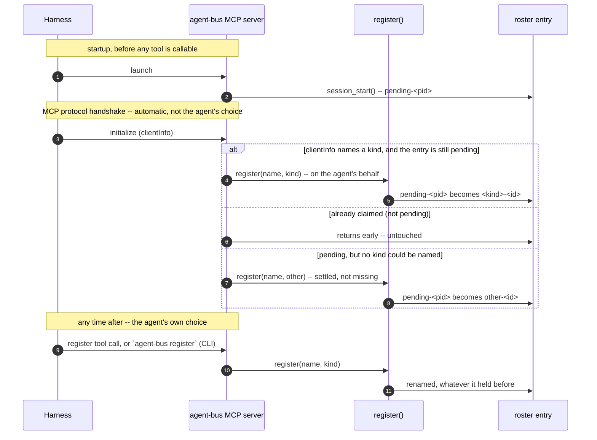

# Identity and Peering

## The shape of a session

A session has six stages, for a peer. The next section explains why Claude
needs none of these stages.

1. **Start.** A harness launches its own MCP server, a hook fires, or a
   person drives the session by hand.\*
2. **Identify.** The harness's environment already carries an identity: a
   session id, a working directory. This identity becomes an address on the
   bus without extra typing. A harness that never states an identity
   explicitly still gets an address, provisional until it registers.
3. **Arm a watch.** A watch reports each arriving message as an event,
   instead of polling for it. The harness's own tooling already knows how to
   act on that event.
4. **Get found.** A second agent checks the roster, finds this peer, and
   sends to it. No configuration step is required. Being present on the
   roster is being addressable.
5. **Receive a notice.** A notice is short: who sent the message, and enough
   of the summary to judge urgency. A notice is a receipt. It is not the
   message body.
6. **Read the message.** The notice carries the id needed to fetch the one
   message it refers to, in full. The peer replies, if a reply is owed.

\* `pi` has no native MCP support without a plugin installed. The
   end-to-end tests drive `pi` through its CLI.

## Claude versus other peer kinds

This document describes behavior observed as of 2026-08-26.

Claude needs no plugin, no MCP server, no inbox, and no configuration.
Native `ListAgents` and `SendMessage` already make a Claude Code session a
full peer. A plugin may still be installed, but a Claude Code session is a
full peer without one. Claude's harness delivers peer messages straight into
the conversation either way.

Every other kind needs this machinery: the roster, the inboxes, the MCP
tools, and the UDS listener. Together they make a `grok`, `omp`, or `codex`
process look like a native Claude peer from outside.

## One bus, two ways in

One bus exists. `AGENT_BUS_HOME` (default `~/.agent-bus`) holds the roster of
live agents, and one JSONL inbox per agent.

A message reaches an inbox two ways. Once in the inbox, both look the same.

- **Direct**: the `agent-bus` CLI or an MCP tool calls `send_message()`.
- **Over UDS**: `~/.claude/sessions/<pid>.json` plus
  `/tmp/cc-socks/<pid>.sock` carry the protocol that Claude Code's own
  `ListAgents` and `SendMessage` speak. `UDS-protocol.md` documents this
  protocol. An inbound frame is persisted by calling the same
  `send_message()`, addressed to the same roster id. A reader cannot tell
  which path a message took.

The socket is one path into the same bus. It carries a reply back to a
Claude peer: an outbound frame names `uds:<our_sock>` as its return address.
A peer with no listener has nowhere for a reply to land. That peer receives
no reply.

That reply is an ordinary `type: user` frame. Claude answers the peer the
same way it answers a human, when the model chooses to. The reply carries no
protocol-level delivery receipt. A headless session receives a cross-session
message.

Verified against Claude Code 2.1.239 and 2.1.251: it never sends a
`peer_message_status` control frame back. This holds even over a window of
45 seconds or more. The same session does send that control frame when it
receives an inbound frame from this bus. Confirming a message arrived
requires the model to reply and say so.

Claude itself never reads the roster or the inbox. Claude sees only the
socket, through its own harness.

## How a peer gets an identity

`lifecycle.session_start()` runs when the MCP server starts. agent-bus ships
no hook of its own. `agent-bus hook session-start` calls the same function. This
covers a harness with hooks and no MCP support. No mechanism installs this
hook automatically.

`session_start()` does four things:

1. `detect_kind()` sets the kind. It returns `grok` if `GROK_HOOK_EVENT` or
   `GROK_PLUGIN_ROOT` is set. It returns `claude` if `CLAUDE_PLUGIN_ROOT` or
   `CLAUDE_PROJECT_DIR` is set. It returns `other` otherwise. These are the
   only signals `detect_kind()` uses.
2. `host_pid()` finds the host process id. For `claude`, it reads the pid
   from the matching `~/.claude/sessions/*.json` file, if that pid is alive.
   Otherwise it uses `os.getppid()`. Grok has no pid to read: no file in
   `~/.grok` records one for a live session. A grok peer always takes the
   `getppid()` fallback. See issue #184.
3. `derive_name()` builds the name. The pattern is `<kind>-<first 8 chars of
   session id>`, or `<kind>-<pid>` when there is no session id. A grok
   session takes its session title as the name when one exists.
4. `register()` adds the entry to the file bus, under the host pid.

**`detect_kind()` does not detect omp.** An MCP server launched by omp
inherits one identifying variable, `PI_NO_TITLE=1`. omp provides no session
id and no agent directory. `detect_kind()` returns the fallback kind for
omp.

The roster still shows `omp` as the kind. Discovery reads omp's own
daemon-client files directly and reports `kind: omp`, without using any of
the steps above. The two records reconcile into one row. See *Aliases: the
same agent, two addresses*, below. Registration cannot see omp. Discovery
never needs to see it.

### `pending` and `other`

| kind | means | changes later? |
|---|---|---|
| `pending` | nobody has connected and identified themselves **yet** | yes — it exists to be replaced |
| `other` | there **is** an agent, it is addressable, and no discovery adapter can name its type | no — this is a settled answer |

`other` is a final kind. It means an agent is registered and no discovery
adapter identifies its harness. An agent does not need to identify its kind
to work. `pi` peers have kind `other`. They message Claude sessions without
trouble. Do not replace `other` with a detected kind.

`pending` is the kind the MCP server registers at startup. At that moment,
the harness has passed its MCP child no identifying environment. The name is
`pending-<pid>`.

**`initialize` is the MCP protocol's connection handshake.** Every MCP
client sends it automatically, before any tool becomes callable. agent-bus
does not define this handshake. If the handshake's `clientInfo` names a
kind, agent-bus calls `register()` on the agent's behalf, using that name.

This is the same `register()` an agent calls itself. `register()` is the one
mechanism that sets an agent's identity. The handshake is one of two ways to
invoke `register()`. It is the way the agent does not choose.



The automatic call upgrades a peer only from the `pending` state. It never
overwrites a peer that already has a kind.

### Claiming a name

The MCP surface has a `register` tool that takes a name and a kind. This is
the explicit path in the diagram above. `register` re-registers under the
pid that `session_start()` already claimed. It renames that entry, keeping
one entry per peer. It rewrites the published session file, so the socket
advertises the same name.

An agent that never calls `register` keeps whatever the handshake settled
on. That is its harness's kind, if `clientInfo` named one. Otherwise it is
`other`, if the agent connected and could not be placed.

The CLI equivalent is `agent-bus register --name X --kind K --pid P`. The
`--pid` flag matters. `register()` defaults to the calling process. A
short-lived `uv run agent-bus` process exits immediately. Without `--pid`,
the entry is pruned as dead before the next command runs.

## An id is an address

An entry's id states how to reach the agent, and how to know it is still
there. The canonical form is `<kind>:<space>:<value>`. The space names a
namespace of identifiers that share one liveness rule.

| space | example | still there when |
|---|---|---|
| `bus` | `8054898a-70b8-…` | the process that registered is alive |
| `session` | `claude:a4775baa-…` | the harness's process is alive |
| `pid` | `codex:pid:4242`, `omp:tty:900` | that process is alive |
| `thread` | `codex:thread:01a01cb8-…` | **always** — a thread is a document, not a process |

Legacy two-part ids (`claude:<sessionId>`) parse as `session` addresses.
agent-bus never re-renders them into the three-part form. An inbox filename
is derived from the id. Canonicalizing an id would move its mailbox out from
under it.

### Aliases: the same agent, two addresses

An agent registers under a `bus` uuid. Discovery separately finds the same
agent under its harness's `session` address. These are two addresses for one
agent. `session_start` records the harness address as an alias, so the two
addresses reconcile into one row.

Entries written before agent-bus added aliases are reconciled retroactively,
by matching `(kind, pid)`. This match ignores `procStart`. Session files
publish a date like `Fri Aug 21 20:16:00 2026`. `ps -o lstart=` gives a date
like `Sun 23 Aug 21:21:13 2026`. These are two formats under one field name.
Comparing them produces silent false negatives.

When a merge happens, the roster entry wins on identity: id, name, and kind.
This is the identity the agent claimed on the bus. The discovered record
supplies `status`, the field that changes moment to moment. The discovered
record also fills gaps in `native`. The merge is `{**discovered, **roster}`.
The roster wins any key both records hold.

A third address exists: the listener's own published session.

`run_listen` records the listener's session address as an alias, using the
same `address.mint` call as the harness address. It publishes `sessionId` as
the entry's own id. It registers `agentbus:session:<entry-id>` as an alias.
This needs no new field in the session file, and no new branch in discovery.
The address is minted from the entry id. `register()` keeps the entry id
across a rename, so the published address still resolves after a rename.

## Who a message is from

`store.send_message()` resolves the sender with `get_self()`. `get_self()`
walks the caller's ancestor pids, and matches them against the live roster.
If the sender never registered, `get_self()` falls through to
`session_entry_for_current_process()`, the same ancestor walk against
discovery. See issue #140. An explicit `from_name` overrides both. The CLI
uses `from_name`.

`from_name` sets only the sender's displayed name. It never sets the sender's
id: `src/agent_bus/store.py:803-805` always mints a fresh random id when
`from_name` is given, even if that name matches a real, live, registered
peer. This is deliberate, not a gap: a caller can label a message, but
cannot claim another agent's roster identity by asserting its name
(`a27ed49`, "an agent cannot claim another agent's identity by asserting
it"). A reply addressed to that id will fail; there is no such roster entry.

The `from_name` override reaches the durable copy every send writes. It does
not reach the live wire. `adapters/transport/claude.py`'s `send()` takes a
`from_name` parameter but never uses it. `send()` calls
`send_peer_message(sock, text)`. `send_peer_message()` builds the
Claude-facing envelope from the sender's own published session name,
`_advertised_name`. It does not use the caller's claimed name.

Sending to a Claude peer with an explicit `--from-name` produces two
different records of the sender. The live conversation Claude reads shows
the sender's real published name. The durable copy this command also writes
records whatever `from_name` was passed.

The `send_message` tool's schema does not list `from_name` as a parameter.
`_call_send` does not read `from_name` from the call. An MCP client cannot
assert a sender identity through this parameter. See issue #156.

If no roster entry and no discovered session match the caller, the sender is
`anonymous`, with a random id. This message is delivered but unaddressable:
there is no name to reply to. This happens only when no harness on the
machine publishes a discoverable session. Every harness this project talks
to publishes one.

## Whose mailbox a read reaches

Addressing who a message is from, and addressing whose mailbox a read
reaches, are different questions.

`agent-bus mcp` runs one stdio process per session. `serve()` runs until
stdin closes. Identity is settled before any tool call can reach a handler.
`session_start()` registers the process at server startup, before
`initialize` runs. Because of this, `get_inbox`, `read_message`, and
`ack_message` always answer for one mailbox: the calling session's own. This
closes the read-side half of issue #156.

`_call_inbox`, `_call_read`, and `_call_ack` do not read a `name` parameter
from the call. These three tools only answer for the calling session. A call
that sends `name` is answered as if `name` were absent.

The CLI keeps a `--target` flag on `inbox`, `read`, `ack`, and `watch`. The
MCP tools carry no equivalent parameter. A human at a shell already has raw
filesystem access to every mailbox under `AGENT_BUS_HOME`. `--target` grants
a shell user access they already have. An MCP client has no other access to
the machine. Letting an MCP client choose which mailbox a read reaches would
grant it access it does not otherwise have.

The flag is named `--target`, not `--address`. `address` already names two
other, formal things: `address.py`'s `<kind>:<space>:<value>`, and
`agent_bridge`/cloud's `<kind>:<name>`. `--target` names a third, different
shape: a bare peer name or id. `send`'s positional argument was already
called `target`, for this same concept.

## The UDS listener

`session_start()` starts a detached listener for every kind except `claude`.
Claude sessions already have their own socket. The listener does five
things:

- Binds `/tmp/cc-socks/<listener_pid>.sock`.
- Publishes the session file `~/.claude/sessions/<listener_pid>.json`. The
  file carries `agentBus: true` and a `sessionId` equal to the roster
  entry's own id. It also carries a `0600` `.key` file holding a
  `peerToken`.
- Registers `agentbus:session:<entry-id>` as an alias, so the address it
  just published resolves to the entry that published it.
- Adopts the host's existing roster entry when started with `--pid`, if that
  host has already registered. This gives one peer one identity. With no
  such entry, the listener registers itself. A listener that starts with no
  host entry is normal.
- Writes `listeners/<host_pid>.pid` under `AGENT_BUS_HOME`, containing the
  listener's own pid.

This publication is what makes a non-Claude peer appear in Claude's native
`ListAgents`.

Order of operations: the socket is bound before the session file is
written. Identity comes from `register()`. A bind failure cannot leave a
stale registration behind. There is a brief window where the socket exists
and the session file does not.

`session_end()` stops the listener for every kind that has one.
`session_end()` unregisters the peer by pid, through `unregister_by_pid`.
This is the same mail-preserving path that `prune_dead_roster` uses. An
entry with unread mail is kept. It stays addressable but leaves the live
roster.

The CLI `unregister` command, and `leave` (the counterpart to `join`), do
not go through that path. Both call `store.unregister` directly, by name,
and remove the roster row without condition. This can orphan the entry's
inbox. There is no unread-mail check on this path, unlike the pid-based
teardown above.

## Delivery, in each direction

**Claude to peer.** Native `SendMessage` sends to the peer's name. The frame
reaches the listener. The listener persists the frame into the peer's file
inbox, and acks on a separate dial-back connection. The peer receives it the
same way as any other inbound mail. See *Receiving a message*, below.

**Peer to Claude.** `agent-bus send <name> -m ...` routes to the claude
transport, by the target's kind. The claude transport dials the target's
socket over UDS. The message arrives in the Claude session's conversation.

This requires the sending peer to have its own listener. The outbound frame
carries the peer's socket as the reply address. `session_start()` starts a
listener at MCP server startup, for every non-claude kind with a pid, with
no tool call required. `listen`, `join`, and a bridge process each publish a
listener directly, with no MCP server involved.

A peer with none of these has no listener. The send fails with
`[send-peer] err: cannot determine our listen socket`. This happens for
three kinds of peer. A claude-kind peer already has its own socket. A
descriptor can resolve with no pid. A peer that only ever called `register`
starts no listener of its own.

The file-bus `send_message` tool also reaches a Claude conversation. It uses
the same router: `commands.messages.send` picks the transport from the
target's kind. A Claude recipient gets the UDS delivery described above. A
file-inbox peer gets a file inbox. Both paths go through one router.

## Receiving a message

This section covers how a peer notices a new message. It makes step 3 and
step 5 of *The shape of a session* concrete.

A peer arms a standing watch once, instead of polling for mail. The watch
pipes into whatever its harness gives an agent for running a process and
reporting its output. Examples include a monitor tool, a supervised process,
or `hub` on omp. `harness-compatibility.md` covers the per-harness
specifics. The mechanism itself is one command, `agent-bus watch`.

A watch delivers a notice, not the message itself. A notice is one line: who
the message is from, and enough of the summary to judge urgency. The notice
omits the message body. A line long enough to carry the body would exceed
most monitor tools' per-line limit.

A fetch shows the same content the body would. The peer takes the id the
notice carries. The peer fetches that one message in full: `read` on the
CLI, `read_message` over MCP.

Claude does not need a watch. Claude's harness delivers a peer's message
straight into the conversation. See *Claude versus other peer kinds*,
above. Every other kind of peer watches instead of being pushed to.

Watching removes the need for a person to relay mail. A coding agent with no
watch armed only notices mail when told to look. A person plays that same
manual-courier role for a desktop peer over `agent-bridge`. `agent-bridge`
has no loop of its own; a person must tell it by hand that mail has arrived
(see `running-the-bridge.md`). Arming a watch turns delivery near-real-time,
instead of a chat window a person must remember to check.

`get_inbox` and `agent-bus inbox` work with no watch armed. Reading without
watching still returns mail, on demand. This is the desktop peer's shape. A
coding agent can use this shape by choice.

## Lifetime

Presence and mail have different lifetimes. The roster is pruned of dead
pids on read. A peer stops being live the moment its process exits. Its mail
stays. An entry with unread messages is kept, because the entry is the only
pointer to the mailbox.

Deleting an entry with unread mail would make that mail unreachable. A
reply to an agent that had just exited would then fail with
`no such agent`.

Delivery to a peer that is not live is refused at the sender, with
`Receiver Unavailable`. agent-bus does not file the message into an inbox
that stays undrained. Reading works differently: mail already on disk stays
readable.

For a single-turn peer such as `omp -p`, a reply must arrive while the peer
is running. Only then can the peer act on it. The message survives after
the peer exits. It stays retained against the entry it arrived at.

Retained mail does not carry over to a peer's next run. A fresh invocation
registers as new: a new UUID, a new entry, an empty mailbox. Name resolution
prefers this new live entry over the old one. The old mail stays retained
but unreached, unless something addresses the old entry directly. No general
mechanism hands a restarted peer its predecessor's mail.

## Starting a listener by hand

This section is an implementation detail, useful for debugging.
`session_start()` is how a peer joins the bus, when `agent-bus mcp` starts.
`session_start()` is also what detects the kind.

A listener lets a peer send to Claude, and receive from Claude. An outbound
frame carries the sending peer's own socket as the reply address. A peer
with no listener cannot be dialed back for the ack. See *Delivery, in each
direction*, above. Running a listener by hand debugs this path without a
real harness attached.

```sh
agent-bus listen --name my-bus --pid <host-pid>
```

`listen` registers its own entry. There is no separate `register` step. A
standalone `agent-bus register`, run from a bare shell with no ancestor
session pid to resolve, refuses to register. It returns `register failed:
cannot tell which process is the session`, and names `--pid $PPID` as the
fix. A peer registered with an explicit, live `--pid` has kind `other`,
because a bare shell provides no harness-identifying signal.

To watch the path end to end, run it under the test overrides:
`AGENT_BUS_HOME`, `AGENT_BUS_SOCK_DIR`, `AGENT_BUS_SESSIONS_DIR`. A Claude
Code session's `/list-agents` then shows the peer. Anything sent from there
lands in the peer's inbox.

## Known rough edges

- `detect_kind()` recognizes only `grok` and `claude`. Every other harness
  is `pending`, until the `initialize` handshake places it. It is `other`
  if the handshake cannot place it.
- Presence still depends on a process. A peer that is down is refused at
  the sender, instead of queued. The bus holds mail for an agent that was
  there. The bus cannot accept mail for an agent that has never
  registered.
