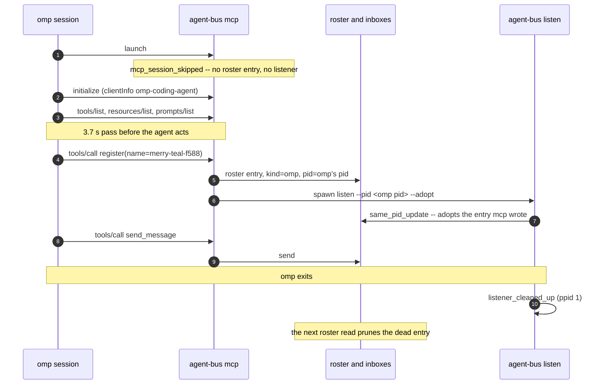
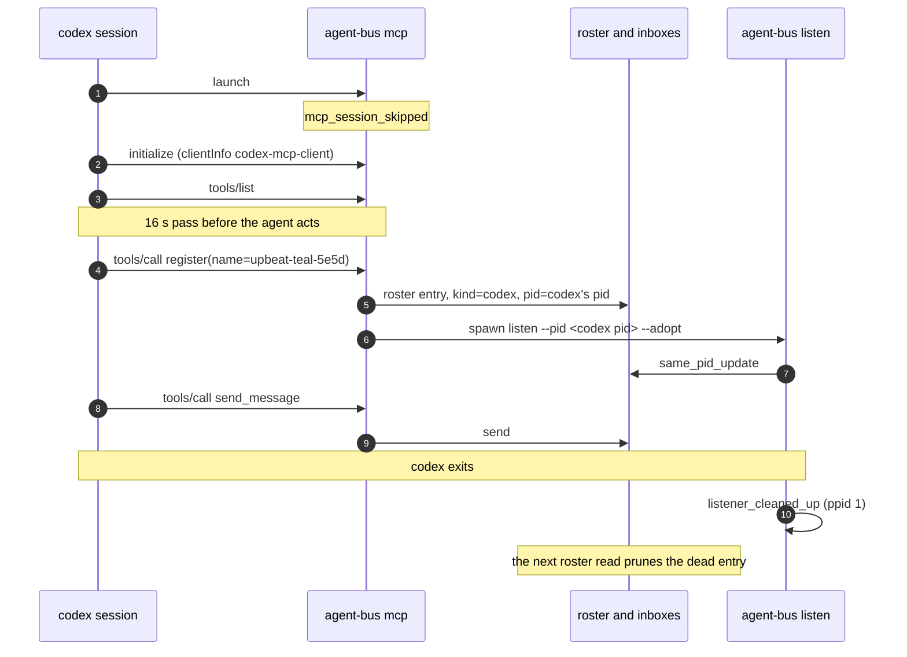

# A harness joins, per harness

Sequence diagrams and findings for `test_a_harness_joins_the_bus.py`, built
from real captured `AGENT_BUS_LOG_FILE`s -- not from reading the test source.
Index and shared notes: [README.md](README.md).

The omp and codex captures come from `docker compose run --rm e2e` with
`AGENT_BUS_LOG_LEVEL=trace`. grok is not captured: in the container it prints
`Not signed in` before it starts any MCP server, so no record of it reaches
this file.

## One shape for every harness

Nothing registers when an MCP client connects. `agent-bus mcp` starts,
answers `initialize` and `tools/list`, and writes no roster entry and starts no
listener (`mcp_session_skipped`). The agent claims a name of its own with the
`register` tool. That call writes the roster entry, with the kind that the
handshake's `clientInfo` names, and starts the listener. The listener watches
the harness process (the MCP server's parent).

The test asserts two facts:

- The sender recorded on the delivered message. It proves the name and kind the
  bus gave the agent.
- The `mcp_request_handled` records with `method: tools/call`. They name the
  tools the agent invoked (`tools_called()` in `busctl.py`). Every harness has
  a shell, so an agent whose MCP server never started can send with the
  `agent-bus` CLI and satisfy the first assertion. This one detects that case.

## omp

Capture: `test_it_joins_and_its_message_arrives_from_the_name_it_claimed[omp]`.
Times are relative to `mcp_server_started`. pid 107 is the MCP server, pid 103
is omp, pid 119 is the listener.

```
+0.0s  mcp     mcp_server_started
+0.0s  mcp     mcp_session_skipped
+0.0s  mcp     mcp_initialized                client_name=omp-coding-agent
+0.0s  mcp     tools/list, resources/list, resources/templates/list, prompts/list handled
+3.7s  mcp     mcp_tool_accepted              tool=register
+3.7s  mcp     host_pid_resolved              decision=parent_process target_pid=103
+3.7s  mcp     roster_entry_saved             name=merry-teal-f588 kind=omp
+3.7s  mcp     register_decided               decision=minted reused_id=false target_pid=103
+3.7s  mcp     listener_spawn_decided         decision=spawned listener_pid=119
+3.7s  mcp     mcp_request_handled            method=tools/call tool=send_message
+3.9s  listen  listener_adopted_host           watch_pid=103
+3.9s  listen  register_decided                decision=same_pid_update reused_id=true
+3.9s  listen  listener_started
+5.4s  cli     roster_entry_removed           decision=pruned_dead
+5.4s  listen  listener_cleaned_up             ppid=1
```



The MCP server decides to spawn the listener 5 ms after the roster write. The
listener then re-registers the same pid as `same_pid_update`. The entry is removed by the
next reader that finds its pid dead (`roster_entry_removed pruned_dead`), and
the listener exits when its host is gone.

## codex

Capture: `test_it_joins_and_its_message_arrives_from_the_name_it_claimed[codex]`.
pid 214 is the MCP server, pid 204 is codex, pid 293 is the listener.

```
+0.0s   mcp     mcp_server_started
+0.0s   mcp     mcp_session_skipped
+0.0s   mcp     mcp_initialized                client_name=codex-mcp-client
+0.0s   mcp     tools/list handled
+16.1s  mcp     mcp_tool_accepted              tool=register
+16.1s  mcp     host_pid_resolved              decision=parent_process target_pid=204
+16.1s  mcp     roster_entry_saved             name=upbeat-teal-5e5d kind=codex
+16.1s  mcp     register_decided               decision=minted reused_id=false
+16.1s  mcp     listener_spawn_decided         decision=spawned listener_pid=293
+16.3s  listen  listener_adopted_host          watch_pid=204
+16.3s  listen  register_decided               decision=same_pid_update
+16.3s  listen  listener_started
+16.9s  mcp     mcp_request_handled            method=tools/call tool=send_message
+18.3s  listen  listener_cleaned_up            ppid=1
+18.4s  cli     roster_entry_removed           decision=pruned_dead
```



## grok

Not captured. `harnesses.py` starts grok with an MCP config in
`<repo>/.grok/config.toml`. Before it spends a run, `mcp_preflight` asks
`grok mcp doctor --json` whether grok will start the server. In an untrusted
folder grok does not start a repo-local server, and the test skips with the
doctor's own words. The doctor runs with `AGENT_BUS_LOG_*` removed and its own
throwaway `AGENT_BUS_HOME`, because it starts each stdio server to handshake
with it, and the test's log must contain only the agent's own records.
Trusting the folder is a manual step: run `grok` once in the repo.

## What the notification channel carries

The server pushes `notifications/resources/updated` for `agentbus://inbox` when
mail lands, and for the roster when it changes (`mcp_server.py`,
`_check_and_notify` and `_check_and_notify_roster`). It offers this to every MCP
client that subscribes. What a client does with the update is the client's
business:

- omp turns one into a turn, so omp needs no `watch`.
- grok's `rmcp` client handles two notification types (`tools/list_changed`,
  `resources/list_changed`) and only to flip a UI badge, never to re-fetch. See
  `docs/harnesses/grok-build-monitor-reference.md`. grok and claude need
  `agent-bus watch` plus a monitor tool, and `WAKE` in
  `tests/support/mail_woken_peer.py` calls that `push`.

## What this proves, and what it does not

It proves real registration and real delivery. A headless agent is a one-shot:
it registers, exits, and its entry is pruned as dead, because presence is
liveness. A live session stays registered and keeps working. This test cannot
show that half, because it would need a session that never exits, which a
deterministic CI assertion cannot wait on.

---
