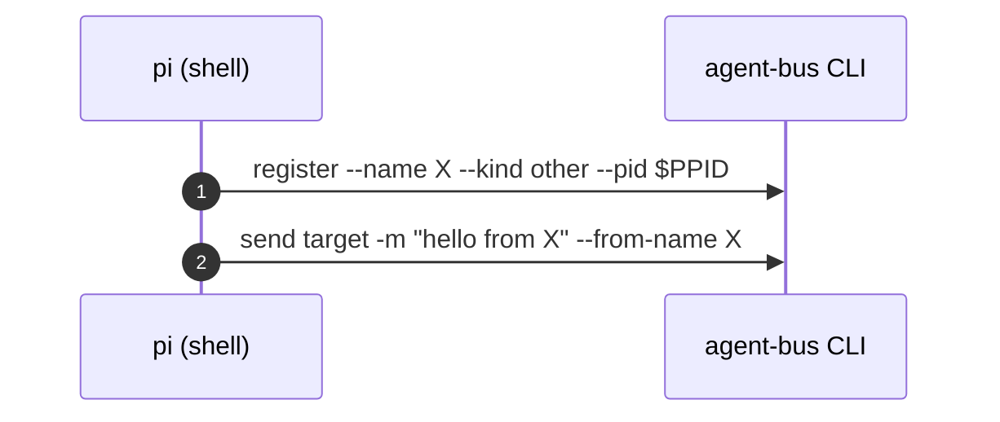
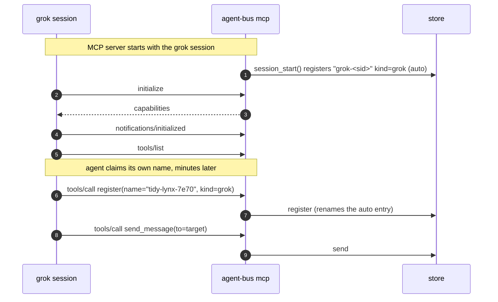
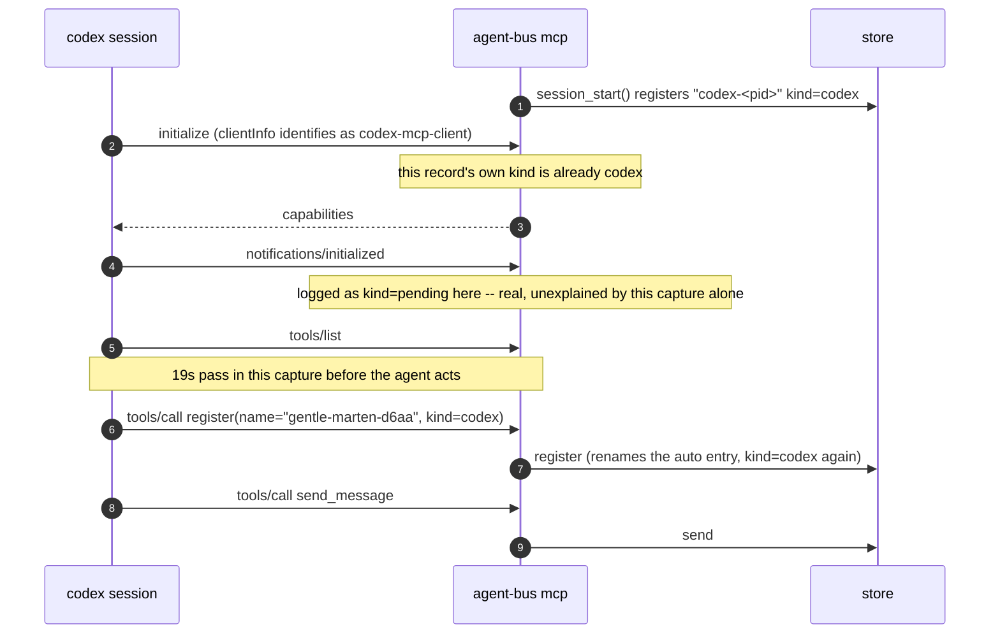

# A harness joins, per harness

Sequence diagram and findings for `test_a_harness_joins_the_bus.py`, built from a real captured
`AGENT_BUS_LOG_FILE` -- not from reading the test source. Index and shared
notes: [README.md](README.md).

**Both.** The registration handshake below is exactly what a real session
does at startup; what's CI-shaped is that the test then exits the moment one
message has landed, which a real session has no reason to do.

Four harnesses, four different paths to the same three facts: register,
prove identity by sending, and the sender's own registered name/kind must
appear on the message that arrives. Real captures, one per harness:

## pi -- shell only, no MCP



## grok -- MCP server, explicit `register` call



**`notifications/initialized` here is the handshake, not a wake channel --
worth being explicit, because this whole document sits in
notifications-adjacent territory.** It is grok telling us "I've processed
your `initialize` response," sent once at startup by every harness that
speaks MCP. `mcp_server.py`'s own `EAGER_DISCOVERY` comment measured this
directly, for a different reason (why eager `resources/list` etc. must
answer empty rather than refuse): "None of the five coding harnesses does
this today -- measured across a full container run, they ask for
initialize, notifications/initialized, tools/list and tools/call, and
nothing else." Our own handler (`mcp_server.py::_dispatch`) does nothing
with `notifications/initialized` but silently accept it. There is no
MCP-defined "you have mail" notification for a server to push, and nothing
here sends one -- which is exactly why `watch` exists as a separate,
agent-bus-owned polling mechanism instead of riding this channel.

Separately reverse-engineered against grok's own source
(`docs/harnesses/grok-build-monitor-reference.md`): of the MCP notification
types a server genuinely *can* push (`notifications/tools/list_changed`,
`resources/list_changed`, `resources/updated`, `prompts/list_changed`,
`progress`, `message`), grok's `rmcp` client handles exactly two --
`tools/list_changed` and `resources/list_changed`, and only to flip a UI
badge, never to re-fetch anything. `notifications/message` (a server
pushing its own log lines to the client) is a confirmed no-op, verified
against `rmcp` 2.1.0's published source, not assumed. None of this is the
wake mechanism either way: grok's actual wake, `monitor`
(`docs/harnesses/grok.md`), is an unrelated tool that streams a shell
command's stdout as conversation events -- architecturally independent of
the JSON-RPC notification channel MCP defines, not a use of it.

## codex -- MCP server, kind settles at `initialize`, then reverts to `pending`

The real capture has an oddity worth keeping rather than smoothing away: the
`initialize` record itself already carries `kind=codex` (codex's
`clientInfo.name` identifies it immediately, unlike grok and omp below), but
the very next two records -- `notifications/initialized` and `tools/list` --
log against `pending-<pid>` again before `register` settles `kind=codex` for
good. Read directly, not inferred:

Times are UTC on 2026-08-31 (`HH:MM:SS`), one capture:

```
12:47:51  message=register  agent=null              kind=null
12:47:53  message=register  agent=codex-7471         kind=codex
12:47:53  message=initialize                         kind=codex
12:47:53  message=notifications/initialized  agent=pending-7471  kind=pending
12:47:53  message=tools/list                 agent=pending-7471  kind=pending
12:48:12  message=register  agent=gentle-marten-d6aa kind=codex
12:48:12  message=tools/call tool=register    agent=gentle-marten-d6aa kind=codex
12:48:14  message=send       agent=gentle-marten-d6aa kind=codex
12:48:14  message=tools/call tool=send_message agent=gentle-marten-d6aa kind=codex
```



## omp -- MCP server, `pending` until `initialize` names it

Real capture, in order:

```json
{"agent":"omp-4461","kind":"omp","message":"register","args":{"name":"omp-4461","pid":4461}}
{"agent":"pending-4461","kind":"pending","message":"initialize","client":"omp-coding-agent"}
{"agent":"pending-4461","kind":"pending","message":"notifications/initialized"}
{"agent":"pending-4461","kind":"pending","message":"tools/list"}
{"agent":"pending-4461","kind":"pending","message":"resources/list"}
{"agent":"pending-4461","kind":"pending","message":"resources/templates/list"}
{"agent":"pending-4461","kind":"pending","message":"prompts/list"}
{"agent":"zesty-falcon-79b2","kind":"omp","message":"register","args":{"name":"zesty-falcon-79b2"}}
{"agent":"zesty-falcon-79b2","kind":"omp","message":"tools/call","tool":"register"}
{"agent":"zesty-falcon-79b2","kind":"omp","message":"send"}
{"agent":"zesty-falcon-79b2","kind":"omp","message":"tools/call","tool":"send_message"}
```

The opposite ordering from codex: `session_start()`'s own auto-register
already carries `kind=omp` (`agent="omp-4461"`), but every MCP record from
`initialize` through the eager-discovery calls (`resources/list`,
`resources/templates/list`, `prompts/list` -- `EAGER_DISCOVERY` in
`mcp_server.py`, answered empty for a client that calls them before reading
capabilities) logs against `pending-4461` until the agent's own `register`
tool call settles it back to `omp`.

**What this proves, and what it doesn't.** Real registration and real
delivery, for real. What's cut short: the test's own docstring says why --
"a headless agent is a one-shot -- it registers, exits, and its entry is
pruned as dead, correctly, because presence is liveness." A live session
stays registered and keeps working; this test cannot show that half, because
proving it would mean the session never exits, which is not a shape a
deterministic CI assertion can wait on.

---
