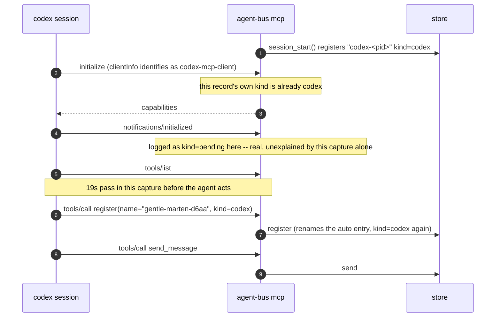

# A harness joins, per harness

Sequence diagrams and findings for `test_a_harness_joins_the_bus.py`, built
from real captured `AGENT_BUS_LOG_FILE`s -- not from reading the test source.
Index and shared notes: [README.md](README.md).

omp was re-captured 2026-09-11 after the wireup itself was fixed, and that
ordering matters: until then `_server_argv()` pointed `uv run --project` at
`tests/`, which has no `pyproject.toml`, so the project-scoped server never
started and the harness quietly used the *developer's* own user-scope
`agent-bus` entry instead. Every capture older than that fix describes
someone's `~/.omp` config, not this repository's wireup. The records below
come from a run whose `proj/.omp/mcp.json` reads
`uv run --project /Users/dan/Code/AI/agent-bus agent-bus mcp`.

grok skips on that machine (folder untrusted -- see its section) and codex is
not installed there, so both sections below are marked for what they are.

**Both.** The registration handshake below is exactly what a real session does
at startup; what is CI-shaped is that the test then exits the moment one
message has landed, which a real session has no reason to do.

One shape now, for every harness: a name of its own choosing, claimed with
the `register` tool. Nothing registers merely by connecting any more -- the
omp sections this file used to carry (a derived `pending`/handshake/`roots`
sequence, "named after its project without ever registering") described a
mechanism this repository deleted, and are removed rather than kept as
stale evidence. omp needs a fresh capture against the current
`AGENT_BUS_NAME` design; until then this file has nothing to say about omp
specifically.

The assertion is the sender recorded on the delivered message, plus --
since 2026-09-11 -- the `tools/call` records naming the tools the
agent actually used. See grok below for why the second one had to be written,
and why "some `mcp` record exists" was not enough.

## What the notification channel actually carries

An older version of this file said "there is no MCP-defined 'you have mail'
notification for a server to push, and nothing here sends one". Both halves
are now wrong, and the corrected version is why omp needs no `watch`:

- The server pushes `notifications/resources/updated` for `agentbus://inbox`
  when mail lands, and for the roster when it changes (`mcp_server.py:889`,
  `:941`). It is offered to **every** MCP client that subscribes.

What has not changed is that consuming the update is the client's business.
omp turns one into a turn; grok's `rmcp` client handles exactly two
notification types (`tools/list_changed`, `resources/list_changed`) and only
to flip a UI badge, never to re-fetch -- reverse-engineered against
`rmcp` 2.1.0, recorded in `docs/harnesses/grok-build-monitor-reference.md`.
So grok and claude still need `agent-bus watch` plus a monitor tool, and
`WAKE` in `tests/support/mail_woken_peer.py` still calls them `push`.

## grok -- what an untrusted folder looks like from the bus

The 2026-09-11 capture contains no `mcp` records at all:

```json
{"surface":"cli","message":"register","args":{"name":"nimble-marten-d29e","kind":"other","pid":5898}}
{"surface":"cli","agent":"keen-otter-7076","kind":"grok","message":"register","args":{"name":"keen-otter-7076","kind":"grok","pid":6036}}
{"surface":"cli","agent":"keen-otter-7076","kind":"grok","message":"send","args":{"to":"nimble-marten-d29e","from_name":null}}
{"surface":"cli","agent":"keen-otter-7076","kind":"grok","message":"inbox"}
```

No `mcp server started`, no `initialize`. grok was briefed to call the MCP
tools, found none, and improvised the `agent-bus` CLI -- which works, because
every harness with a shell can always fall back to it.

`grok mcp doctor`, run in the repo, says why in one line:

```
  agent-bus (stdio: uv run --project <repo> agent-bus mcp)
    ✗ folder untrusted (repo-local (project-scoped) server not started for an untrusted folder)
    → re-run with --trust to allow repo-local servers
```

`_wire_grok` writes `<repo>/.grok/config.toml` and `grok mcp list` shows the
server, so the wireup is found; grok declines to *start* it. This is what
`Harness.needs_trusted_repo` and the "needs `cd <repo> && grok` once" note in
`harnesses.py` are about, and on a machine where that has not been done the
row measures the CLI fallback instead of the MCP path.

**Three consecutive runs, three outcomes, none of them about MCP.** The first
two differed only in whether grok passed `--from-name`:

| run | what grok did | result |
|---|---|---|
| 03:56 | CLI `send --from-name keen-otter-7076` | sender `(name, **other**)` -- failed |
| 04:31 | CLI `send`, no `--from-name` | sender `(name, grok)` -- passed |
| 05:12 | never finished | 420s timeout |

`store.send_message` gives an explicit `from_name` a fresh id and leaves
`from_kind` at its `"other"` default, by design and documented there; without
one, the sender resolves from the caller's own registration, which grok had
made as `kind=grok`. So an assertion meant to prove "the agent claimed its
identity over MCP" was being decided by which CLI flags a model felt like
typing -- and one run in three did not decide anything at all.

Two changes came out of that, and both are about making the row honest rather
than green:

- **The assertion is on `tools/call` records**, not on the presence of an
  `mcp` surface record. The server logs its own startup and handshake before
  any model has a turn, and anything else that connects -- a diagnostic, a
  second harness -- logs those too. `tools_called()` names what the agent
  actually invoked.
- **The row skips when grok says it will not start the server.** `harnesses.py`
  asks `grok mcp doctor --json` after writing the config and before spending a
  run; an untrusted folder now skips in about two seconds with the doctor's
  own words, instead of failing at 420s or passing by accident. The doctor is
  run with `AGENT_BUS_LOG_*` dropped and its own throwaway `AGENT_BUS_HOME`,
  because it starts each stdio server to handshake with it -- inheriting the
  test's log would have written `mcp` records into the evidence the assertion
  reads, which is the exact contamination the assertion exists to catch.

Granting trust is left to the developer: a test that granted it silently
would be changing the thing it measures. `cd <repo> && grok` once is the fix.

## codex -- MCP server, kind settles at `initialize`, then reverts to `pending`

**Not re-captured on 2026-09-11** -- codex is not installed on the machine that
produced the rest of this file, so the row skipped. What follows is the
2026-08-31 capture, and it predates #329's changes to `register`'s `kind`
handling: treat the `kind` transitions specifically as unverified.

```
12:47:51  message=register  agent=null              kind=null
12:47:53  message=register  agent=codex-7471         kind=codex
12:47:53  message=initialize                         kind=codex
12:47:53  message=notifications/initialized  agent=pending-7471  kind=pending
12:47:53  message=tools/list                 agent=pending-7471  kind=pending
12:48:12  message=register  agent=gentle-marten-d6aa kind=codex
12:48:12  message=tools/call tool=register    agent=gentle-marten-d6aa kind=codex
12:48:14  message=send       agent=gentle-marten-d6aa kind=codex
12:48:14  message=tools/call tool=send_message agent=gentle-marten-d6aa kind=codex
```



Worth re-capturing in the container, where codex is installed: this predates
the deletion of the `pending`-kind auto-adoption machinery entirely (this
repository no longer registers anything merely from `initialize`, for any
harness), so the `pending-<pid>` records between `initialize` and the
agent's own `register` describe a state this capture's own moment no longer
produces.

## What this proves, and what it doesn't

Real registration and real delivery, for real. What is cut short: the test's
own docstring says why -- "a headless agent is a one-shot -- it registers,
exits, and its entry is pruned as dead, correctly, because presence is
liveness." A live session stays registered and keeps working; this test cannot
show that half, because proving it would mean the session never exits, which
is not a shape a deterministic CI assertion can wait on.

One thing the omp capture shows that no assertion checks: `pid 6036` in the
grok capture above is not grok's pid at all -- it is the developer's own omp
session, found by walking the ancestor chain out of a headless run that
publishes no session file of its own. Same trap as
`test_unregistered_self_provides_appropriate_instructions.py`'s docstring
describes, arriving through `--pid $PPID` in a shell this time. In the
container there is no such ancestor.

---
