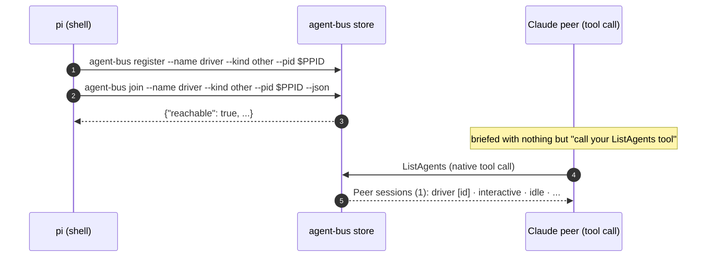

# A joined peer's real name reaches Claude's `ListAgents` tool

Sequence diagram and findings for
`test_a_joined_peer_is_named_in_claudes_list_agents_tool.py`, built from a
real captured `AGENT_BUS_LOG_FILE` and a real Claude peer transcript -- not
from reading the test source. Index and shared notes: [README.md](README.md).

## #200, scoped down to what is actually automatable

#200 reported every agent-bus session showing as `(unnamed session)` in
Claude's own `/list-agents`. Live-verified before writing this test, not
assumed:

- A human running `/list-agents` against a real, still-running bridge
  session (`desktop-claude`) saw `(unnamed session)`.
- The native `ListAgents` **tool**, called moments later against the same
  session, returned the real name.

agent-bus has no part in that divergence. It publishes one Claude-shaped
session file and binds one UDS socket -- the entirety of its involvement --
and has no visibility into, or influence over, how Claude Code's two listing
features each choose to render what was published. Whatever produces the
difference is entirely inside Claude Code, between `/list-agents` (and
@-mention, both human-typed) and `ListAgents` (the tool a model calls).

**That makes #200's actual bug unautomatable, not merely unreproduced.** A
pytest/docker e2e test drives a model calling tools; there is nothing for it
to call that exercises a slash command or an @-mention, on any container
image or Claude Code version. #200 stays open, real, and verifiable only by
a human running `/list-agents` directly.

What this test covers instead: the tool path, confirmed unaffected, and
worth a regression guard because it is what `SendMessage`/cross-session
addressing actually depends on.



Captured, real (`AGENT_BUS_LOG_LEVEL=INFO`, a live `pi` shell peer and a live
headless Claude peer, run inside the container with Claude Code 2.1.257):

```json
{"verb":"register","args":{"name":"dapper-marten-6da2","kind":"other","pid":135},"ok":true,"ms":1}
{"verb":"join","args":{"name":"dapper-marten-6da2","kind":"other","pid":135,"ready_timeout":15.0},"ok":true,"ms":210}
```

The Claude peer's own `ListAgents` tool result, read out of its transcript
(not paraphrased):

```
This session is agent-bus-b3 [716931] — the name other sessions use to
message it (it is not listed below; a message to it would be a message to
yourself).

Peer sessions (1):
  dapper-marten-6da2 [1bbe6f]  ·  interactive  ·  idle  ·  started 26s ago
```

`dapper-marten-6da2` -- the real name `join` registered -- is exactly what
the tool returned. No `(unnamed session)` anywhere in it.

## What this does not show

**#200's actual bug.** Confirmed real, separately, by a human running
`/list-agents` -- not something this or any automated test can drive. See
the issue thread for that verification.

**Why the two surfaces differ.** Only that they do. Claude Code's own
internals for `/list-agents`/@-mention versus the `ListAgents` tool are
outside what agent-bus publishes or controls, and outside what this repo
can instrument.
