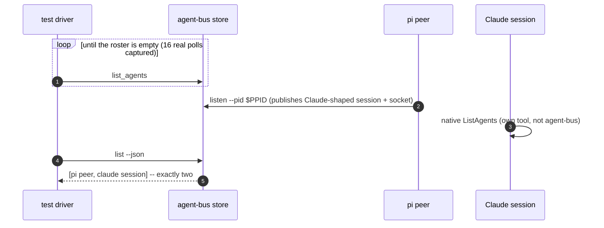

# Both views of the roster agree

Sequence diagram and findings for `test_both_views_of_the_roster_agree.py`, built from a real captured
`AGENT_BUS_LOG_FILE` -- not from reading the test source. Index and shared
notes: [README.md](README.md).

**CI-shaped, and says so about itself.** `_require_an_exclusive_bus` polls
`agent-bus list` once a second until the machine has zero agents on it,
purely so the assertion isn't fooled by a bystander. A real machine is never
required to be empty before an agent starts.



Captured (the polling loop, real):

```json
{"verb":"list_agents","ok":true,"ms":46}
{"verb":"list_agents","ok":true,"ms":1}
... 14 more, one per second, until the bus reports empty
```

**What the CLI log alone cannot show:** Claude's own `ListAgents` call never
touches agent-bus at all -- it is the harness's native tool, reading the
session file `listen` published. The only record of what Claude actually
saw is in *its own transcript* (`stdout.jsonl`), which is why the test's
`_list_agents_results()` helper parses that file separately rather than
trusting anything in the structured log. This is the clearest example in
this set of "the log is not the whole story" -- two systems being compared,
and only one of them logs to agent-bus at all.

---
