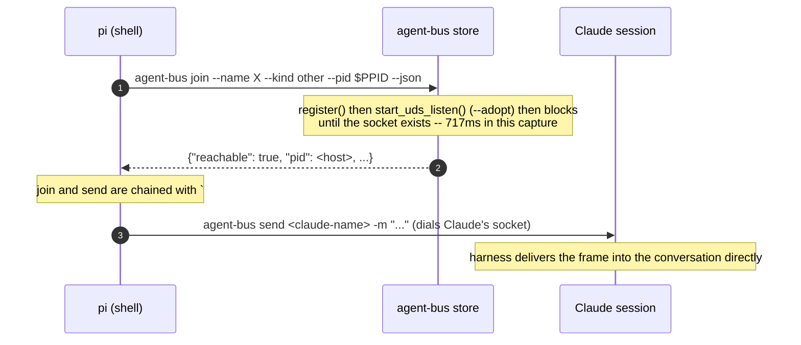

# `join` reaches a Claude session the instant it returns

Sequence diagram and findings for `test_join_reaches_a_claude_session.py`, built from a real captured
`AGENT_BUS_LOG_FILE` -- not from reading the test source. Index and shared
notes: [README.md](README.md).

**`join`'s sibling gap, per #171 -- and, unlike [`test_leave_stops_a_listener.py`](test_leave_stops_a_listener.md)'s `leave`, not a
bug.** Checked live before writing anything: a real `join` from a real
shell, against a real held pid, correctly resolved the host pid, published
a listener whose pid file matched it (no divergence -- `start_uds_listen`,
which `join` uses, always passes `--adopt` and always keys the pid file by
the host pid it was already given, unlike the hand-started shape [`test_leave_stops_a_listener.py`](test_leave_stops_a_listener.md)
found broken), and both an inbound send to it and this test's own outbound
send *from* it worked. `join` had zero e2e coverage, not a live defect.

`join`'s actual documented risk is narrower: `register()` claims a name and
stops; the listener that gives a peer a socket to send *from* is a detached
process, so there is a window between "registered" and "reachable" where an
agent that starts working loses whatever it tries to send. `join` closes
that window by blocking until the socket exists. This test is whether that
wait actually holds for a real shell-only peer sending to a real Claude
session, immediately, with no sleep of its own -- `join`'s own wait is the
only thing standing between "registered" and "sent."



A first draft ran `join` and `send` as two separate steps in the prompt --
two separate tool calls a real model makes one at a time, with a full turn
between them. A review of this PR caught it: that turn is real latency (the
first capture showed ~4 real seconds between the two), and if `join` had
returned before the socket actually existed, those four seconds would have
masked it exactly the way a `sleep` would have. The fix is the one-line
version above -- `join` and `send` chained by `;` inside a single bash
invocation, so there is one tool call and no model turn between them. The
capture below is from that fixed prompt, not the original one.

Captured, real (`AGENT_BUS_LOG_LEVEL=INFO`, a live `pi` run against a live
Claude session):

```json
{"verb":"register","args":{"name":"merry-puffin-e1e8","pid":5983},"ok":true,"ms":21}
{"verb":"join","args":{"name":"merry-puffin-e1e8","pid":5983,"ready_timeout":15.0},"ok":true,"ms":717}
{"verb":"send","args":{"to":"agent-bus-dev-a3","text_len":34},"ok":true,"ms":741}
```

The listener's own log, same run:

```
[listen] adopting host registration merry-puffin-e1e8 (pid 5983)
[listen] pid=6658 name=merry-puffin-e1e8
[listen] socket=/tmp/cc-socks/6658.sock
[listen] session=/Users/dan/.claude/sessions/6658.json
[listen] waiting for connections (newline json frames)...
```

`register` and `join` both land in the same second; the listener's own log
confirms it took the *adopting* branch (`--adopt`, since `start_uds_listen`
always passes it), not the "no registration" branch [`test_leave_stops_a_listener.py`](test_leave_stops_a_listener.md) was built on
-- the two tests exercise the two different paths through the same adopt
loop on purpose. `send` runs immediately after `join` returns, inside the
same shell invocation, and reports `ok: true`; `send.txt` reads
`SEND_EXIT=0`. No gap is left for `join`'s wait to hide behind.

**What this does not show:** `join`'s `False`-reachable path -- what
happens when the wait genuinely times out. Nothing here forces that; it
would need a way to make the listener slow to bind on purpose, which is a
different, harder test than driving the ordinary case for real.

---
