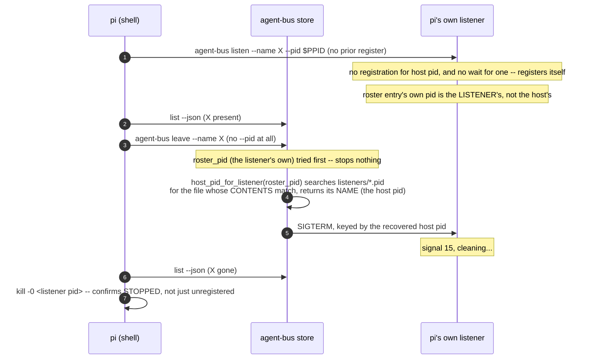

# `leave` stops the listener it unregisters

Sequence diagram and findings for `test_leave_stops_a_listener.py`, built from a real captured
`AGENT_BUS_LOG_FILE` -- not from reading the test source. Index and shared
notes: [README.md](README.md).

**Not CI-shaped at all -- this is a real bug's regression test**, driven by
`pi` from a bare shell because, per the test's own docstring, "`leave` is a
shell verb and this is the surface a person or an agent actually types it
on." #170 fixed a real gap #166's earlier fix had left open: `leave --name X`
with no `--pid` -- the ordinary, documented form -- reported success while
the listener process kept its socket bound.



Captured, real (a live `pi` run, `AGENT_BUS_LOG_LEVEL=INFO`):

```json
{"verb":"list_agents","args":{"kind":null},"ok":true}
{"verb":"leave","args":{"name":"keen-badger-cf7b","host_pid":null},"ok":true}
{"verb":"list_agents","args":{"kind":null},"ok":true}
```

The listener's own log, same run, exactly as captured:

```
[listen] no registration for pid 33439 after 5s; registering our own
[listen] pid=33824 name=keen-badger-cf7b
...
[listen] signal 15, cleaning...
```

**That first line's own "after 5s" is wrong, and was product code lying, not
a documentation slip.** `--adopt` is internal-only -- a bare `agent-bus
listen`, exactly the call above, never passes it -- so the adopt-wait loop's
deadline was `now + 0.0`, and the loop fell through on its first check,
never waiting at all. But the message unconditionally printed the constant
`ADOPT_TIMEOUT` regardless of which path actually ran, so every bare
`listen` claimed a 5-second wait that never happened. A reader debugging
"why didn't my listener adopt my registration" would read this line and
conclude it looked twice, five seconds apart, and the entry genuinely
wasn't there -- when it never looked a second time at all, and a
registration landing 100ms later would have been missed just the same.
Caught by a second reader of this exact section, live-reproduced (under 3s
real wall clock for the whole startup sequence, `PYTHONUNBUFFERED=1` to
rule out output buffering as a confound) before fixing `uds.py` to print
the interval it actually used. Worth stating plainly, since this document's
whole premise is "built from real evidence, not from reading source": that
premise is not immunity. A captured line is real evidence that the product
*said* this -- it is not, on its own, evidence that what it said was true.
This is the one case in this document where the two came apart.

Two different pids in one run -- `33439` (pi's shell, the host) and `33824`
(the listener's own) -- is the entire bug in two lines, the "after 5s"
mistake aside. Before #170, `leave` only ever looked up `33824` under a key
meant for `33439` and found nothing; `--json leave.json` still said
`{"left": true}` and the process kept running. This capture confirms the
fix: `host_pid: null` in the `leave` record (the ordinary, no-flag form)
still resolved the right pid, and the listener's own log shows the signal
actually landing.

**What this does not show:** the same coverage gap that let this bug ship in
the first place. `join` and `leave` were, until this test, the only two CLI
verbs a real harness had never touched -- `listen`, which they wrap, had
three prompts driving it; they had none. `scripts/e2e_coverage.py`'s matrix
is what would have surfaced that gap, if anyone had looked at it as a gap
rather than as a passing suite.

---
