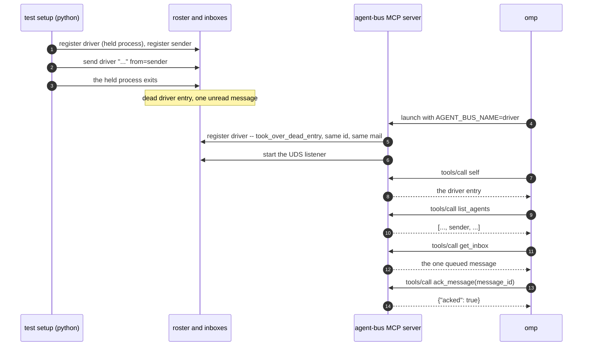

# A real MCP call lists, reads and acks its own mail

Findings for `test_mcp_inbox_and_ack_close_the_loop.py`, built from a real
captured `AGENT_BUS_LOG_FILE` -- not from reading the test source. Index and
shared notes: [README.md](README.md).

The capture comes from `docker compose run --rm e2e` with
`AGENT_BUS_LOG_LEVEL=trace`.

## What the test sets up

The test registers a driver name (kind `other`, held by a `sleep` process) and a
sender, sends the driver one message, then kills the `sleep` process. The
driver's roster entry is now dead and holds one unread message.

omp runs with `AGENT_BUS_NAME=<driver>` in its MCP server's environment and the
prompt `tests/support/prompts/mcp_inbox_and_ack.md`, which tells it to:

1. call `self` and print `SELF=<name>`;
2. call `list_agents` and print `SEEN=yes` if the sender is listed;
3. call `get_inbox` with no arguments and print `TEXT=<the message text>`;
4. call `ack_message` with the message id and print `ACKED=yes`.

The test requires `SELF` to equal the driver name, `TEXT` to equal the sent
text, `ACKED=yes`, and the four tool names in the test's own log.

## Why omp, and why no `name`

`get_inbox`, `read_message` and `ack_message` answer for the calling session
only. `_call_inbox` reads `unread_only` and nothing else, and `_call_ack` reads
`message_id` and nothing else (`mcp_server.py`, `_call_inbox`, `_call_read`,
`_call_ack`). The driver has to own the mailbox, so the MCP server registers the
driver's name itself.

Takeover needs the same name and the same kind. The `AGENT_BUS_NAME` path takes
its kind from `detect_kind()`, which is `other` for omp, and `send` writes to an
`other` entry through the file bus. `send` refuses a codex-kind name ("is a codex
process, not a thread"), so a codex driver has no mailbox to read.

## Capture

Times are relative to `mcp_server_started`.

```
+0.0s   mcp     mcp_server_started
+0.0s   mcp     session_start_resolved, roster_entry_saved
+0.0s   mcp     register_decided decision=took_over_dead_entry reused_id=true
+0.0s   mcp     listener_spawn_decided decision=spawned
+0.0s   mcp     mcp_session_started, mcp_initialized (client omp-coding-agent)
+0.2s   listen  listener_started
+7.8s   mcp     tools/call self
+7.9s   mcp     tools/call list_agents
+7.9s   mcp     tools/call get_inbox
+10.7s  mcp     tools/call ack_message
```

The `self` result names the driver, the `get_inbox` result holds the one queued
message, and `ack_message` returns `{"acked": true}`.



## Log records per tool call

Each tool call writes a verb record and an `mcp_request_handled` record
(`method: tools/call`, `tool`). The verb name can differ from the tool name:
the tool `get_inbox` writes the verb `inbox`, and `ack_message` writes `ack`.
The verb name is the Python function (`messages.inbox`, `messages.ack`) that
the CLI commands `inbox` and `ack` also call.
