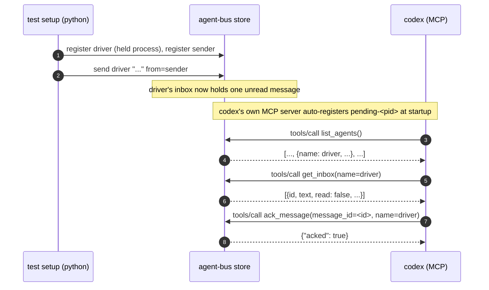

# A real MCP call lists, reads and acks a named peer's mail

Sequence diagram and findings for `test_mcp_inbox_and_ack_close_the_loop.py`, built from a real captured
`AGENT_BUS_LOG_FILE` -- not from reading the test source. Index and shared
notes: [README.md](README.md).

**#171's other Tier 1 gap, and the MCP-surface sibling of [`test_read_and_ack_close_the_loop.py`](test_read_and_ack_close_the_loop.md).** Two
of eight MCP tools had ever been driven by a real harness (`register`,
`send_message`, both via `join_via_mcp.md`); #171 named `get_inbox`,
`ack_message` and `list_agents` as the priority among the other six.
`read_message` was deliberately left out of that list -- `get_inbox`
already returns each message whole, so a driver reading its own inbox has
no need to also call `read_message`, and [`test_read_and_ack_close_the_loop.py`](test_read_and_ack_close_the_loop.md) already put a live
regression guard on the function underneath it (`read_one`).

Driven by `codex`: the one MCP-joining harness needing no project wiring
and no repo-trust step, so the test is about the three tools rather than
about codex.

The driver deliberately never calls `register`. `get_inbox` and
`ack_message` both take an explicit `name` argument for exactly this
reason -- acting on a mailbox that is not the caller's own, which the
tools' own descriptions call "acking is bookkeeping, not agreement to
act." Checked before writing this, not assumed: `store.register()`
silently auto-renames a caller to `name-2` on collision with a live entry
under a different pid, so a driver that registered as the pre-seeded name
to "become" that mailbox would not become it -- it would collide and land
somewhere else, silently. Addressing the mailbox by `name=` sidesteps that
entirely, and is also the more realistic shape: an operator or triage
agent inspecting a named peer's mail.



Captured, real (`AGENT_BUS_LOG_LEVEL=INFO`, a live `codex exec` run against
a real MCP server child):

```json
{"verb":"register","args":{"name":"hardy-vole-7d16","kind":"other"},"ok":true,"ms":7}
{"verb":"register","args":{"name":"candid-otter-d156","kind":"other"},"ok":true,"ms":14}
{"verb":"send","args":{"to":"hardy-vole-7d16","text_len":43,"from_name":"candid-otter-d156"},"ok":true,"ms":48}
{"verb":"register","args":{"name":"codex-35429","kind":"codex","pid":35429},"ok":true,"ms":78}
{"verb":"list_agents","args":{"kind":null},"ok":true,"ms":45}
{"verb":"inbox","args":{"name":"hardy-vole-7d16","unread_only":false},"ok":true,"ms":15}
{"verb":"ack","args":{"message_id":"2fd68fbd-3087-45c4-8e50-47927c827151","name":"hardy-vole-7d16"},"ok":true,"ms":17}
```

Two things a cold read of this log gets wrong. First, `codex` calls
`register` on its own (`pid=35429` renaming `pending-35429` to
`codex-35429`, kind=`codex`) even though nothing in the prompt asked for
it -- unprompted, and consistent with a real agent claiming its identity
before it does anything else on the bus, not a bug in the prompt or the
test. Second, the verb names in the log are not the tool names: the MCP
tool is `get_inbox` and the log says `inbox`, the tool is `ack_message`
and the log says `ack` -- `@logged` records the Python function name
(`messages.inbox`, `messages.ack`), the same function the CLI's `inbox`
and `ack` commands call, which is the point: one verb, two surfaces, one
log line either way.

**What this does not show:** `list_agents`'s and `get_inbox`'s actual
returned content -- both are read-only, so unlike `ack` there is no
mutation on the bus to check independently, and the assertions for those
two rely on the model relaying a single strict token
(`SEEN=`/`TEXT=`, never free prose) rather than a file a shell wrote.
`ack_message` is not taken on the model's word: the test re-reads the real
inbox file afterward and checks `read: true` there.

---
