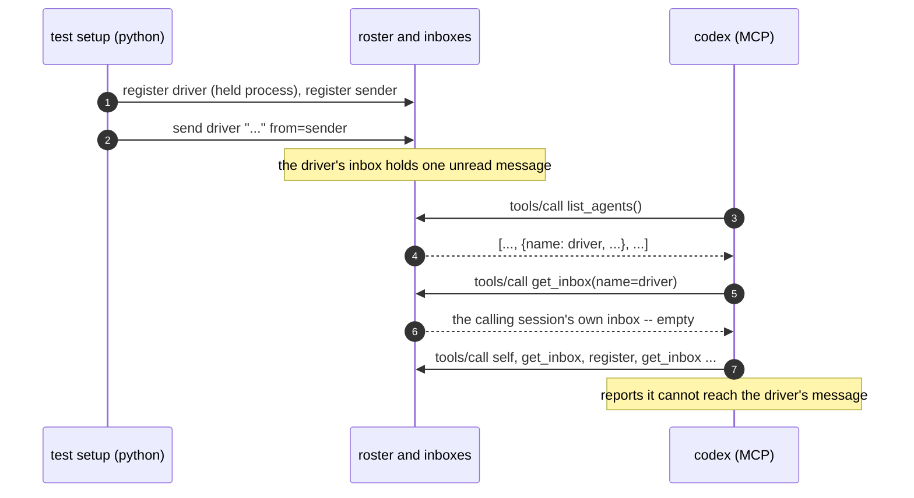

# A real MCP call lists, reads and acks a named peer's mail

Findings for `test_mcp_inbox_and_ack_close_the_loop.py`, built from real
captured `AGENT_BUS_LOG_FILE`s -- not from reading the test source. Index and
shared notes: [README.md](README.md).

The captures come from `docker compose run --rm e2e` with
`AGENT_BUS_LOG_LEVEL=trace`.

## What the test sets up

The test registers a driver (held by a `sleep` process) and a sender, and
sends the driver one message. Then `codex exec` runs the prompt
`tests/support/prompts/mcp_inbox_and_ack.md`, which tells codex to:

1. call `list_agents` and print `SEEN=yes` if the driver is listed;
2. call `get_inbox` with `name=<driver>` and print `TEXT=<the message text>`;
3. call `ack_message` with the message id and `name=<driver>` and print
   `ACKED=yes`.

The test then re-reads the driver's real inbox file and requires the message to
be marked `read`.

## What the server does with `name`

`get_inbox`, `read_message` and `ack_message` answer for the calling session
only. `_call_inbox` reads `unread_only` and nothing else, and `_call_ack` reads
`message_id` and nothing else (`mcp_server.py`, `_call_inbox`, `_call_read`,
`_call_ack`). The calling session is the entry that resolves for the MCP server process. The
`name` argument in the prompt has no effect.

## Captures

**Run through pytest** (`test_a_driver_lists_reads_and_acks_a_named_peers_mail`,
passed). The log for that test holds three records from the MCP server:
`mcp_server_started`, `initialize` and `notifications/initialized`. It holds no
`tools/list` and no `tools/call` record. The passing assertions therefore came
from something other than MCP tool calls that the server logged in that file.
This capture does not show which route codex took.

**Same scenario, run once outside pytest** with the same fixtures and prompt.
codex called the tools below and printed `SEEN=yes`. It then reported that
`get_inbox` returned only the current agent's inbox, which was empty, and that
it could not retrieve or ack a message for the driver. It printed neither
`TEXT=` nor `ACKED=`. Times are relative to `mcp_server_started`.

```
+0.0s   mcp     mcp_server_started, mcp_session_skipped
+0.0s   mcp     initialize, notifications/initialized, tools/list handled
+12.0s  mcp     tools/call list_agents
+13.6s  mcp     tools/call get_inbox
+17.2s  mcp     tools/call self
+20.1s  mcp     tools/call get_inbox
+25.5s  mcp     tools/call register
+25.8s  listen  listener_started
+31.1s  mcp     tools/call get_inbox
+35.6s  mcp     tools/call get_inbox
```



## Log records per tool call

Each tool call writes a verb record and an `mcp_request_handled` record
(`method: tools/call`, `tool`). The verb name can differ from the tool name:
the tool `get_inbox` writes the verb `inbox`, and `ack_message` writes `ack`.
The verb name is the Python function (`messages.inbox`, `messages.ack`) that
the CLI commands `inbox` and `ack` also call.
