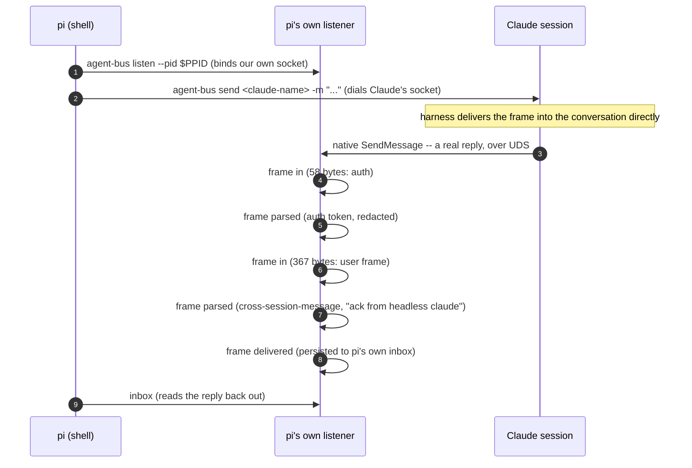

# A peer messages a live Claude session over UDS

Sequence diagram and findings for `test_messaging_a_claude_session.py`, built from a real captured
`AGENT_BUS_LOG_FILE` -- not from reading the test source. Index and shared
notes: [README.md](README.md).

**This is the product**, per the test's own docstring, and the diagram below
needed `AGENT_BUS_LOG_LEVEL=TRACE` to capture -- the frame-level records are
DEBUG severity and off by default. This is the one place in this document
where a CI convenience (driving it with `pi`, "the least capable harness
available") is also exactly the real path a shell-only peer takes; nothing
here is CI-only.



Captured, real (`AGENT_BUS_LOG_LEVEL=TRACE`):

```json
{"message":"frame in","surface":"listen","bytes":58}
{"message":"frame parsed","surface":"listen","parsed":{"type":"auth","token":"<redacted>"}}
{"message":"frame in","surface":"listen","bytes":367}
{"message":"frame parsed","surface":"listen","parsed":{"type":"user","message":{"content":"<cross-session-message from=\"uds:/tmp/cc-socks/10681.sock\" ... from-name=\"agent-bus-23\">\nack from headless claude\n</cross-session-message>"}}}
{"message":"frame delivered","surface":"listen","text_len":24}
```

**What this does not show:** whether Claude ever confirms *our* outbound
send at the protocol level. It doesn't -- measured directly, twice, across
two Claude Code versions, and recorded in the belief ledger. Delivery here
is real; a wire-level receipt for it is not a thing this protocol has.

---
