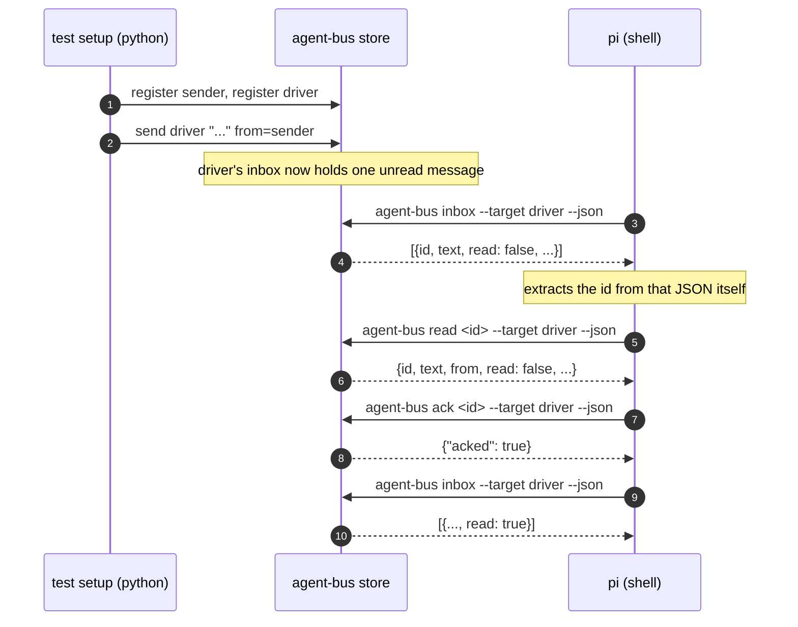

# `read` and `ack` close the ordinary loop

Sequence diagram and findings for `test_read_and_ack_close_the_loop.py`, built from a real captured
`AGENT_BUS_LOG_FILE` -- not from reading the test source. Index and shared
notes: [README.md](README.md).

**#171's other Tier 1 gap, and the one it named a live false positive for.**
Grep the existing prompts for "ACK" and four hits come back -- all of them
the conversation stop-word in `conversation_peer.md` /
`conversation_peer_park.md`, a peer's own `SendMessage` reply, nothing to do
with `agent-bus ack`. Every unit and CLI test for `ack`/`read_one` calls them
directly or against a controlled pid; none had ever been driven by a real
shell process deciding, from what it actually found in its own inbox, to
read a message and then ack it. That is the ordinary loop -- receive, read,
ack -- and nothing before this exercised it end to end.

Building this test found a second, unrelated real bug, the same way section
7's did: `commands/messages.py::ack` was the one verb in that module missing
`@logged` -- `send`, `inbox` and `read_one` all carry it. Nothing raised, so
nothing failed loudly; `ack` simply never appeared in the structured log,
which is also what `scripts/e2e_coverage.py` reads to say a verb was
exercised at all. Fixed in the same change, with a unit regression guard in
`test_log.py` -- and the fix is exactly why `ack` appears in the capture
below.



Captured, real (`AGENT_BUS_LOG_LEVEL=INFO`, a live `pi` run, no MCP, no
Claude session needed -- `read`/`ack` are pure filebus operations):

```json
{"verb":"register","args":{"name":"prompt-heron-3597","kind":"other"},"ok":true,"ms":12}
{"verb":"register","args":{"name":"fleet-marten-8cf3","kind":"other"},"ok":true,"ms":15}
{"verb":"send","args":{"to":"fleet-marten-8cf3","text_len":37,"from_name":"prompt-heron-3597"},"ok":true,"ms":29}
{"verb":"inbox","args":{"target":"fleet-marten-8cf3","unread_only":false},"ok":true,"ms":9}
{"verb":"inbox","args":{"target":"fleet-marten-8cf3","unread_only":false},"ok":true,"ms":10}
{"verb":"read_one","args":{"message_id":"64f7e4b9-be11-42c0-a45d-08061b453446","target":"fleet-marten-8cf3"},"ok":true,"ms":57}
{"verb":"ack","args":{"message_id":"64f7e4b9-be11-42c0-a45d-08061b453446","target":"fleet-marten-8cf3"},"ok":true,"ms":9}
{"verb":"inbox","args":{"target":"fleet-marten-8cf3","unread_only":false},"ok":true,"ms":22}
```

Two things worth reading rather than skimming past: the CLI command is
`agent-bus read`, but the verb the log names is `read_one` --
`cli.py::cmd_read` calls `messages.read_one`, and `@logged` records the
Python function name, not the argparse subcommand. And there are two
`inbox` calls before `read_one` ever appears, not one -- the second is not
the prompt re-checking anything, it is `read_one`'s own implementation
(`commands/messages.py:203`: `msgs = inbox(target=target, ...)`) resolving the
id against a fresh inbox read before it can return the one message that
matches. Both are real, and both would look like a mistake to someone
who only read the prompt.

`ack.json` reads `{"acked": true}`; the final `inbox` call shows the same
message with `"read": true` -- the loop closes, and now the log shows it
closing.

**What this does not show:** the prefix-matching path (`agent-bus read
<first 8 chars>`, covered in `test_the_watch_cycle.py` at the unit level) or
`ack`'s idempotent re-ack. Both are already unit-tested against a
controlled id; what was missing was a real process choosing the id for
itself out of a real inbox, which is what this test adds.

---
