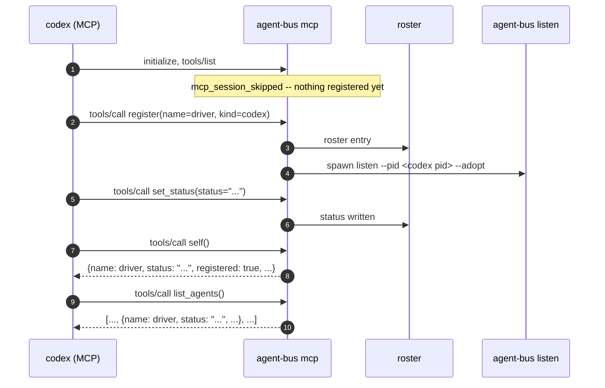

# `self` reflects a status it just set, agreeing with `list_agents`

Sequence diagram and findings for `test_self_reflects_a_status_it_just_set.py`,
built from a real captured `AGENT_BUS_LOG_FILE` -- not from reading the test
source. Index and shared notes: [README.md](README.md).

The capture comes from `docker compose run --rm e2e` with
`AGENT_BUS_LOG_LEVEL=trace`: a live `codex exec` run against real MCP server
children.

## What the test covers

`self` and `set_status` are called by a real harness as MCP tools, for a
session that registered itself with `register`. The test relays two checks
from one live run, each as a single strict token:

- `SELF=<name>,<status>`: what `self` reports after `set_status`.
- `LISTED=<status>`: what a separate `list_agents` call shows for the same
  entry.

Both checks happen inside the run. A one-shot harness's roster entry is pruned
when its process exits, so no process outside the run can read its status
afterward.

The test does not cover the case of an unregistered session that discovery can
still reach (`self` reporting `reachable: true, registered: false`). That case
needs a live Claude session as its own driver.

## Capture

codex started the MCP server three times in this run (pids 393, 523 and 532).
The first two answered `initialize` and `notifications/initialized` and handled
no tool call. pid 532 handled all four tool calls. Times are relative to
`mcp_server_started` for pid 532; pid 528 is codex and pid 534 is the listener.

```
+0.0s   mcp     mcp_server_started
+0.0s   mcp     mcp_session_skipped
+4.4s   mcp     initialize handled
+11.0s  mcp     register (verb record)        agent=quiet-auk-bf3a kind=codex
+11.0s  mcp     mcp_request_handled           method=tools/call tool=register
+11.1s  listen  listener_adopted_host          watch_pid=528
+11.1s  listen  listener_started
+16.5s  mcp     set_status (verb record)      status="reviewing e2e coverage"
+16.5s  mcp     mcp_request_handled           method=tools/call tool=set_status
+16.5s  mcp     self_info (verb record)       trace_id=<the caller's roster id>
+16.5s  mcp     mcp_request_handled           method=tools/call tool=self
+16.5s  mcp     list_agents (verb record)
+16.5s  mcp     mcp_request_handled           method=tools/call tool=list_agents
```



## Log records per tool call

Each tool call writes two records: a verb record (`set_status`, `self_info`,
`list_agents`, `register`, with the verb's own arguments and duration) and an
`mcp_request_handled` record (`method: tools/call`, `tool`). The verb name can
differ from the tool name: the tool `self` writes the verb `self_info`, and the
tool `get_inbox` writes the verb `inbox`. The verb name is the Python function
that the CLI command also calls.

The `self_info` record carries `trace_id`. It is the caller's own roster id,
which is the same id the caller's `register` record carries.
