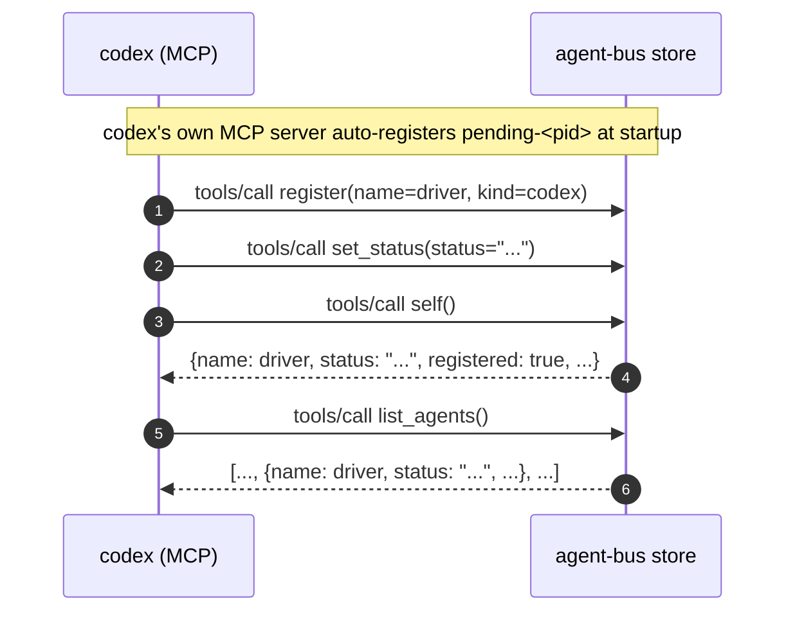

# `self` reflects a status it just set, agreeing with `list_agents`

Real sequence diagram for `test_self_reflects_a_status_it_just_set.py`, built
from a real capture (`AGENT_BUS_LOG_LEVEL=INFO`, a live `codex exec` run
against a real MCP server child) -- not from reading the test source. See
`tests/agent_bus/integration/README.md` for how to reproduce a capture like
this one, and what "CI-shaped and use-shaped are different questions" means
for how to read it.

**#171's Tier 2: "`self` -- worth having now that #125 changed what it
answers for an unregistered session" and "`status` / MCP `set_status` --
presence is read by every listing."** Both named cheap, one line on an
existing prompt, so this is one small test covering both tools rather than
two. #125's own PR is explicit that every one of its new tests stubs
discovery rather than driving it live -- so `self` had unit coverage of the
branch logic and zero coverage of a real harness actually calling it. This
test does not attempt #125's harder case (an unregistered-but-discovered
session): that needs a live Claude session acting as its own driver, a
materially bigger test than "cheap, one line." What it closes is the plainer
gap underneath: nothing had ever called `self`/`set_status` as real MCP
tools at all, registered or not.

Driven by `codex`: the same cheap, no-wiring MCP harness used for the
`get_inbox`/`ack_message`/`list_agents` coverage, for the same reason -- the
test is about the tools, not about codex.



Captured, real:

```json
{"verb":"register","args":{"name":"vivid-falcon-d04e","kind":"codex"},"ok":true,"ms":57}
{"verb":"set_status","args":{"status":"reviewing e2e coverage","cwd":null},"ok":true,"ms":72}
{"tool":"self","ok":true,"ms":76}
{"verb":"list_agents","args":{"kind":null},"ok":true,"ms":10}
```

(The `self` line above is the generic `tools/call` dispatch record, not a
verb-specific one -- see "what this does not show" below.)

## The first design did not survive contact with a one-shot harness

The first draft checked the roster from *outside*, after `codex exec`
returned, via `agent-bus list --json` run as a separate process. It got an
empty roster back every time, `set_status` notwithstanding. Not a bug:
`test_a_harness_joins_the_bus.py` already states the reason ("presence is
liveness... asserting it appears in `list` would be asserting it is still
running") for a different field. Mail outlives its sender; a roster entry's
status does not outlive the process that holds it. A one-shot MCP harness's
entry is pruned the moment its process exits, so nothing outside that
process can read its status back afterward -- there is no post-exit check to
write here.

So both checks happen inside the one live run instead: `self`'s reported
status and a separate `list_agents` call finding the same entry, two
different MCP tools reading the same roster entry while it is still alive,
which is the only window in which either can be checked for a harness this
short-lived.

## What this does not show

**`self_info` is not `@logged`.** Every other tool in this capture
(`register`, `set_status`, `list_agents`) produces two log lines per call: a
verb-specific one (`"verb": "set_status"`, with its own args and timing) and
the generic `tools/call` dispatch record. `self` produces only the second --
confirmed here, in a real capture, not assumed. Checked empirically before
writing this: `commands/agents.py::self_info` has no `@logged` decorator,
unlike `list_agents` right above it in the same file. A synthetic probe
(decorate it locally, call it, watch the log) showed no infinite recursion
-- `log._who()`, which needs identity to stamp *every* record including
`self_info`'s own, already bypasses `self_info` and calls `store.get_self()`
directly, which is exactly why `log.py` is on `test_layering.py`'s allowlist
to touch the store at all. So the recursion `test_layering.py`'s own comment
warns about does not reproduce as written.

What would go wrong if `@logged` were simply added: `self_info`'s result
carries a real `"id"` field -- the caller's own roster id, not a message id
-- and `log._trace_of()` treats any dict's `"id"` key as a message trace to
correlate. `test_log.py::test_a_verb_with_no_message_has_no_trace_id`'s own
docstring already names `self` alongside `list_agents` as a verb that "must
not grow" one, anticipating this. Fixing the coverage gap without also
teaching `_trace_of` that `self_info` produces no message is a one-line
change with a real, if narrow, downstream mistake attached -- left as a
finding here rather than fixed in this test's PR, which is scoped to
coverage, not to that judgment call.

**#125's harder case.** An unregistered session that discovery can still
reach -- `self` reporting `reachable: true, registered: false` -- needs a
live Claude session acting as its own driver, not codex claiming a name up
front. Not attempted here; see the Tier 2 framing above for why.
