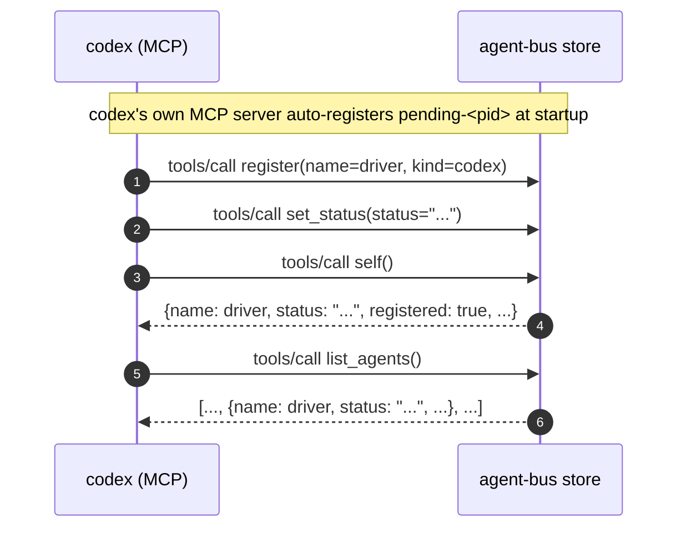

# `self` reflects a status it just set, agreeing with `list_agents`

Sequence diagram and findings for `test_self_reflects_a_status_it_just_set.py`,
built from a real captured `AGENT_BUS_LOG_FILE` -- not from reading the test
source. Index and shared notes: [README.md](README.md).

Captured with `AGENT_BUS_LOG_LEVEL=INFO`, a live `codex exec` run against a
real MCP server child.

**#171's Tier 2: "`self` -- worth having now that #125 changed what it
answers for an unregistered session" and "`status` / MCP `set_status` --
presence is read by every listing."** Both named cheap, one line on an
existing prompt, so this is one small test covering both tools rather than
two. #125's own PR is explicit that every one of its new tests stubs
discovery rather than driving it live -- so `self` had unit coverage of the
branch logic and zero coverage of a real harness actually calling it. This
test does not attempt #125's harder case (an unregistered-but-discovered
session): that needs a live Claude session acting as its own driver, a
materially bigger test than "cheap, one line." What it closes is the plainer
gap underneath: nothing had ever called `self`/`set_status` as real MCP
tools at all, registered or not.

Driven by `codex`: the same cheap, no-wiring MCP harness used for the
`get_inbox`/`ack_message`/`list_agents` coverage, for the same reason -- the
test is about the tools, not about codex.



Captured, real, from the run that found the logging gap below -- `self`
still shows only the generic `tools/call` dispatch record here, from before
the fix landed:

```json
{"verb":"register","args":{"name":"vivid-falcon-d04e","kind":"codex"},"ok":true,"ms":57}
{"verb":"set_status","args":{"status":"reviewing e2e coverage","cwd":null},"ok":true,"ms":72}
{"tool":"self","ok":true,"ms":76}
{"verb":"list_agents","args":{"kind":null},"ok":true,"ms":10}
```

After the fix (`@logged` added to `self_info`), the same call also emits its
own verb-specific record, `trace_id` included -- verified in
`test_log.py::test_self_info_is_logged_and_its_own_id_is_the_trace_id`, not
recaptured live here since the mechanism is already covered by that unit
test:

```json
{"verb":"self_info","ok":true,"trace_id":"<the caller's own roster id>"}
```

## The first design did not survive contact with a one-shot harness

The first draft checked the roster from *outside*, after `codex exec`
returned, via `agent-bus list --json` run as a separate process. It got an
empty roster back every time, `set_status` notwithstanding. Not a bug:
`test_a_harness_joins_the_bus.py` already states the reason ("presence is
liveness... asserting it appears in `list` would be asserting it is still
running") for a different field. Mail outlives its sender; a roster entry's
status does not outlive the process that holds it. A one-shot MCP harness's
entry is pruned the moment its process exits, so nothing outside that
process can read its status back afterward -- there is no post-exit check to
write here.

So both checks happen inside the one live run instead: `self`'s reported
status and a separate `list_agents` call finding the same entry, two
different MCP tools reading the same roster entry while it is still alive,
which is the only window in which either can be checked for a harness this
short-lived.

## A logging gap this test found, and a review correction on it

**`self_info` was not `@logged`.** Every other tool in the first capture
above (`register`, `set_status`, `list_agents`) produces two log lines per
call: a verb-specific one (`"verb": "set_status"`, with its own args and
timing) and the generic `tools/call` dispatch record. `self` produced only
the second -- confirmed in that real capture, not assumed. Checked
empirically before touching anything: `commands/agents.py::self_info` had
no `@logged` decorator, unlike `list_agents` right above it in the same
file. A synthetic probe (decorate it locally, call it, watch for recursion)
showed none -- `log._who()`, which needs identity to stamp *every* record
including `self_info`'s own, already bypasses `self_info` and calls
`store.get_self()` directly, which is exactly why `log.py` is on
`test_layering.py`'s allowlist to touch the store at all. So the recursion
`test_layering.py`'s own comment warns about does not reproduce as written.

The first version of this section deferred the fix, reasoning that
`self_info`'s result carries a real `"id"` field (the caller's own roster
id, not a message id) that `log._trace_of()` would misread as a message
trace to correlate. That reasoning was wrong, and a PR review caught it
with a direct check: `register` returns the exact same shape
(`{**roster_to_public(entry), "registered": True}`), is already `@logged`,
and has carried that same kind of `trace_id` in every one of its records
since before this test existed. Adding `@logged` to `self_info` does not
introduce the hazard -- it makes `self` behave exactly as `register`
already behaves. Landed as the one-liner it always was, with a regression
test verifying both the presence of the record and its `trace_id`
(`test_log.py::test_self_info_is_logged_and_its_own_id_is_the_trace_id`).

The one real, still-open question the deferral surfaced correctly: whether
`_trace_of` promoting a roster id to `trace_id` at all is the right design.
That is `register`'s question first and `self_info`'s only by inheritance
-- worth its own issue if it needs one, not a reason to withhold `self`'s
coverage.

**#125's harder case.** An unregistered session that discovery can still
reach -- `self` reporting `reachable: true, registered: false` -- needs a
live Claude session acting as its own driver, not codex claiming a name up
front. Not attempted here; see the Tier 2 framing above for why.
