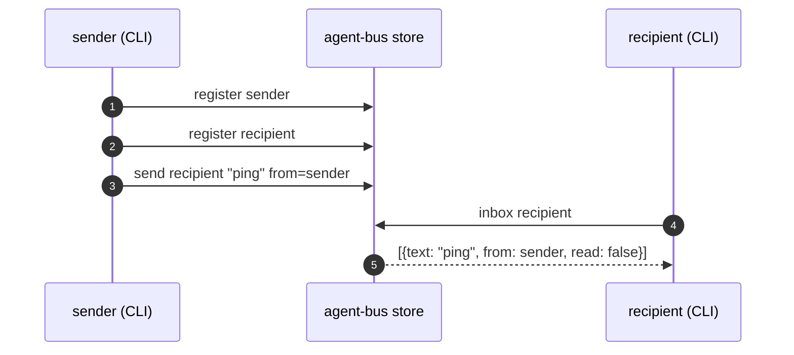

# The file bus -- no harness

Sequence diagram and findings for `test_the_file_bus.py`, built from a real captured
`AGENT_BUS_LOG_FILE` -- not from reading the test source. Index and shared
notes: [README.md](README.md).

**CI-shaped and use-shaped agree here.** Two CLI calls, no model, no
process left running afterward. This is also exactly how a real send
happens -- there is no CI-only shortcut in this one.



Captured from a real run:

```json
{"verb":"register","args":{"name":"nimble-puffin-d1c9","kind":"other"},"ok":true}
{"verb":"register","args":{"name":"keen-badger-ee32","kind":"other"},"ok":true}
{"verb":"send","agent":"keen-badger-ee32","args":{"to":"keen-badger-ee32","from_name":"nimble-puffin-d1c9"},"ok":true}
{"verb":"inbox","agent":"keen-badger-ee32","args":{"unread_only":false},"ok":true}
```

**What this does not show:** a real sender and recipient are two different
processes; this test's helper runs `send` and `inbox` from the same shell in
sequence because that is sufficient to prove the store's contract. Nothing
here is about timing or waking -- that is [`test_watch_wakes_a_peer.py`](test_watch_wakes_a_peer.md).

---
