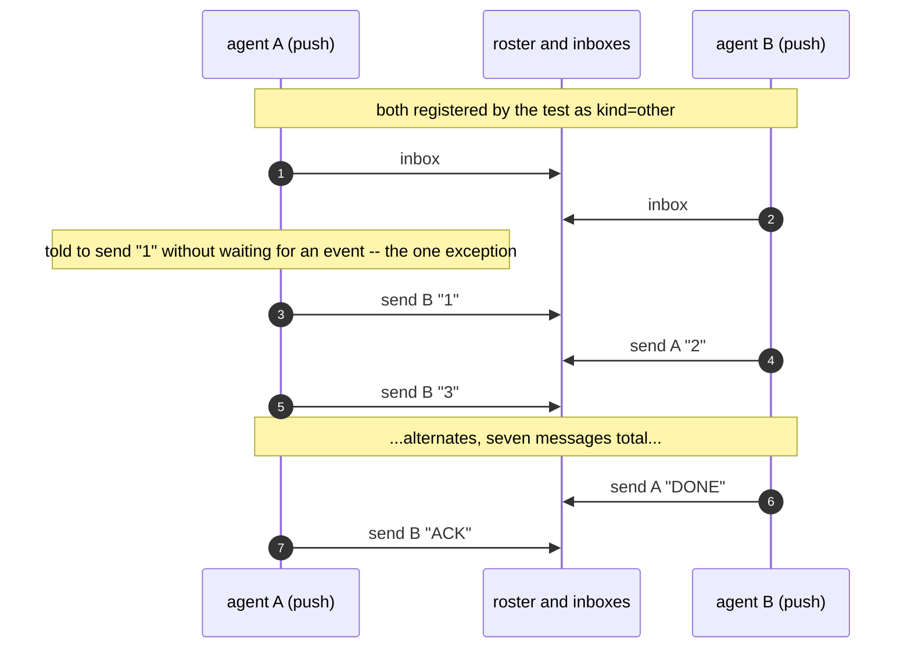

# Two agents hold a conversation

Sequence diagrams and findings for `test_two_agents_hold_a_conversation.py`,
built from real captured `AGENT_BUS_LOG_FILE`s -- not from reading the test
source. Index and shared notes: [README.md](README.md).

The captures come from `docker compose run --rm e2e` with
`AGENT_BUS_LOG_LEVEL=trace`. In that run `claude-to-claude` passed.
`claude-to-omp` and `claude-to-codex` failed. `claude-to-grok` was not run:
grok reports `Not signed in` in the container. Each section says what its
capture shows.

The test is a CI compromise for determinism: seven scripted turns and a
hardcoded stop word exist so there is something deterministic to assert, not
because that is how a peer should spend its time.

## Three wake mechanisms

`WAKE` in `tests/support/mail_woken_peer.py` decides the shape of each brief:

| harness | wake | what the brief tells it |
|---|---|---|
| claude, grok | `push` | arm `agent-bus watch`, then end the turn; a monitor event starts the next one |
| omp | `notify` | arm nothing; stay running and keep working, and the update arrives mid-turn |
| codex | `queue` | nothing; the counterpart's `send` writes into its thread queue |

The server offers the `agentbus://inbox` subscription to every MCP client. omp
turns an update into a turn. grok's `rmcp` client handles two notification
types and only to flip a UI badge (`docs/harnesses/grok-build-monitor-reference.md`),
so `push` uses `watch` plus a monitor tool.

## claude to claude (push, CLI)

Captured. Both peers are registered as `kind: other` by the test
(`register(..., "other", pid=...)`). They read the file inbox and publish no
listener. Registering a peer as `claude` would send `send` down the UDS path,
which refuses when no socket is reachable.

Every record is `adapter: cli`. The record sequence, 17 records in all:

```
register  brisk-otter-55a9          (test setup)
register  prompt-newt-444d          (test setup)
inbox     prompt-newt-444d
inbox     brisk-otter-55a9
send      prompt-newt-444d -> brisk-otter-55a9   "1"   the send made without an event
send      brisk-otter-55a9 -> prompt-newt-444d   "2"
send      prompt-newt-444d -> brisk-otter-55a9   "3"
...       alternates
send      DONE, then ACK
```

The gaps between records, up to 8 s, are model time that each record's `ms`
does not show.



## claude to omp (notify)

The omp peer's MCP server runs with `AGENT_BUS_NAME=<the name the test minted>`
in its environment (`tests/support/mail_woken_peer.py`). At start it registers
that name with kind `other` and starts the listener, so the test addresses omp
by the minted name and has nothing to register for it. omp's own working
directory does not name it. `conversation_peer_omp.md` tells omp it is already on
the bus under that name and not to register.

One run passed. An earlier run of the same test failed: omp's MCP server
registered the minted name, but omp received only `['1']`. Its model ran
`agent-bus inbox` through bash where the brief tells it to read mail through the
`get_inbox` tool, and the exchange stopped after the first message. A model
that does not follow the brief fails this test, and the test has no way to tell
that from a bus fault.

## claude to codex (queue)

Codex holds one thread open for the whole exchange. The counterpart's
`agent-bus send` writes into that thread's queue, and codex picks the write up
on its own, idle or mid-turn (`tests/support/codex_peer.py`, `transport-seam.md`).

One run passed. Three runs failed with the same assertion: the codex thread
received `['1', '3', '5']` as turn inputs where the test expects
`['1', '3', '5', 'ACK']`. In the failing runs the log shows the claude peer's
`send` records addressed to the codex thread id, and codex's own `send` records
for `2`, `4` and `DONE`, each with `from_name` set. The cause of the missing
`ACK` was not found. The ack is the claude peer's last send, after it reads
`DONE`.

## What this does not show

A real conversation is not seven scripted turns with a hardcoded stop word. It
is two agents doing real work, occasionally sending or receiving a message in
the middle of it, with no deadline and no `DONE` convention. This test shows
the mechanics of delivery, not how a peer should spend its time. The `sleep`
loop in the omp brief only keeps `omp -p` running; a session someone is using
has work to do between messages. See `harness-compatibility.md`, **Woken
headless?**, for the per-harness version of this.

---
