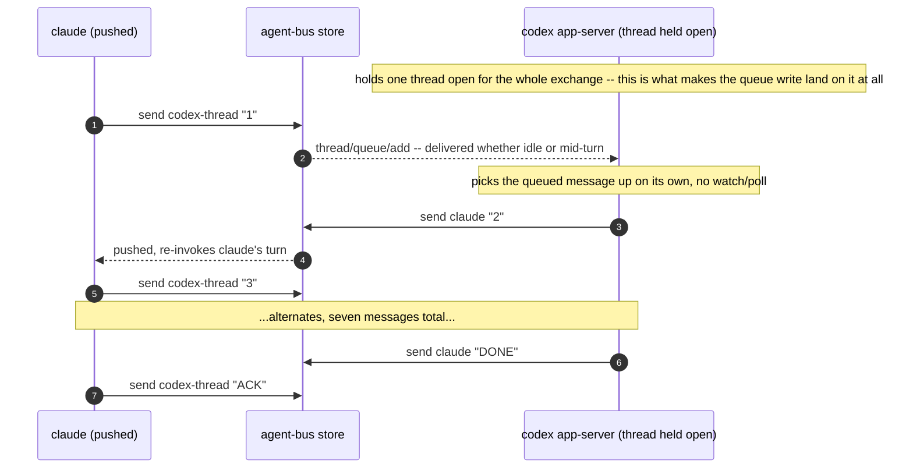
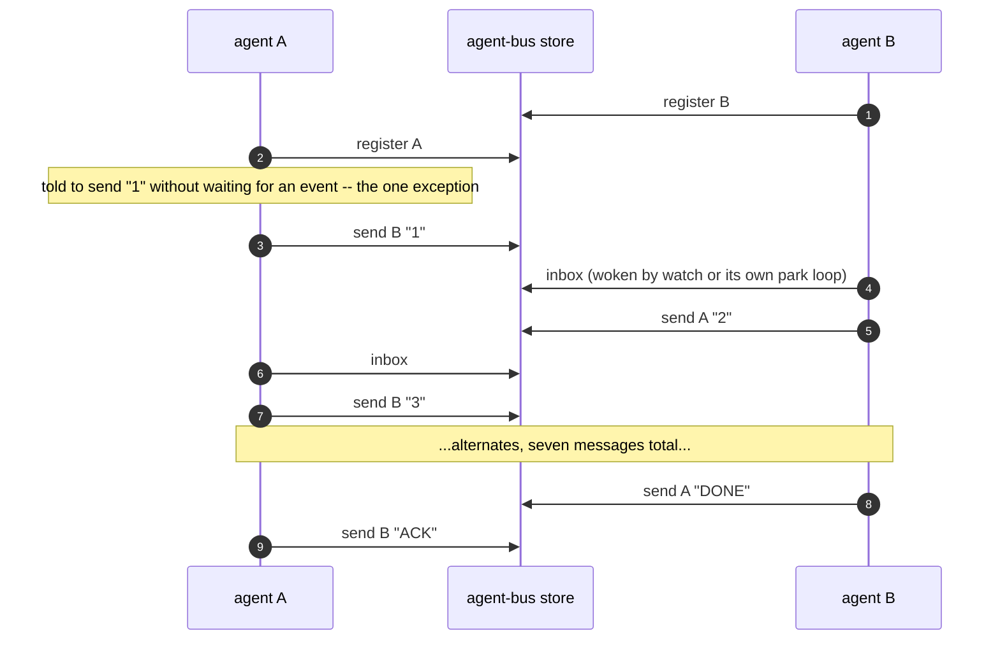

# Two agents hold a conversation

Sequence diagram and findings for `test_two_agents_hold_a_conversation.py`, built from a real captured
`AGENT_BUS_LOG_FILE` -- not from reading the test source. Index and shared
notes: [README.md](README.md).

**The most CI-shaped test in this directory, and it says so in its own
module docstring: "a CI compromise for determinism."** Read this one last,
and read the warning first: `WAKE[harness] == "park"` (omp today) means the
agent blocks in a tool call and loops on a bounded read, purely so there is
one deterministic point per exchange for the test to assert on. A pushed
harness (Claude, grok) ends its turn and gets re-invoked by an event instead
-- closer to real use, but still inside a fixture built to produce an
assertion, not to demonstrate the idle-and-respond shape a working session
actually holds.

**`PAIRS` has four entries as of #292/#294, not three** --
`("claude","claude")`, `("claude","grok")`, `("claude","omp")`,
`("claude","codex")`. Codex is not a third *variant* of push/park; it is a
third mechanism entirely. Nothing on codex's side watches for mail at all --
it neither arms a monitor (push) nor blocks in a tool call (park). The
counterpart's own `agent-bus send` writes straight into codex's queue, and
an app-server holding that codex thread open picks up the write on its own,
whether the thread is idle or mid-turn. There is no "codex notices it has
mail" step to diagram, because codex is never the one doing the noticing --
see `codex_peer.py` and #292's postmortem in `transport-seam.md` for why a
fire-and-forget wake (`turn/steer`) was tried and reverted in favor of this.



This second diagram is drawn from the current test source and its module
docstring, not from a fresh captured `AGENT_BUS_LOG_FILE` the way the
claude/grok capture below is -- the live docker-compose run that proved this
(#294, 54.84s, real) wasn't captured to a log this doc could quote. If that
rigor is wanted, re-run `test_they_alternate_until_one_says_done[claude-to-codex]`
with `AGENT_BUS_RUN_SPENDY_E2E_TESTS=1` and an `AGENT_BUS_LOG_FILE` set, and
replace this paragraph with the real excerpt.



Captured, real (claude-to-grok, `ms` is each call's own duration; the gaps
*between* lines -- up to 17s here -- are model-thinking time, not shown by
`ms` at all):

```json
{"verb":"register","args":{"name":"quiet-vole-f7a2"}}
{"verb":"register","args":{"name":"dapper-shrew-ea23"}}
{"verb":"inbox","args":{"name":"dapper-shrew-ea23"}}
{"verb":"send","args":{"to":"quiet-vole-f7a2"},"ms":196}
{"verb":"inbox","args":{"name":"quiet-vole-f7a2"},"ms":44}
... alternates, 21 records total
```

**What this does not show, and is the whole point of this document:** a
real conversation is not seven scripted turns with a hardcoded stop word. It
is two agents doing real work, occasionally sending or receiving a message
in the middle of it, with no deadline and no "DONE" convention imposed from
outside. If you are reading this test to understand how to *use* the bus,
you will come away thinking a peer's job is to sit and wait for mail. That
is what CI needed from it. It is not what a working agent should do with
its time -- see `harness-compatibility.md`'s **Woken headless?** row, and
the "push and park" distinction directly below it, for the actual shape.

---
