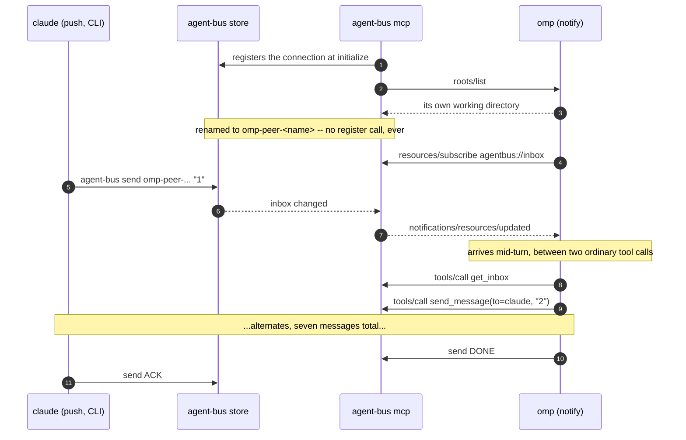
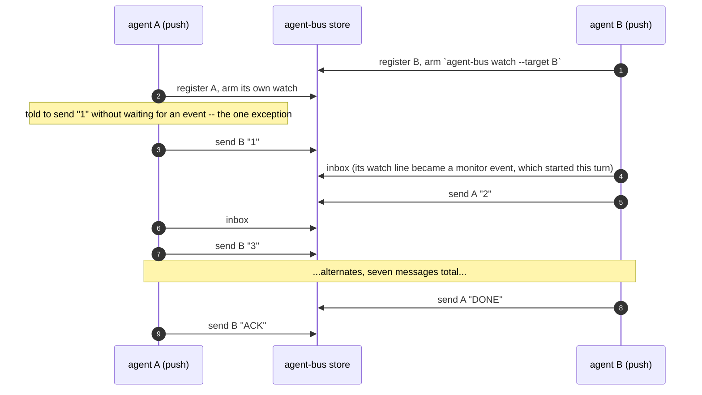
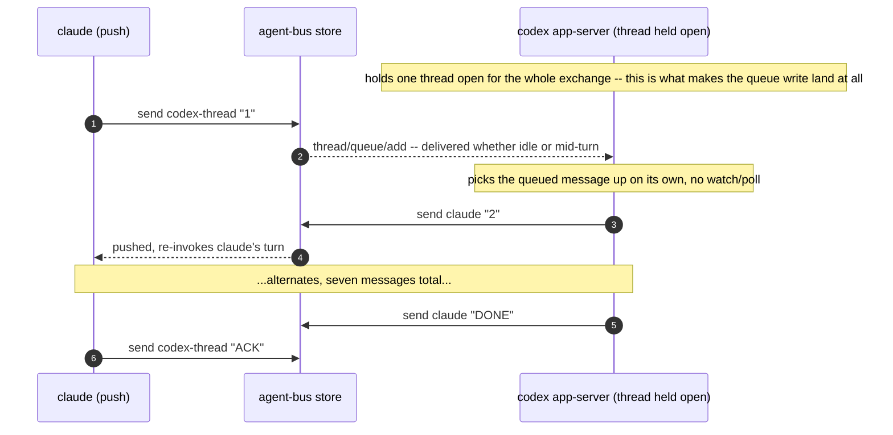

# Two agents hold a conversation

Sequence diagrams and findings for `test_two_agents_hold_a_conversation.py`,
built from real captured `AGENT_BUS_LOG_FILE`s -- not from reading the test
source. Index and shared notes: [README.md](README.md).

claude-to-claude, claude-to-grok and claude-to-omp were re-captured
2026-09-11 from `./e2e_tests.sh`. claude-to-codex skipped: codex is not
installed on that machine.

**The most CI-shaped test in this directory, and it says so in its own module
docstring: "a CI compromise for determinism."** Seven scripted turns and a
hardcoded stop word exist so there is something deterministic to assert, not
because that is how a peer should spend its time.

## Three wake mechanisms, one conversation shape

`WAKE` in `tests/support/mail_woken_peer.py` is the single place that decides
a brief's shape, and it now reads `push` / `notify` / `queue`:

| harness | wake | what the brief tells it |
|---|---|---|
| claude, grok | `push` | arm `agent-bus watch`, then end the turn; a monitor event starts the next one |
| omp | `notify` | nothing to arm -- stay alive and keep working; the update arrives mid-turn |
| codex | `queue` | nothing at all; the counterpart's `send` writes into its thread queue |

**`park` is gone as a name, and the thing it named is gone with it.** It used
to mean `hub start` plus a bounded `hub logs --follow` loop, then (after #308)
a peer blocking on a cursor. omp does neither: it subscribes to
`agentbus://inbox` and its harness turns the server's
`notifications/resources/updated` into a turn.

**That is omp's doing, not the server's.** The subscription is offered to
every MCP client alike. grok's `rmcp` client handles two notification types
and only to flip a UI badge; claude's has no equivalent at all. So `push`
stays exactly as it was for those two -- `watch` plus a monitor tool -- and
nothing in this change makes the MCP notification a universal wake.

## claude (push, CLI) to omp (notify, MCP)

Captured 2026-09-11. The omp peer never registers: it is named
`omp-peer-warm-shrew-34e9` after its own working directory, which is what the
test addresses it by.

```json
{"surface":"cli","message":"register","args":{"name":"keen-tern-c5b3"}}
{"surface":"mcp","message":"mcp server started"}
{"surface":"mcp","agent":"omp-68391","message":"register","args":{"name":"omp-68391"}}
{"surface":"mcp","agent":"omp-68391","message":"initialize"}
{"surface":"mcp","agent":"omp-68391","message":"notifications/initialized"}
{"surface":"mcp","agent":"omp-peer-warm-shrew-34e9","message":"register"}
{"surface":"mcp","agent":"omp-peer-warm-shrew-34e9","message":"rpc"}
{"surface":"listen","agent":"omp-peer-warm-shrew-34e9","message":"listen started"}
{"surface":"cli","agent":"keen-tern-c5b3","message":"send","args":{"to":"omp-peer-warm-shrew-34e9","summary":"1"}}
{"surface":"mcp","agent":"omp-peer-warm-shrew-34e9","message":"inbox"}
{"surface":"mcp","agent":"omp-peer-warm-shrew-34e9","message":"tools/call","tool":"get_inbox"}
{"surface":"mcp","agent":"omp-peer-warm-shrew-34e9","message":"resources/subscribe"}
{"surface":"mcp","agent":"omp-peer-warm-shrew-34e9","message":"send","args":{"to":"keen-tern-c5b3"}}
{"surface":"mcp","agent":"omp-peer-warm-shrew-34e9","message":"tools/call","tool":"send_message"}
... alternates to DONE/ACK
```



The two sides are asymmetric on purpose and the capture shows it: every
`keen-tern-c5b3` record is `surface: cli` (claude shelling out to
`agent-bus`), every peer record is `surface: mcp`. One conversation, two
integration styles, no adapter between them.

## claude to claude, and claude to grok (both push)

Captured 2026-09-11, claude-to-grok. Both sides drive the CLI; `ms` is each
call's own duration, and the gaps *between* records -- up to 17s -- are model
thinking time that `ms` does not show:

```json
{"verb":"register","args":{"name":"rapid-falcon-e2b8","kind":"other"}}
{"verb":"register","args":{"name":"rapid-heron-2a56","kind":"other"}}
{"verb":"inbox","args":{"target":"rapid-heron-2a56"}}
{"verb":"send","args":{"to":"rapid-falcon-e2b8","summary":"1"}}
{"verb":"inbox","args":{"target":"rapid-falcon-e2b8"}}
... alternates, 17 records total, to DONE then ACK
```



Note both peers register as `kind: other` here. That is the fixture's doing
(`register(..., "other", pid=...)` in the test): this peer reads the file
inbox and publishes no listener, and registering it as `claude` would send
`send` down the UDS path, which correctly refuses with "no reachable socket".

## claude to codex (queue)

**Not re-captured** -- codex is not installed on the machine that produced the
rest of this file. Drawn from the test source and #294's live docker-compose
run (54.84s, real), which was not captured to a log this doc can quote.

Codex is not a third variant of push and notify; it is a third mechanism.
Nothing on its side watches for mail. The counterpart's own `agent-bus send`
writes straight into codex's queue, and an app-server holding that thread open
picks the write up on its own, idle or mid-turn. There is no "codex notices"
step to draw, because codex is never the one noticing -- see `codex_peer.py`
and #292's postmortem in `transport-seam.md` for why a fire-and-forget wake
(`turn/steer`) was tried and reverted in favour of this.



## What this does not show, and is the whole point of this document

A real conversation is not seven scripted turns with a hardcoded stop word. It
is two agents doing real work, occasionally sending or receiving a message in
the middle of it, with no deadline and no "DONE" convention imposed from
outside. Read this test to learn how to *use* the bus and you will come away
thinking a peer's job is to sit and wait for mail. That is what CI needed from
it.

The omp row is the closest of the four to the real shape, and still not it:
the `sleep` loop in its brief exists only because `omp -p` exits the moment it
has nothing left to do. A session someone is actually using has work to be
doing between messages, which is the thing no fixture here supplies.

See `harness-compatibility.md`'s **Woken headless?** row for the per-harness
version of this.

---
