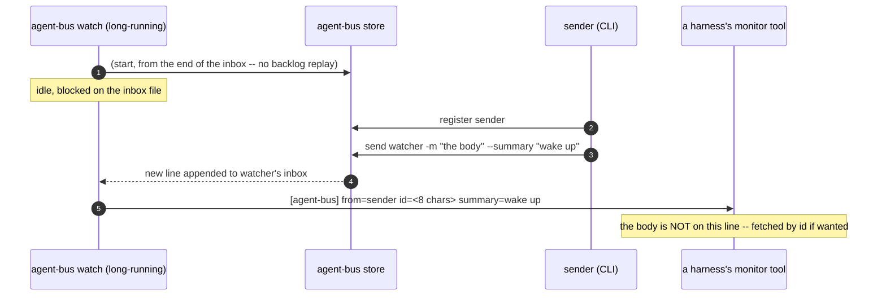

# `watch` wakes a peer

Sequence diagram and findings for `test_watch_wakes_a_peer.py`, built from a real captured
`AGENT_BUS_LOG_FILE` -- not from reading the test source. Index and shared
notes: [README.md](README.md).

**CI-shaped in exactly the way `harness-compatibility.md` warns about**,
and its own module docstring already half-says so: `omp`'s bounded
`hub logs --follow` loop is "a CI compromise for determinism... a real
session is not obligated to loop this tightly just because this test does."
This test drives the same mechanism a real monitor uses, but the *shape* of
consumption -- one poll, one assertion, then the test ends -- is CI's, not a
running peer's.



Captured, real (the CLI-log half; re-captured 2026-09-07 after #281/#263 --
`summary` used to show only as `summary_len`, collapsing "this is what
happened" down to "something happened". `text` still redacts to a length;
`summary` is safe-to-show content everywhere else in this system --
`envelope()`, `watch`'s own stdout notice below -- and now logs that way too):

```json
{"verb":"register","args":{"name":"zesty-shrew-ba63","kind":"other","pid":48003,"cwd":null}}
{"verb":"send","args":{"to":"zesty-shrew-ba63","text_len":8,"summary":"wake up","from_name":"lucid-kite-f17a"}}
```

The line a monitor actually sees, from `watch`'s own stdout (never written to
`AGENT_BUS_LOG_FILE` -- `watch` has no verb-call logging of its own today,
only this line):

```
[agent-bus] from=gentle-vole-61f2 id=136abbd6 summary=wake up
```

**What this does not show:** `watch` is a background process a real peer
starts once and leaves running for its whole session; this test starts one,
waits for exactly one line, and tears it down. A real monitor's loop --
`monitor(command="agent-bus watch --target me", persistent=true)` -- has no
analog to "the test ends here" at all.

---
